# Data-Synth UI/UX Implementation Roadmap

> **Implementation Strategy & Timeline**  
> **Date:** May 2, 2026  
> **Duration:** 5 Weeks  
> **Team Size:** 1-2 Frontend Developers

---

## 📊 Project Architecture

### System Architecture Diagram

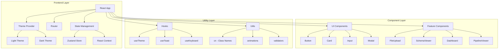

### Component Hierarchy

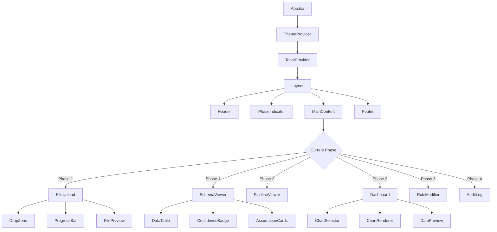

---

## 🗓️ Implementation Timeline

### Week 1: Foundation & Design System

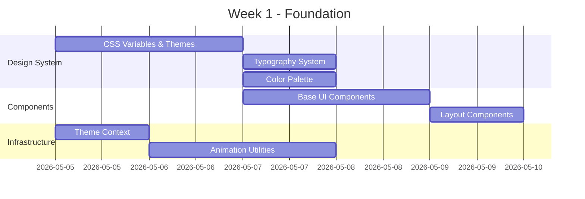

**Deliverables:**
- ✅ Complete design system with CSS variables
- ✅ Theme switching functionality (light/dark)
- ✅ Base UI component library (Button, Card, Input, etc.)
- ✅ Animation utilities and transitions
- ✅ Layout components (Header, Footer, Container)

---

### Week 2: Component Enhancement

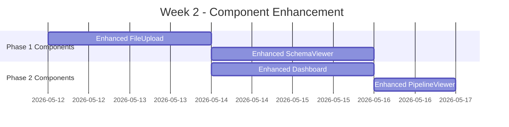

**Deliverables:**
- ✅ FileUpload with animations and better UX
- ✅ SchemaViewer with sorting and filtering
- ✅ Dashboard with multiple chart types
- ✅ PipelineViewer with better code display
- ✅ All components responsive

---

### Week 3: UX Features & Interactions

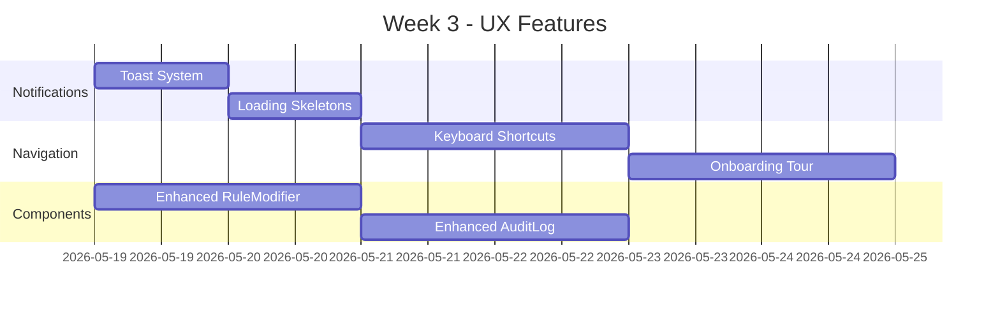

**Deliverables:**
- ✅ Toast notification system
- ✅ Loading skeletons for all components
- ✅ Keyboard shortcuts implementation
- ✅ Onboarding tour for new users
- ✅ Enhanced RuleModifier and AuditLog

---

### Week 4: Accessibility & Polish

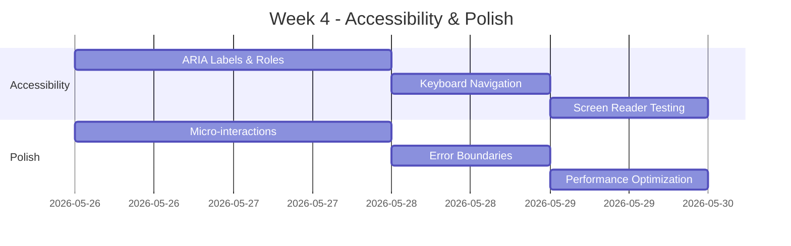

**Deliverables:**
- ✅ WCAG 2.1 AA compliance
- ✅ Complete keyboard navigation
- ✅ Screen reader compatibility
- ✅ Error boundaries for all components
- ✅ Performance optimizations
- ✅ Smooth micro-interactions

---

### Week 5: Documentation & Testing

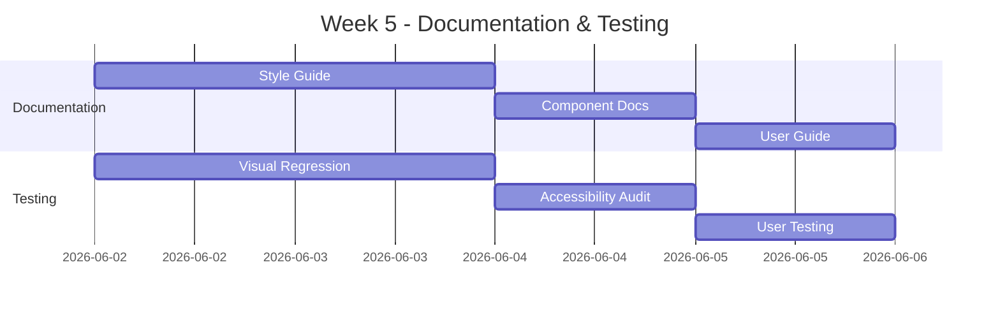

**Deliverables:**
- ✅ Complete style guide
- ✅ Component documentation
- ✅ Updated user guide
- ✅ Visual regression tests
- ✅ Accessibility audit report
- ✅ User testing feedback

---

## 🎯 Implementation Phases

### Phase 1: Foundation (Days 1-5)

#### Day 1-2: Design System Setup
```typescript
// File: frontend/src/styles/themes.css
:root {
  /* Color System */
  --primary-500: #3b82f6;
  --success-500: #22c55e;
  /* ... all design tokens */
}

[data-theme="dark"] {
  --bg-primary: #0f172a;
  --text-primary: #f1f5f9;
  /* ... dark mode overrides */
}
```

#### Day 3-4: Base Components
```typescript
// File: frontend/src/components/ui/Button.tsx
interface ButtonProps {
  variant: 'primary' | 'secondary' | 'outline' | 'ghost';
  size: 'sm' | 'md' | 'lg';
  loading?: boolean;
  disabled?: boolean;
}

// File: frontend/src/components/ui/Card.tsx
// File: frontend/src/components/ui/Input.tsx
// File: frontend/src/components/ui/Modal.tsx
```

#### Day 5: Theme Context
```typescript
// File: frontend/src/contexts/ThemeContext.tsx
export const ThemeProvider = ({ children }) => {
  const [theme, setTheme] = useState<'light' | 'dark'>('light');
  
  useEffect(() => {
    document.documentElement.setAttribute('data-theme', theme);
  }, [theme]);
  
  return (
    <ThemeContext.Provider value={{ theme, setTheme }}>
      {children}
    </ThemeContext.Provider>
  );
};
```

---

### Phase 2: Component Enhancement (Days 6-12)

#### Enhanced FileUpload
```typescript
// New Features:
- Drag-over animation with scale effect
- File preview with icon
- Upload progress with speed
- Success animation
- Retry mechanism
- Multiple file support
```

#### Enhanced SchemaViewer
```typescript
// New Features:
- Search and filter columns
- Sortable table headers
- Visual confidence bars
- Editable column properties
- Export schema option
```

#### Enhanced Dashboard
```typescript
// New Features:
- Multiple chart types (bar, line, pie, scatter, area)
- Chart type switcher
- Zoom and pan
- Export chart as image
- Fullscreen mode
```

---

### Phase 3: UX Features (Days 13-19)

#### Toast Notification System
```typescript
// File: frontend/src/contexts/ToastContext.tsx
import toast from 'react-hot-toast';

export const useToast = () => {
  const success = (message: string) => toast.success(message);
  const error = (message: string) => toast.error(message);
  const info = (message: string) => toast(message);
  
  return { success, error, info };
};
```

#### Keyboard Shortcuts
```typescript
// File: frontend/src/hooks/useKeyboard.ts
export const useKeyboard = () => {
  useEffect(() => {
    const handleKeyPress = (e: KeyboardEvent) => {
      if (e.ctrlKey || e.metaKey) {
        switch (e.key) {
          case 'u': handleUpload(); break;
          case 's': handleSave(); break;
          case 'z': handleUndo(); break;
        }
      }
    };
    
    window.addEventListener('keydown', handleKeyPress);
    return () => window.removeEventListener('keydown', handleKeyPress);
  }, []);
};
```

#### Onboarding Tour
```typescript
// File: frontend/src/components/OnboardingTour.tsx
import Joyride from 'react-joyride';

const steps = [
  {
    target: '.file-upload',
    content: 'Start by uploading your CSV file here',
  },
  {
    target: '.schema-viewer',
    content: 'Review the detected schema',
  },
  // ... more steps
];
```

---

## 🔄 Data Flow Diagram

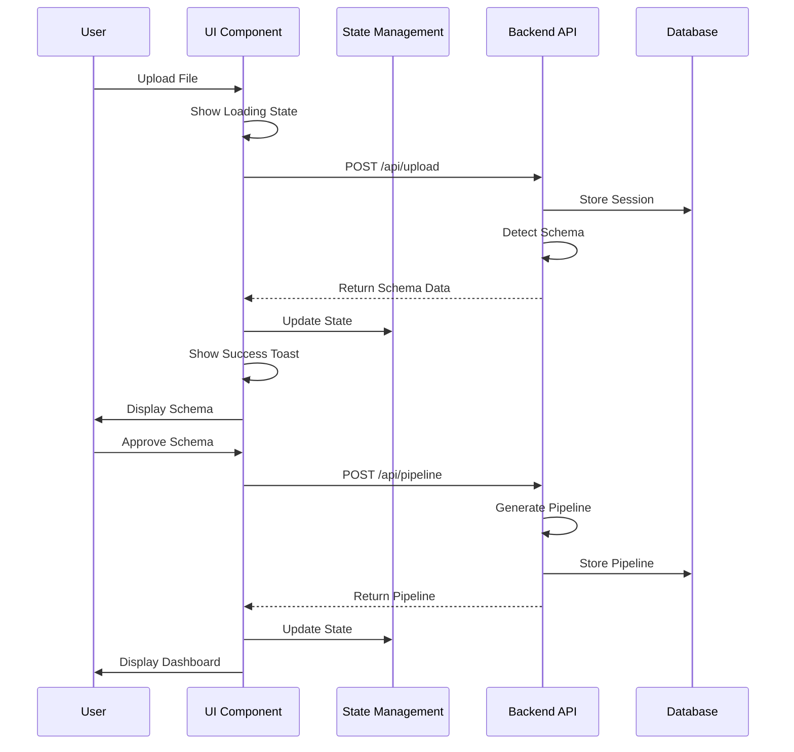

---

## 🎨 Theme Switching Flow

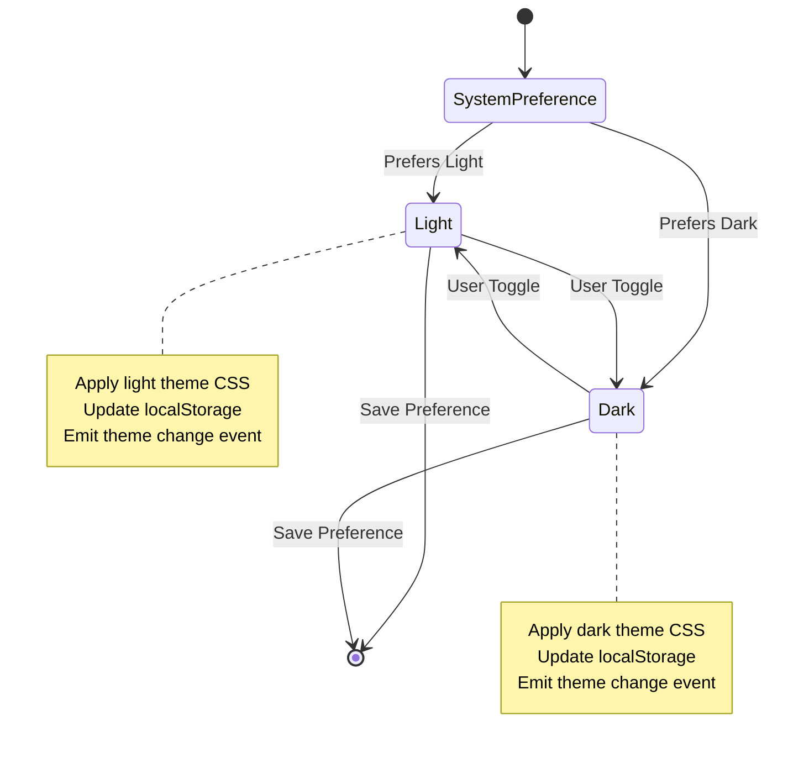

---

## 📦 Component Dependencies

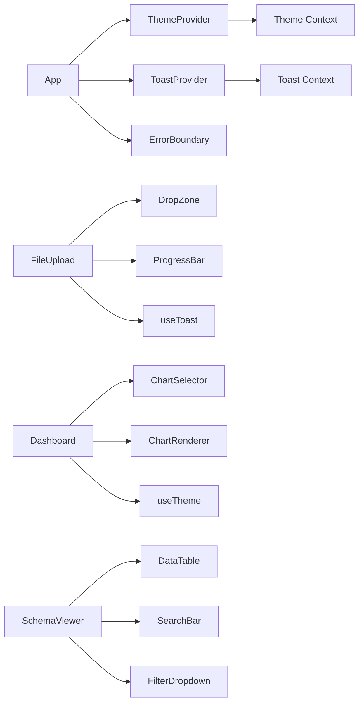

---

## 🧪 Testing Strategy

### Unit Tests
```typescript
// Example: Button.test.tsx
describe('Button Component', () => {
  it('renders with correct variant', () => {
    render(<Button variant="primary">Click me</Button>);
    expect(screen.getByRole('button')).toHaveClass('btn-primary');
  });
  
  it('shows loading state', () => {
    render(<Button loading>Click me</Button>);
    expect(screen.getByRole('button')).toBeDisabled();
  });
});
```

### Integration Tests
```typescript
// Example: FileUpload.test.tsx
describe('FileUpload Flow', () => {
  it('uploads file and shows schema', async () => {
    render(<App />);
    
    const file = new File(['data'], 'test.csv', { type: 'text/csv' });
    const input = screen.getByLabelText('Upload file');
    
    await userEvent.upload(input, file);
    
    await waitFor(() => {
      expect(screen.getByText('Schema Detected')).toBeInTheDocument();
    });
  });
});
```

### Accessibility Tests
```typescript
// Example: Accessibility.test.tsx
describe('Accessibility', () => {
  it('has no accessibility violations', async () => {
    const { container } = render(<App />);
    const results = await axe(container);
    expect(results).toHaveNoViolations();
  });
});
```

---

## 📊 Performance Optimization

### Code Splitting
```typescript
// Lazy load components
const Dashboard = lazy(() => import('./components/Dashboard'));
const AuditLog = lazy(() => import('./components/AuditLog'));

// Use Suspense
<Suspense fallback={<LoadingSkeleton />}>
  <Dashboard />
</Suspense>
```

### Memoization
```typescript
// Memoize expensive computations
const chartData = useMemo(() => {
  return transformData(rawData);
}, [rawData]);

// Memoize components
const MemoizedChart = memo(Chart);
```

### Virtual Scrolling
```typescript
// For large data tables
import { FixedSizeList } from 'react-window';

<FixedSizeList
  height={600}
  itemCount={data.length}
  itemSize={50}
>
  {Row}
</FixedSizeList>
```

---

## 🚀 Deployment Checklist

### Pre-Deployment
- [ ] All tests passing
- [ ] Lighthouse score > 90
- [ ] Accessibility audit complete
- [ ] Browser compatibility tested
- [ ] Mobile responsiveness verified
- [ ] Performance optimized
- [ ] Error boundaries in place
- [ ] Analytics integrated

### Post-Deployment
- [ ] Monitor error rates
- [ ] Track user engagement
- [ ] Collect user feedback
- [ ] A/B test key features
- [ ] Performance monitoring
- [ ] Accessibility monitoring

---

## 📈 Success Metrics Dashboard

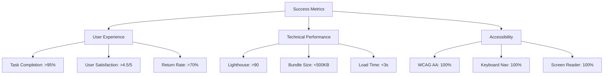

---

## 🎓 Training & Documentation

### Developer Documentation
1. **Setup Guide** - Environment setup and dependencies
2. **Component Guide** - How to use each component
3. **Style Guide** - Design system and patterns
4. **API Reference** - Component props and methods
5. **Best Practices** - Code standards and conventions

### User Documentation
1. **Getting Started** - Quick start guide
2. **Feature Tutorials** - Step-by-step guides
3. **Video Walkthroughs** - Screen recordings
4. **FAQ** - Common questions and answers
5. **Troubleshooting** - Common issues and solutions

---

## 🔮 Future Enhancements (Post-MVP)

### Phase 2 Features
- Real-time collaboration
- Advanced data transformations
- Custom chart builder
- Template marketplace
- API integrations

### Phase 3 Features
- Machine learning insights
- Predictive analytics
- Data quality scoring
- Automated reporting
- Multi-language support

---

## 📞 Support & Maintenance

### Ongoing Tasks
- Weekly dependency updates
- Monthly accessibility audits
- Quarterly performance reviews
- Continuous user feedback collection
- Regular security patches

### Issue Tracking
- Bug reports via GitHub Issues
- Feature requests via discussions
- Security issues via private channel
- Performance issues via monitoring

---

## ✅ Definition of Done

A feature is considered complete when:
- ✅ Code is written and reviewed
- ✅ Unit tests pass (>80% coverage)
- ✅ Integration tests pass
- ✅ Accessibility tests pass
- ✅ Visual regression tests pass
- ✅ Documentation is updated
- ✅ Performance benchmarks met
- ✅ Browser compatibility verified
- ✅ Mobile responsiveness confirmed
- ✅ User acceptance testing complete

---

*Made with Bob - Planning for Success* 🚀