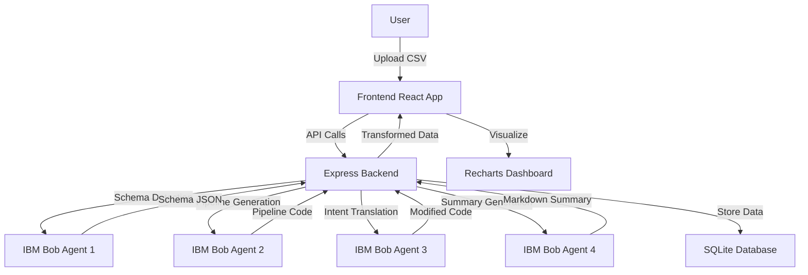

# Data-Synth: AI-Powered Data Pipeline Platform

> **IBM Bob Hackathon Project** - Turn Idea into Impact Faster

A streamlined data analysis tool that uses IBM Bob to automate data pipeline creation, enable non-technical stakeholders to modify business logic in plain English, and automatically document every decision.

[]()
[]()
[]()

## 🎯 Project Overview

**Core Value Proposition:** Upload a CSV, let IBM Bob detect the schema and generate a dashboard, then modify business rules in plain English while Bob documents every decision.

### What We're Proving:
1. ✅ Bob can automate data pipeline creation (schema → transformation → visualization)
2. ✅ Non-technical stakeholders can modify business logic without writing code
3. ✅ Every decision is automatically documented for audit trails

### Key Features:
- 📤 **CSV Upload** - Drag-and-drop file upload with progress tracking
- 🔍 **Schema Detection** - AI-powered schema analysis with confidence scores
- ⚙️ **Pipeline Generation** - Automatic JavaScript code generation for data transformation
- 📊 **Data Visualization** - Interactive bar charts with recharts
- ✨ **Plain English Rules** - Modify pipelines using natural language
- 📋 **Session Summaries** - AI-generated comprehensive session reports
- 💾 **Export Functionality** - Download complete session data as JSON
- 🔒 **Complete Audit Trail** - Every action logged and traceable

## 🏗️ Architecture

```
Data-Synth/
├── frontend/                 # React + TypeScript + Vite
│   ├── src/
│   │   ├── components/      # UI Components
│   │   │   ├── FileUpload.tsx
│   │   │   ├── SchemaViewer.tsx
│   │   │   ├── Dashboard.tsx
│   │   │   ├── PipelineViewer.tsx
│   │   │   ├── RuleModifier.tsx
│   │   │   └── AuditLog.tsx
│   │   ├── App.tsx
│   │   └── main.tsx
│   └── package.json
│
├── backend/                  # Node.js + Express
│   ├── routes/
│   │   ├── upload.js        # File upload & schema detection
│   │   └── pipeline.js      # Pipeline generation & rules
│   ├── services/
│   │   └── ibmService.js    # IBM watsonx.ai integration
│   ├── db/
│   │   └── init.js          # SQLite database setup
│   └── server.js
│
└── README.md
```

### Architecture Diagram



## 🚀 Tech Stack

| Layer | Technology | Purpose |
|-------|-----------|---------|
| Frontend | React 18 + TypeScript + Vite | Single-page dashboard |
| UI Framework | Tailwind CSS | Styling and responsive design |
| Charts | recharts | Data visualization |
| Backend | Node.js + Express | REST API server |
| Database | SQLite | File-based storage |
| AI Core | IBM watsonx.ai | Schema detection + code generation |
| Code Execution | vm2 | Sandboxed JavaScript execution |

## 🛠️ Setup Instructions

### Prerequisites
- Node.js v18+ installed
- npm or yarn package manager
- (Optional) IBM watsonx.ai API credentials

### Installation

1. **Clone the repository**
   ```bash
   git clone <repository-url>
   cd IBM_Bob_Data-Synth
   ```

2. **Setup Backend**
   ```bash
   cd backend
   npm install
   
   # Create .env file (optional - will run in mock mode without it)
   cp .env.example .env
   # Edit .env with your IBM credentials if available
   
   # Start backend server
   npm start
   ```

3. **Setup Frontend**
   ```bash
   cd frontend
   npm install
   
   # Start frontend dev server
   npm run dev
   ```

4. **Verify Setup**
   - Backend: http://localhost:3001/api/health
   - Frontend: http://localhost:5173

## 🔧 Configuration

### Backend Environment Variables

Create a `.env` file in the `backend` directory:

```env
# IBM watsonx.ai Configuration (Optional)
WATSONX_API_KEY=your_api_key_here
WATSONX_PROJECT_ID=your_project_id_here
WATSONX_URL=https://us-south.ml.cloud.ibm.com

# Server Configuration
PORT=3001
NODE_ENV=development
```

**Note:** The application will run in **mock mode** if IBM credentials are not configured, allowing full development and testing without API access.

## 📊 Database Schema

### Sessions Table
```sql
CREATE TABLE sessions (
  id TEXT PRIMARY KEY,
  created_at DATETIME DEFAULT CURRENT_TIMESTAMP,
  filename TEXT,
  status TEXT
);
```

### Schemas Table
```sql
CREATE TABLE schemas (
  id TEXT PRIMARY KEY,
  session_id TEXT,
  columns TEXT,
  confidence_scores TEXT,
  FOREIGN KEY(session_id) REFERENCES sessions(id)
);
```

### Pipelines Table
```sql
CREATE TABLE pipelines (
  id TEXT PRIMARY KEY,
  session_id TEXT,
  code TEXT,
  chart_config TEXT,
  status TEXT,
  created_at DATETIME DEFAULT CURRENT_TIMESTAMP,
  FOREIGN KEY(session_id) REFERENCES sessions(id)
);
```

### Audit Log Table
```sql
CREATE TABLE audit_log (
  id INTEGER PRIMARY KEY AUTOINCREMENT,
  session_id TEXT,
  timestamp DATETIME DEFAULT CURRENT_TIMESTAMP,
  action TEXT,
  details TEXT,
  FOREIGN KEY(session_id) REFERENCES sessions(id)
);
```

## 🎯 Development Phases

### ✅ Phase 0: Foundation Setup (Day 1)
**Status:** COMPLETED

- ✅ Vite + React + TypeScript project initialized
- ✅ All dependencies installed
- ✅ SQLite database initialized
- ✅ IBM SDK service with mock mode
- ✅ Health check endpoint working
- ✅ Both dev servers running

### ✅ Phase 1: CSV Upload & Schema Detection (Day 2)
**Status:** COMPLETED

- ✅ CSV upload endpoint with multer
- ✅ Bob schema detection integration
- ✅ Schema viewer UI with confidence scores
- ✅ Assumption cards display
- ✅ File upload component with drag-and-drop

### ✅ Phase 2: Pipeline Generation & Visualization (Day 3)
**Status:** COMPLETED

- ✅ Bob pipeline generation
- ✅ Code execution in sandboxed VM
- ✅ Bar chart rendering with recharts
- ✅ Pipeline code viewer with syntax highlighting
- ✅ Data transformation validation

### ✅ Phase 3: Simple Rule Engine (Day 4)
**Status:** COMPLETED

- ✅ Plain English rule input interface
- ✅ Bob intent translation
- ✅ Pipeline modification with versioning
- ✅ Audit log viewer with timeline
- ✅ Real-time chart updates

### ✅ Phase 4: Audit Trail & Documentation (Day 5)
**Status:** COMPLETED

- ✅ Session summary generation (Bob Agent 4)
- ✅ Export functionality (JSON download)
- ✅ Enhanced audit trail viewer
- ✅ Complete documentation
- ✅ Demo preparation

## 🎮 How to Use

### 1. Upload CSV File
- Navigate to http://localhost:5173
- Drag and drop a CSV file or click to browse
- Wait for upload to complete

### 2. Review Detected Schema
- View detected columns with data types
- Check confidence scores (green = high, amber = medium, red = low)
- Read Bob's assumptions about the data
- Click "Approve Schema" to continue

### 3. Generate Pipeline
- Click "Generate Pipeline" button
- Bob creates transformation code automatically
- View the generated JavaScript code
- See the bar chart visualization

### 4. Modify with Rules
- Type plain English rules like:
  - "Exclude rows where value is less than 100"
  - "Show only top 10 results"
  - "Sort by ascending order"
- Click "Apply Rule"
- See Bob's explanation of changes
- Chart updates automatically

### 5. Generate Summary & Export
- Click "Generate Session Summary" for AI-generated report
- Click "Export Session Data" to download JSON
- View complete audit trail of all actions

## 📡 API Endpoints

### Upload & Schema
- `POST /api/upload` - Upload CSV file
- `GET /api/schema/:sessionId` - Get detected schema

### Pipeline
- `POST /api/pipeline/:sessionId` - Generate pipeline
- `GET /api/pipeline/:sessionId` - Get pipeline code
- `GET /api/data/:sessionId` - Get transformed data

### Rules
- `POST /api/pipeline/rules/:sessionId` - Apply rule modification

### Audit & Export
- `GET /api/pipeline/audit/:sessionId` - Get audit log
- `GET /api/summary/:sessionId` - Generate session summary
- `GET /api/export/:sessionId` - Export session data

## 🧪 Testing

### Backend Health Check
```bash
curl http://localhost:3001/api/health
```

Expected response:
```json
{
  "status": "ok",
  "message": "Data-Synth Backend is running",
  "timestamp": "2026-05-01T23:44:52.597Z"
}
```

### Test with Sample Data
A sample CSV file is included at `backend/uploads/sample-data.csv` for testing.

## 🤖 IBM Bob Integration

### Four Agent System

1. **Agent 1: Schema Detective**
   - Analyzes CSV structure
   - Infers data types and semantics
   - Provides confidence scores

2. **Agent 2: Pipeline Generator**
   - Creates transformation code
   - Generates chart configurations
   - Validates output format

3. **Agent 3: Intent Translator**
   - Parses plain English rules
   - Modifies pipeline code
   - Explains changes

4. **Agent 4: Documentation Writer**
   - Generates session summaries
   - Creates audit reports
   - Provides insights

### Mock Mode
When IBM credentials are not configured, the system uses intelligent mock responses that simulate Bob's behavior, allowing full functionality for development and demos.

## 🎨 UI Components

### FileUpload
- Drag-and-drop interface
- Progress tracking
- File validation

### SchemaViewer
- Column details table
- Confidence badges
- Assumption cards

### Dashboard
- Bar chart visualization
- Interactive tooltips
- Responsive design

### PipelineViewer
- Syntax-highlighted code
- Collapsible panels
- Copy to clipboard

### RuleModifier
- Plain English input
- Example rules
- Change explanations

### AuditLog
- Timeline view
- Expandable entries
- Action icons
- Summary generation
- Export functionality

## 🔒 Security Features

- Sandboxed code execution with vm2
- Input validation on all endpoints
- SQL injection prevention
- File type validation
- Size limits on uploads

## 🚀 Future Enhancements

### Phase 2 (Post-Hackathon)
- Multiple input formats (JSON, Excel)
- Additional chart types
- Live What-If simulator
- Developer approval workflow

### Phase 3 (Production)
- PostgreSQL migration
- Authentication & authorization
- Multi-user sessions
- Real-time collaboration
- Cloud deployment

## 📝 License

MIT

## 🏆 Hackathon Information

- **Track:** IBM Bob — "Turn Idea into Impact Faster"
- **Timeline:** 5 days (May 1-5, 2026)
- **Focus:** Efficiency · Agentic Workflows · Developer-to-Stakeholder Alignment

## 👥 Team

Built with IBM Bob for the IBM Hackathon 2026

## 🙏 Acknowledgments

- IBM watsonx.ai team for the powerful AI platform
- IBM Bob SDK for enabling agentic workflows
- Open source community for amazing tools

---

**All Phases Completed:** May 2, 2026  
**Status:** ✅ Ready for Demo  
**Made with Bob** 🤖