**User:**

<task>
We need to do quit a bit of work on the UI/UX of the project.
</task>
<environment_details>
# VSCode Visible Files


# VSCode Open Tabs


# Actively Running Terminals
## Terminal 1 (Active)
### Working Directory: `g:\IBM_Bob_Data-Synth`
### Original command: `cd backend; npm start`
### New Output
📁 Processing file: test-simple.csv (Session: c4665d7e-7931-46ba-8547-80c979f8aa61)
✅ Parsed 5 rows with 3 columns
Using mock schema detection...
✅ Schema detected with 3 columns
✅ Session c4665d7e-7931-46ba-8547-80c979f8aa61 saved to database
🔧 Generating pipeline for session: c4665d7e-7931-46ba-8547-80c979f8aa61
Using mock pipeline generation...
✅ Pipeline generated with 666 characters
[Pipeline] Skipping row with invalid value: {
  id: 1,
  name: 'Product A',
  value: 150,
  date: '2024-01-01',
  category: 'Electronics'
}
[Pipeline] Skipping row with invalid value: {
  id: 2,
  name: 'Product B',
  value: 230,
  date: '2024-01-02',
  category: 'Clothing'
}
[Pipeline] Skipping row with invalid value: {
  id: 3,
  name: 'Product C',
  value: 180,
  date: '2024-01-03',
  category: 'Electronics'
}
[Pipeline] Skipping row with invalid value: {
  id: 4,
  name: 'Product D',
  value: 95,
  date: '2024-01-04',
  category: 'Food'
}
[Pipeline] Skipping row with invalid value: {
  id: 5,
  name: 'Product E',
  value: 310,
  date: '2024-01-05',
  category: 'Electronics'
}
[Pipeline] Skipping row with invalid value: {
  id: 6,
  name: 'Product F',
  value: 125,
  date: '2024-01-06',
  category: 'Clothing'
}
[Pipeline] Skipping row with invalid value: {
  id: 7,
  name: 'Product G',
  value: 275,
  date: '2024-01-07',
  category: 'Food'
}
[Pipeline] Skipping row with invalid value: {
  id: 8,
  name: 'Product H',
  value: 190,
  date: '2024-01-08',
  category: 'Electronics'
}
[Pipeline] Skipping row with invalid value: {
  id: 9,
  name: 'Product I',
  value: 85,
  date: '2024-01-09',
  category: 'Clothing'
}
[Pipeline] Skipping row with invalid value: {
  id: 10,
  name: 'Product J',
  value: 420,
  date: '2024-01-10',
  category: 'Electronics'
}
✅ Pipeline executed successfully, produced 0 rows
✅ Pipeline c4df1f15-1ead-40bb-b82c-2ace1288fcf4 saved to database
📊 Loading data for session: c4665d7e-7931-46ba-8547-80c979f8aa61
[Pipeline] Skipping row with invalid value: {
  id: 1,
  name: 'Product A',
  value: 150,
  date: '2024-01-01',
  category: 'Electronics'
}
[Pipeline] Skipping row with invalid value: {
  id: 2,
  name: 'Product B',
  value: 230,
  date: '2024-01-02',
  category: 'Clothing'
}
[Pipeline] Skipping row with invalid value: {
  id: 3,
  name: 'Product C',
  value: 180,
  date: '2024-01-03',
  category: 'Electronics'
}
[Pipeline] Skipping row with invalid value: {
  id: 4,
  name: 'Product D',
  value: 95,
  date: '2024-01-04',
  category: 'Food'
}
[Pipeline] Skipping row with invalid value: {
  id: 5,
  name: 'Product E',
  value: 310,
  date: '2024-01-05',
  category: 'Electronics'
}
[Pipeline] Skipping row with invalid value: {
  id: 6,
  name: 'Product F',
  value: 125,
  date: '2024-01-06',
  category: 'Clothing'
}
[Pipeline] Skipping row with invalid value: {
  id: 7,
  name: 'Product G',
  value: 275,
  date: '2024-01-07',
  category: 'Food'
}
[Pipeline] Skipping row with invalid value: {
  id: 8,
  name: 'Product H',
  value: 190,
  date: '2024-01-08',
  category: 'Electronics'
}
[Pipeline] Skipping row with invalid value: {
  id: 9,
  name: 'Product I',
  value: 85,
  date: '2024-01-09',
  category: 'Clothing'
}
[Pipeline] Skipping row with invalid value: {
  id: 10,
  name: 'Product J',
  value: 420,
  date: '2024-01-10',
  category: 'Electronics'
}
✅ Data transformed: 0 rows
🔧 Generating pipeline for session: c4665d7e-7931-46ba-8547-80c979f8aa61
Using mock pipeline generation...
✅ Pipeline generated with 666 characters
[Pipeline] Skipping row with invalid value: {
  id: 1,
  name: 'Product A',
  value: 150,
  date: '2024-01-01',
  category: 'Electronics'
}
[Pipeline] Skipping row with invalid value: {
  id: 2,
  name: 'Product B',
  value: 230,
  date: '2024-01-02',
  category: 'Clothing'
}
[Pipeline] Skipping row with invalid value: {
  id: 3,
  name: 'Product C',
  value: 180,
  date: '2024-01-03',
  category: 'Electronics'
}
[Pipeline] Skipping row with invalid value: {
  id: 4,
  name: 'Product D',
  value: 95,
  date: '2024-01-04',
  category: 'Food'
}
[Pipeline] Skipping row with invalid value: {
  id: 5,
  name: 'Product E',
  value: 310,
  date: '2024-01-05',
  category: 'Electronics'
}
[Pipeline] Skipping row with invalid value: {
  id: 6,
  name: 'Product F',
  value: 125,
  date: '2024-01-06',
  category: 'Clothing'
}
[Pipeline] Skipping row with invalid value: {
  id: 7,
  name: 'Product G',
  value: 275,
  date: '2024-01-07',
  category: 'Food'
}
[Pipeline] Skipping row with invalid value: {
  id: 8,
  name: 'Product H',
  value: 190,
  date: '2024-01-08',
  category: 'Electronics'
}
[Pipeline] Skipping row with invalid value: {
  id: 9,
  name: 'Product I',
  value: 85,
  date: '2024-01-09',
  category: 'Clothing'
}
[Pipeline] Skipping row with invalid value: {
  id: 10,
  name: 'Product J',
  value: 420,
  date: '2024-01-10',
  category: 'Electronics'
}
✅ Pipeline executed successfully, produced 0 rows
✅ Pipeline c9910596-f0be-4f50-83bb-3470d2dc182e saved to database
📊 Loading data for session: c4665d7e-7931-46ba-8547-80c979f8aa61
[Pipeline] Skipping row with invalid value: {
  id: 1,
  name: 'Product A',
  value: 150,
  date: '2024-01-01',
  category: 'Electronics'
}
[Pipeline] Skipping row with invalid value: {
  id: 2,
  name: 'Product B',
  value: 230,
  date: '2024-01-02',
  category: 'Clothing'
}
[Pipeline] Skipping row with invalid value: {
  id: 3,
  name: 'Product C',
  value: 180,
  date: '2024-01-03',
  category: 'Electronics'
}
[Pipeline] Skipping row with invalid value: {
  id: 4,
  name: 'Product D',
  value: 95,
  date: '2024-01-04',
  category: 'Food'
}
[Pipeline] Skipping row with invalid value: {
  id: 5,
  name: 'Product E',
  value: 310,
  date: '2024-01-05',
  category: 'Electronics'
}
[Pipeline] Skipping row with invalid value: {
  id: 6,
  name: 'Product F',
  value: 125,
  date: '2024-01-06',
  category: 'Clothing'
}
[Pipeline] Skipping row with invalid value: {
  id: 7,
  name: 'Product G',
  value: 275,
  date: '2024-01-07',
  category: 'Food'
}
[Pipeline] Skipping row with invalid value: {
  id: 8,
  name: 'Product H',
  value: 190,
  date: '2024-01-08',
  category: 'Electronics'
}
[Pipeline] Skipping row with invalid value: {
  id: 9,
  name: 'Product I',
  value: 85,
  date: '2024-01-09',
  category: 'Clothing'
}
[Pipeline] Skipping row with invalid value: {
  id: 10,
  name: 'Product J',
  value: 420,
  date: '2024-01-10',
  category: 'Electronics'
}
✅ Data transformed: 0 rows
📝 Applying rule to session c4665d7e-7931-46ba-8547-80c979f8aa61: "Filter values greater than 200"
Using mock intent translation...
✅ Rule translated: 1 changes
✅ Rule applied successfully, 0 rows in result
🔧 Generating pipeline for session: c4665d7e-7931-46ba-8547-80c979f8aa61
Using mock pipeline generation...
✅ Pipeline generated with 666 characters
[Pipeline] Skipping row with invalid value: {
  id: 1,
  name: 'Product A',
  value: 150,
  date: '2024-01-01',
  category: 'Electronics'
}
[Pipeline] Skipping row with invalid value: {
  id: 2,
  name: 'Product B',
  value: 230,
  date: '2024-01-02',
  category: 'Clothing'
}
[Pipeline] Skipping row with invalid value: {
  id: 3,
  name: 'Product C',
  value: 180,
  date: '2024-01-03',
  category: 'Electronics'
}
[Pipeline] Skipping row with invalid value: {
  id: 4,
  name: 'Product D',
  value: 95,
  date: '2024-01-04',
  category: 'Food'
}
[Pipeline] Skipping row with invalid value: {
  id: 5,
  name: 'Product E',
  value: 310,
  date: '2024-01-05',
  category: 'Electronics'
}
[Pipeline] Skipping row with invalid value: {
  id: 6,
  name: 'Product F',
  value: 125,
  date: '2024-01-06',
  category: 'Clothing'
}
[Pipeline] Skipping row with invalid value: {
  id: 7,
  name: 'Product G',
  value: 275,
  date: '2024-01-07',
  category: 'Food'
}
[Pipeline] Skipping row with invalid value: {
  id: 8,
  name: 'Product H',
  value: 190,
  date: '2024-01-08',
  category: 'Electronics'
}
[Pipeline] Skipping row with invalid value: {
  id: 9,
  name: 'Product I',
  value: 85,
  date: '2024-01-09',
  category: 'Clothing'
}
[Pipeline] Skipping row with invalid value: {
  id: 10,
  name: 'Product J',
  value: 420,
  date: '2024-01-10',
  category: 'Electronics'
}
✅ Pipeline executed successfully, produced 0 rows
✅ Pipeline b1aa96d2-43f0-4639-bdbb-bd848cbf26f6 saved to database
📊 Loading data for session: c4665d7e-7931-46ba-8547-80c979f8aa61
[Pipeline] Skipping row with invalid value: {
  id: 1,
  name: 'Product A',
  value: 150,
  date: '2024-01-01',
  category: 'Electronics'
}
[Pipeline] Skipping row with invalid value: {
  id: 2,
  name: 'Product B',
  value: 230,
  date: '2024-01-02',
  category: 'Clothing'
}
[Pipeline] Skipping row with invalid value: {
  id: 3,
  name: 'Product C',
  value: 180,
  date: '2024-01-03',
  category: 'Electronics'
}
[Pipeline] Skipping row with invalid value: {
  id: 4,
  name: 'Product D',
  value: 95,
  date: '2024-01-04',
  category: 'Food'
}
[Pipeline] Skipping row with invalid value: {
  id: 5,
  name: 'Product E',
  value: 310,
  date: '2024-01-05',
  category: 'Electronics'
}
[Pipeline] Skipping row with invalid value: {
  id: 6,
  name: 'Product F',
  value: 125,
  date: '2024-01-06',
  category: 'Clothing'
}
[Pipeline] Skipping row with invalid value: {
  id: 7,
  name: 'Product G',
  value: 275,
  date: '2024-01-07',
  category: 'Food'
}
[Pipeline] Skipping row with invalid value: {
  id: 8,
  name: 'Product H',
  value: 190,
  date: '2024-01-08',
  category: 'Electronics'
}
[Pipeline] Skipping row with invalid value: {
  id: 9,
  name: 'Product I',
  value: 85,
  date: '2024-01-09',
  category: 'Clothing'
}
[Pipeline] Skipping row with invalid value: {
  id: 10,
  name: 'Product J',
  value: 420,
  date: '2024-01-10',
  category: 'Electronics'
}
✅ Data transformed: 0 rows
📋 Generating summary for session: c4665d7e-7931-46ba-8547-80c979f8aa61
Using mock session summary generation...
✅ Summary generated (1265 characters)
📦 Exporting session data: c4665d7e-7931-46ba-8547-80c979f8aa61
✅ Session exported successfully

## Terminal 2 (Active)
### Working Directory: `g:\IBM_Bob_Data-Synth`
### Original command: `cd frontend; npm run dev`

# Current Time
Current time in ISO 8601 UTC format: 2026-05-02T08:34:10.652Z
User time zone: Asia/Calcutta, UTC+5:30

# Current Cost
$0.00

# Review Exclusions
The following file patterns are excluded from code reviews:
- .vscode/**

# Current Mode
<slug>plan</slug>
<name>📝 Plan</name>


# Current Workspace Directory (g:/IBM_Bob_Data-Synth) Files
.gitignore
Data-Synth_MVP_Plan.md
DEMO_SCRIPT.md
package.json
PHASE_0_COMPLETION.md
PHASE_1_COMPLETION.md
PHASE_2_COMPLETION.md
PHASE_3_COMPLETION.md
PHASE_4_COMPLETION.md
PLAN_REVIEW_FINDINGS.md
README.md
SUBMISSION.md
test-upload-file.js
test-upload.js
backend/
backend/.env.example
backend/package.json
backend/server.js
backend/db/
backend/db/init.js
backend/routes/
backend/routes/pipeline.js
backend/routes/upload.js
backend/services/
backend/services/ibmService.js
backend/uploads/
backend/uploads/1777681644653-test-simple.csv
backend/uploads/1777681846135-test-simple.csv
backend/uploads/1777681921538-sample-data.csv
backend/uploads/1777710596819-test-simple.csv
backend/uploads/sales-data.csv
backend/uploads/sample-data_1.csv
backend/uploads/sample-data.csv
backend/uploads/test-simple.csv
frontend/
frontend/.gitignore
frontend/eslint.config.js
frontend/index.html
frontend/package.json
frontend/postcss.config.js
frontend/README.md
frontend/tailwind.config.js
frontend/tsconfig.app.json
frontend/tsconfig.json
frontend/tsconfig.node.json
frontend/vite.config.ts
frontend/public/
frontend/public/favicon.svg
frontend/public/icons.svg
frontend/src/
frontend/src/App.css
frontend/src/App.tsx
frontend/src/index.css
frontend/src/main.tsx
frontend/src/assets/
frontend/src/assets/hero.png
frontend/src/assets/react.svg
frontend/src/assets/vite.svg
frontend/src/components/
frontend/src/components/AuditLog.tsx
frontend/src/components/Dashboard.tsx
frontend/src/components/FileUpload.tsx
frontend/src/components/PipelineViewer.tsx
frontend/src/components/RuleModifier.tsx
frontend/src/components/SchemaViewer.tsx
frontend/src/lib/
frontend/src/pages/
You have not created a todo list yet. Create one with `update_todo_list` if your task is complicated or involves multiple steps.
</environment_details>

---

**Assistant:**

I'll gather information about the current UI/UX state of the project to understand what needs improvement.

<read_file>
<args>
  <file>
    <path>frontend/src/App.tsx</path>
  </file>
  <file>
    <path>frontend/src/index.css</path>
  </file>
  <file>
    <path>frontend/src/components/Dashboard.tsx</path>
  </file>
  <file>
    <path>frontend/src/components/FileUpload.tsx</path>
  </file>
  <file>
    <path>README.md</path>
  </file>
</args>
</read_file>

---

**User:**

[read_file for 5 files] Result:
<files>
<file><path>frontend/src/App.tsx</path>
<content lines="1-414">
  1 | import { useState } from 'react';
  2 | import axios from 'axios';
  3 | import FileUpload from './components/FileUpload';
  4 | import SchemaViewer from './components/SchemaViewer';
  5 | import PipelineViewer from './components/PipelineViewer';
  6 | import Dashboard from './components/Dashboard';
  7 | import RuleModifier from './components/RuleModifier';
  8 | import AuditLog from './components/AuditLog';
  9 | import './App.css';
 10 | 
 11 | interface UploadData {
 12 |   sessionId: string;
 13 |   filename: string;
 14 |   rowCount: number;
 15 |   schema: {
 16 |     id: string;
 17 |     columns: Array<{
 18 |       name: string;
 19 |       type: string;
 20 |       semantic: string;
 21 |       confidence: number;
 22 |     }>;
 23 |     assumptions: string[];
 24 |   };
 25 | }
 26 | 
 27 | interface PipelineData {
 28 |   pipelineId: string;
 29 |   pipeline: {
 30 |     code: string;
 31 |     chartConfig: {
 32 |       xAxis: string;
 33 |       yAxis: string;
 34 |       dataKey: string;
 35 |     };
 36 |   };
 37 |   preview: Array<{
 38 |     label: string;
 39 |     value: number;
 40 |   }>;
 41 | }
 42 | 
 43 | interface ChartData {
 44 |   data: Array<{
 45 |     label: string;
 46 |     value: number;
 47 |   }>;
 48 |   chartConfig: {
 49 |     xAxis: string;
 50 |     yAxis: string;
 51 |     dataKey: string;
 52 |   };
 53 | }
 54 | 
 55 | const API_BASE_URL = 'http://localhost:3001/api';
 56 | 
 57 | function App() {
 58 |   const [uploadData, setUploadData] = useState<UploadData | null>(null);
 59 |   const [isSchemaApproved, setIsSchemaApproved] = useState(false);
 60 |   const [pipelineData, setPipelineData] = useState<PipelineData | null>(null);
 61 |   const [chartData, setChartData] = useState<ChartData | null>(null);
 62 |   const [isGeneratingPipeline, setIsGeneratingPipeline] = useState(false);
 63 |   const [isLoadingData, setIsLoadingData] = useState(false);
 64 |   const [error, setError] = useState<string | null>(null);
 65 | 
 66 |   const handleUploadSuccess = (data: UploadData) => {
 67 |     console.log('Upload successful:', data);
 68 |     setUploadData(data);
 69 |     setIsSchemaApproved(false);
 70 |     setPipelineData(null);
 71 |     setChartData(null);
 72 |     setError(null);
 73 |   };
 74 | 
 75 |   const handleApproveSchema = async () => {
 76 |     if (!uploadData) return;
 77 |     
 78 |     console.log('Schema approved for session:', uploadData.sessionId);
 79 |     setIsSchemaApproved(true);
 80 |     setError(null);
 81 |     
 82 |     // Automatically generate pipeline
 83 |     await generatePipeline();
 84 |   };
 85 | 
 86 |   const generatePipeline = async () => {
 87 |     if (!uploadData) return;
 88 |     
 89 |     setIsGeneratingPipeline(true);
 90 |     setError(null);
 91 |     
 92 |     try {
 93 |       console.log('Generating pipeline for session:', uploadData.sessionId);
 94 |       
 95 |       const response = await axios.post<{ success: boolean } & PipelineData>(
 96 |         `${API_BASE_URL}/pipeline/${uploadData.sessionId}`
 97 |       );
 98 |       
 99 |       if (response.data.success) {
100 |         console.log('Pipeline generated successfully:', response.data);
101 |         setPipelineData(response.data);
102 |         
103 |         // Load chart data
104 |         await loadChartData();
105 |       }
106 |     } catch (err: any) {
107 |       console.error('Pipeline generation error:', err);
108 |       setError(err.response?.data?.message || 'Failed to generate pipeline');
109 |     } finally {
110 |       setIsGeneratingPipeline(false);
111 |     }
112 |   };
113 | 
114 |   const loadChartData = async () => {
115 |     if (!uploadData) return;
116 |     
117 |     setIsLoadingData(true);
118 |     setError(null);
119 |     
120 |     try {
121 |       console.log('Loading chart data for session:', uploadData.sessionId);
122 |       
123 |       const response = await axios.get<{ success: boolean } & ChartData>(
124 |         `${API_BASE_URL}/data/${uploadData.sessionId}`
125 |       );
126 |       
127 |       if (response.data.success) {
128 |         console.log('Chart data loaded successfully:', response.data);
129 |         setChartData(response.data);
130 |       }
131 |     } catch (err: any) {
132 |       console.error('Data loading error:', err);
133 |       setError(err.response?.data?.message || 'Failed to load chart data');
134 |     } finally {
135 |       setIsLoadingData(false);
136 |     }
137 |   };
138 | 
139 |   const handleRegeneratePipeline = async () => {
140 |     setPipelineData(null);
141 |     setChartData(null);
142 |     await generatePipeline();
143 |   };
144 | 
145 |   const handleRuleApplied = (result: any) => {
146 |     console.log('Rule applied successfully:', result);
147 |     
148 |     // Update pipeline data
149 |     if (result.pipeline) {
150 |       setPipelineData({
151 |         pipelineId: result.pipelineId,
152 |         pipeline: result.pipeline,
153 |         preview: result.data.slice(0, 10)
154 |       });
155 |     }
156 |     
157 |     // Update chart data
158 |     if (result.data && result.pipeline?.chartConfig) {
159 |       setChartData({
160 |         data: result.data,
161 |         chartConfig: result.pipeline.chartConfig
162 |       });
163 |     }
164 |   };
165 | 
166 |   const handleReset = () => {
167 |     setUploadData(null);
168 |     setIsSchemaApproved(false);
169 |     setPipelineData(null);
170 |     setChartData(null);
171 |     setError(null);
172 |   };
173 | 
174 |   // Calculate average confidence from schema
175 |   const getAverageConfidence = () => {
176 |     if (!uploadData?.schema.columns) return 0.85;
177 |     const total = uploadData.schema.columns.reduce((sum, col) => sum + col.confidence, 0);
178 |     return total / uploadData.schema.columns.length;
179 |   };
180 | 
181 |   return (
182 |     <div className="min-h-screen bg-gray-50">
183 |       {/* Header */}
184 |       <header className="bg-white shadow-sm border-b border-gray-200">
185 |         <div className="max-w-7xl mx-auto px-4 sm:px-6 lg:px-8 py-4">
186 |           <div className="flex items-center justify-between">
187 |             <div className="flex items-center space-x-3">
188 |               <div className="w-10 h-10 bg-blue-600 rounded-lg flex items-center justify-center">
189 |                 <svg className="w-6 h-6 text-white" fill="none" viewBox="0 0 24 24" stroke="currentColor">
190 |                   <path strokeLinecap="round" strokeLinejoin="round" strokeWidth={2} d="M9 19v-6a2 2 0 00-2-2H5a2 2 0 00-2 2v6a2 2 0 002 2h2a2 2 0 002-2zm0 0V9a2 2 0 012-2h2a2 2 0 012 2v10m-6 0a2 2 0 002 2h2a2 2 0 002-2m0 0V5a2 2 0 012-2h2a2 2 0 012 2v14a2 2 0 01-2 2h-2a2 2 0 01-2-2z" />
191 |                 </svg>
192 |               </div>
193 |               <div>
194 |                 <h1 className="text-2xl font-bold text-gray-900">Data-Synth</h1>
195 |                 <p className="text-sm text-gray-500">Powered by IBM Bob</p>
196 |               </div>
197 |             </div>
198 |             {uploadData && (
199 |               <button
200 |                 onClick={handleReset}
201 |                 className="px-4 py-2 text-sm font-medium text-gray-700 bg-white border border-gray-300 rounded-lg hover:bg-gray-50 transition-colors"
202 |               >
203 |                 Upload New File
204 |               </button>
205 |             )}
206 |           </div>
207 |         </div>
208 |       </header>
209 | 
210 |       {/* Main Content */}
211 |       <main className="max-w-7xl mx-auto px-4 sm:px-6 lg:px-8 py-8">
212 |         {/* Phase Indicator */}
213 |         <div className="mb-8">
214 |           <div className="flex items-center justify-center space-x-4">
215 |             <div className={`flex items-center ${uploadData ? 'text-green-600' : 'text-blue-600'}`}>
216 |               <div className={`w-8 h-8 rounded-full flex items-center justify-center font-bold ${uploadData ? 'bg-green-100' : 'bg-blue-100'}`}>
217 |                 {uploadData ? '✓' : '1'}
218 |               </div>
219 |               <span className="ml-2 font-medium">Upload & Schema</span>
220 |             </div>
221 |             <div className="w-16 h-0.5 bg-gray-300"></div>
222 |             <div className={`flex items-center ${isSchemaApproved ? 'text-blue-600' : 'text-gray-400'}`}>
223 |               <div className={`w-8 h-8 rounded-full flex items-center justify-center font-bold ${isSchemaApproved ? 'bg-blue-100' : 'bg-gray-100'}`}>
224 |                 2
225 |               </div>
226 |               <span className="ml-2 font-medium">Pipeline</span>
227 |             </div>
228 |             <div className="w-16 h-0.5 bg-gray-300"></div>
229 |             <div className={`flex items-center ${chartData ? 'text-blue-600' : 'text-gray-400'}`}>
230 |               <div className={`w-8 h-8 rounded-full flex items-center justify-center font-bold ${chartData ? 'bg-blue-100' : 'bg-gray-100'}`}>
231 |                 3
232 |               </div>
233 |               <span className="ml-2 font-medium">Rules</span>
234 |             </div>
235 |             <div className="w-16 h-0.5 bg-gray-300"></div>
236 |             <div className={`flex items-center ${chartData ? 'text-blue-600' : 'text-gray-400'}`}>
237 |               <div className={`w-8 h-8 rounded-full flex items-center justify-center font-bold ${chartData ? 'bg-blue-100' : 'bg-gray-100'}`}>
238 |                 4
239 |               </div>
240 |               <span className="ml-2 font-medium">Audit</span>
241 |             </div>
242 |           </div>
243 |         </div>
244 | 
245 |         {/* Error Display */}
246 |         {error && (
247 |           <div className="mb-6 p-4 bg-red-50 border border-red-200 rounded-lg">
248 |             <div className="flex items-center">
249 |               <span className="text-red-600 text-xl mr-2">⚠️</span>
250 |               <div>
251 |                 <h3 className="font-semibold text-red-800">Error</h3>
252 |                 <p className="text-sm text-red-700">{error}</p>
253 |               </div>
254 |             </div>
255 |           </div>
256 |         )}
257 | 
258 |         {/* Content Area */}
259 |         {!uploadData ? (
260 |           <div className="space-y-6">
261 |             <div className="text-center mb-8">
262 |               <h2 className="text-3xl font-bold text-gray-900 mb-2">
263 |                 Phase 1: CSV Upload & Schema Detection
264 |               </h2>
265 |               <p className="text-lg text-gray-600">
266 |                 Upload your CSV file and let IBM Bob analyze the schema
267 |               </p>
268 |             </div>
269 |             <FileUpload onUploadSuccess={handleUploadSuccess} />
270 |             
271 |             {/* Instructions */}
272 |             <div className="max-w-2xl mx-auto mt-8 p-6 bg-blue-50 border border-blue-200 rounded-lg">
273 |               <h3 className="text-lg font-semibold text-blue-900 mb-3">How it works:</h3>
274 |               <ol className="space-y-2 text-sm text-blue-800">
275 |                 <li className="flex items-start">
276 |                   <span className="font-bold mr-2">1.</span>
277 |                   <span>Upload a CSV file (max 10MB)</span>
278 |                 </li>
279 |                 <li className="flex items-start">
280 |                   <span className="font-bold mr-2">2.</span>
281 |                   <span>IBM Bob analyzes the data and detects column types</span>
282 |                 </li>
283 |                 <li className="flex items-start">
284 |                   <span className="font-bold mr-2">3.</span>
285 |                   <span>Review the detected schema with confidence scores</span>
286 |                 </li>
287 |                 <li className="flex items-start">
288 |                   <span className="font-bold mr-2">4.</span>
289 |                   <span>Approve the schema to proceed to pipeline generation</span>
290 |                 </li>
291 |               </ol>
292 |             </div>
293 |           </div>
294 |         ) : !isSchemaApproved ? (
295 |           <SchemaViewer
296 |             schema={uploadData.schema}
297 |             filename={uploadData.filename}
298 |             rowCount={uploadData.rowCount}
299 |             onApprove={handleApproveSchema}
300 |           />
301 |         ) : (
302 |           <div className="space-y-6">
303 |             {/* Phase 2 Header */}
304 |             <div className="text-center mb-8">
305 |               <h2 className="text-3xl font-bold text-gray-900 mb-2">
306 |                 Phase 2: Pipeline Generation & Visualization
307 |               </h2>
308 |               <p className="text-lg text-gray-600">
309 |                 IBM Bob generates transformation code and visualizes your data
310 |               </p>
311 |             </div>
312 | 
313 |             {/* Loading State */}
314 |             {isGeneratingPipeline && (
315 |               <div className="bg-white rounded-lg shadow-md p-8 text-center">
316 |                 <div className="inline-block animate-spin rounded-full h-12 w-12 border-b-2 border-blue-600 mb-4"></div>
317 |                 <h3 className="text-xl font-semibold text-gray-800 mb-2">
318 |                   Generating Pipeline...
319 |                 </h3>
320 |                 <p className="text-gray-600">
321 |                   IBM Bob is analyzing your schema and creating transformation code
322 |                 </p>
323 |               </div>
324 |             )}
325 | 
326 |             {/* Pipeline Viewer */}
327 |             {pipelineData && !isGeneratingPipeline && (
328 |               <PipelineViewer
329 |                 code={pipelineData.pipeline.code}
330 |                 chartConfig={pipelineData.pipeline.chartConfig}
331 |                 onRegenerate={handleRegeneratePipeline}
332 |               />
333 |             )}
334 | 
335 |             {/* Loading Chart Data */}
336 |             {isLoadingData && (
337 |               <div className="bg-white rounded-lg shadow-md p-8 text-center">
338 |                 <div className="inline-block animate-spin rounded-full h-12 w-12 border-b-2 border-green-600 mb-4"></div>
339 |                 <h3 className="text-xl font-semibold text-gray-800 mb-2">
340 |                   Loading Data...
341 |                 </h3>
342 |                 <p className="text-gray-600">
343 |                   Transforming your data for visualization
344 |                 </p>
345 |               </div>
346 |             )}
347 | 
348 |             {/* Dashboard with Chart */}
349 |             {chartData && !isLoadingData && (
350 |               <>
351 |                 <Dashboard
352 |                   data={chartData.data}
353 |                   chartConfig={chartData.chartConfig}
354 |                   confidence={getAverageConfidence()}
355 |                 />
356 | 
357 |                 {/* Phase 3: Rule Modifier */}
358 |                 <div className="mt-8">
359 |                   <div className="text-center mb-6">
360 |                     <h2 className="text-3xl font-bold text-gray-900 mb-2">
361 |                       Phase 3: Modify Rules
362 |                     </h2>
363 |                     <p className="text-lg text-gray-600">
364 |                       Describe changes in plain English and Bob will update the pipeline
365 |                     </p>
366 |                   </div>
367 |                   <RuleModifier
368 |                     sessionId={uploadData.sessionId}
369 |                     onRuleApplied={handleRuleApplied}
370 |                   />
371 |                 </div>
372 | 
373 |                 {/* Phase 4: Audit Trail */}
374 |                 <div className="mt-8">
375 |                   <div className="text-center mb-6">
376 |                     <h2 className="text-3xl font-bold text-gray-900 mb-2">
377 |                       Phase 4: Audit Trail
378 |                     </h2>
379 |                     <p className="text-lg text-gray-600">
380 |                       Complete history of all actions and decisions
381 |                     </p>
382 |                   </div>
383 |                   <AuditLog sessionId={uploadData.sessionId} />
384 |                 </div>
385 |               </>
386 |             )}
387 |           </div>
388 |         )}
389 |       </main>
390 | 
391 |       {/* Footer */}
392 |       <footer className="mt-16 border-t border-gray-200 bg-white">
393 |         <div className="max-w-7xl mx-auto px-4 sm:px-6 lg:px-8 py-6">
394 |           <div className="flex items-center justify-between">
395 |             <p className="text-sm text-gray-500">
396 |               Built with IBM Bob for the IBM Hackathon 2026
397 |             </p>
398 |             <div className="flex items-center space-x-4 text-sm text-gray-500">
399 |               <span>
400 |                 {!uploadData ? 'Phase 1' : !isSchemaApproved ? 'Phase 1' : !chartData ? 'Phase 2' : 'Phase 3-4'} of 4
401 |               </span>
402 |               <span>•</span>
403 |               <span>MVP Demo</span>
404 |             </div>
405 |           </div>
406 |         </div>
407 |       </footer>
408 |     </div>
409 |   );
410 | }
411 | 
412 | export default App;
413 | 
414 | // Made with Bob
</content>
</file>
<file><path>frontend/src/index.css</path>
<content lines="1-115">
  1 | @tailwind base;
  2 | @tailwind components;
  3 | @tailwind utilities;
  4 | 
  5 | :root {
  6 |   --text: #6b6375;
  7 |   --text-h: #08060d;
  8 |   --bg: #fff;
  9 |   --border: #e5e4e7;
 10 |   --code-bg: #f4f3ec;
 11 |   --accent: #aa3bff;
 12 |   --accent-bg: rgba(170, 59, 255, 0.1);
 13 |   --accent-border: rgba(170, 59, 255, 0.5);
 14 |   --social-bg: rgba(244, 243, 236, 0.5);
 15 |   --shadow:
 16 |     rgba(0, 0, 0, 0.1) 0 10px 15px -3px, rgba(0, 0, 0, 0.05) 0 4px 6px -2px;
 17 | 
 18 |   --sans: system-ui, 'Segoe UI', Roboto, sans-serif;
 19 |   --heading: system-ui, 'Segoe UI', Roboto, sans-serif;
 20 |   --mono: ui-monospace, Consolas, monospace;
 21 | 
 22 |   font: 18px/145% var(--sans);
 23 |   letter-spacing: 0.18px;
 24 |   color-scheme: light dark;
 25 |   color: var(--text);
 26 |   background: var(--bg);
 27 |   font-synthesis: none;
 28 |   text-rendering: optimizeLegibility;
 29 |   -webkit-font-smoothing: antialiased;
 30 |   -moz-osx-font-smoothing: grayscale;
 31 | 
 32 |   @media (max-width: 1024px) {
 33 |     font-size: 16px;
 34 |   }
 35 | }
 36 | 
 37 | @media (prefers-color-scheme: dark) {
 38 |   :root {
 39 |     --text: #9ca3af;
 40 |     --text-h: #f3f4f6;
 41 |     --bg: #16171d;
 42 |     --border: #2e303a;
 43 |     --code-bg: #1f2028;
 44 |     --accent: #c084fc;
 45 |     --accent-bg: rgba(192, 132, 252, 0.15);
 46 |     --accent-border: rgba(192, 132, 252, 0.5);
 47 |     --social-bg: rgba(47, 48, 58, 0.5);
 48 |     --shadow:
 49 |       rgba(0, 0, 0, 0.4) 0 10px 15px -3px, rgba(0, 0, 0, 0.25) 0 4px 6px -2px;
 50 |   }
 51 | 
 52 |   #social .button-icon {
 53 |     filter: invert(1) brightness(2);
 54 |   }
 55 | }
 56 | 
 57 | #root {
 58 |   width: 1126px;
 59 |   max-width: 100%;
 60 |   margin: 0 auto;
 61 |   text-align: center;
 62 |   border-inline: 1px solid var(--border);
 63 |   min-height: 100svh;
 64 |   display: flex;
 65 |   flex-direction: column;
 66 |   box-sizing: border-box;
 67 | }
 68 | 
 69 | body {
 70 |   margin: 0;
 71 | }
 72 | 
 73 | h1,
 74 | h2 {
 75 |   font-family: var(--heading);
 76 |   font-weight: 500;
 77 |   color: var(--text-h);
 78 | }
 79 | 
 80 | h1 {
 81 |   font-size: 56px;
 82 |   letter-spacing: -1.68px;
 83 |   margin: 32px 0;
 84 |   @media (max-width: 1024px) {
 85 |     font-size: 36px;
 86 |     margin: 20px 0;
 87 |   }
 88 | }
 89 | h2 {
 90 |   font-size: 24px;
 91 |   line-height: 118%;
 92 |   letter-spacing: -0.24px;
 93 |   margin: 0 0 8px;
 94 |   @media (max-width: 1024px) {
 95 |     font-size: 20px;
 96 |   }
 97 | }
 98 | p {
 99 |   margin: 0;
100 | }
101 | 
102 | code,
103 | .counter {
104 |   font-family: var(--mono);
105 |   display: inline-flex;
106 |   border-radius: 4px;
107 |   color: var(--text-h);
108 | }
109 | 
110 | code {
111 |   font-size: 15px;
112 |   line-height: 135%;
113 |   padding: 4px 8px;
114 |   background: var(--code-bg);
115 | }
</content>
</file>
<file><path>frontend/src/components/Dashboard.tsx</path>
<content lines="1-152">
  1 | import { BarChart, Bar, XAxis, YAxis, CartesianGrid, Tooltip, Legend, ResponsiveContainer } from 'recharts';
  2 | 
  3 | interface DashboardProps {
  4 |   data: Array<{
  5 |     label: string;
  6 |     value: number;
  7 |   }>;
  8 |   chartConfig: {
  9 |     xAxis: string;
 10 |     yAxis: string;
 11 |     dataKey: string;
 12 |   };
 13 |   confidence?: number;
 14 | }
 15 | 
 16 | export default function Dashboard({ data, chartConfig, confidence = 0.85 }: DashboardProps) {
 17 |   // Calculate confidence badge color
 18 |   const getConfidenceBadge = (score: number) => {
 19 |     if (score >= 0.8) {
 20 |       return { color: 'bg-green-100 text-green-800 border-green-300', label: 'High Confidence' };
 21 |     } else if (score >= 0.5) {
 22 |       return { color: 'bg-amber-100 text-amber-800 border-amber-300', label: 'Medium Confidence' };
 23 |     } else {
 24 |       return { color: 'bg-red-100 text-red-800 border-red-300', label: 'Low Confidence' };
 25 |     }
 26 |   };
 27 | 
 28 |   const badge = getConfidenceBadge(confidence);
 29 | 
 30 |   // Calculate statistics
 31 |   const totalValue = data.reduce((sum, item) => sum + item.value, 0);
 32 |   const avgValue = data.length > 0 ? totalValue / data.length : 0;
 33 |   const maxValue = data.length > 0 ? Math.max(...data.map(d => d.value)) : 0;
 34 | 
 35 |   return (
 36 |     <div className="bg-white rounded-lg shadow-md p-6">
 37 |       {/* Header */}
 38 |       <div className="flex items-center justify-between mb-6">
 39 |         <div>
 40 |           <h2 className="text-2xl font-bold text-gray-800">Data Visualization</h2>
 41 |           <p className="text-gray-600 mt-1">Interactive bar chart of transformed data</p>
 42 |         </div>
 43 |         <div className={`px-4 py-2 rounded-lg border ${badge.color}`}>
 44 |           <div className="flex items-center gap-2">
 45 |             <span className="text-2xl">
 46 |               {confidence >= 0.8 ? '✓' : confidence >= 0.5 ? '⚠' : '⚠'}
 47 |             </span>
 48 |             <div>
 49 |               <div className="font-semibold">{badge.label}</div>
 50 |               <div className="text-sm">{(confidence * 100).toFixed(0)}%</div>
 51 |             </div>
 52 |           </div>
 53 |         </div>
 54 |       </div>
 55 | 
 56 |       {/* Statistics */}
 57 |       <div className="grid grid-cols-3 gap-4 mb-6">
 58 |         <div className="bg-blue-50 rounded-lg p-4">
 59 |           <div className="text-sm text-blue-600 font-semibold mb-1">Total Items</div>
 60 |           <div className="text-2xl font-bold text-blue-900">{data.length}</div>
 61 |         </div>
 62 |         <div className="bg-green-50 rounded-lg p-4">
 63 |           <div className="text-sm text-green-600 font-semibold mb-1">Average Value</div>
 64 |           <div className="text-2xl font-bold text-green-900">{avgValue.toFixed(1)}</div>
 65 |         </div>
 66 |         <div className="bg-purple-50 rounded-lg p-4">
 67 |           <div className="text-sm text-purple-600 font-semibold mb-1">Max Value</div>
 68 |           <div className="text-2xl font-bold text-purple-900">{maxValue.toFixed(1)}</div>
 69 |         </div>
 70 |       </div>
 71 | 
 72 |       {/* Chart */}
 73 |       <div className="border border-gray-200 rounded-lg p-4 bg-gray-50">
 74 |         <ResponsiveContainer width="100%" height={400}>
 75 |           <BarChart
 76 |             data={data}
 77 |             margin={{ top: 20, right: 30, left: 20, bottom: 60 }}
 78 |           >
 79 |             <CartesianGrid strokeDasharray="3 3" stroke="#e5e7eb" />
 80 |             <XAxis
 81 |               dataKey={chartConfig.xAxis}
 82 |               angle={-45}
 83 |               textAnchor="end"
 84 |               height={100}
 85 |               tick={{ fill: '#4b5563', fontSize: 12 }}
 86 |             />
 87 |             <YAxis
 88 |               tick={{ fill: '#4b5563', fontSize: 12 }}
 89 |               label={{ value: chartConfig.yAxis, angle: -90, position: 'insideLeft', style: { fill: '#4b5563' } }}
 90 |             />
 91 |             <Tooltip
 92 |               contentStyle={{
 93 |                 backgroundColor: '#ffffff',
 94 |                 border: '1px solid #e5e7eb',
 95 |                 borderRadius: '8px',
 96 |                 padding: '12px'
 97 |               }}
 98 |               formatter={(value: number) => [value.toFixed(2), 'Value']}
 99 |             />
100 |             <Legend
101 |               wrapperStyle={{ paddingTop: '20px' }}
102 |             />
103 |             <Bar
104 |               dataKey={chartConfig.dataKey}
105 |               fill="#3b82f6"
106 |               radius={[8, 8, 0, 0]}
107 |               name="Value"
108 |             />
109 |           </BarChart>
110 |         </ResponsiveContainer>
111 |       </div>
112 | 
113 |       {/* Data Table Preview */}
114 |       <div className="mt-6">
115 |         <h3 className="font-semibold text-gray-700 mb-3">Data Preview (Top 5)</h3>
116 |         <div className="overflow-x-auto">
117 |           <table className="min-w-full divide-y divide-gray-200">
118 |             <thead className="bg-gray-50">
119 |               <tr>
120 |                 <th className="px-6 py-3 text-left text-xs font-medium text-gray-500 uppercase tracking-wider">
121 |                   Label
122 |                 </th>
123 |                 <th className="px-6 py-3 text-left text-xs font-medium text-gray-500 uppercase tracking-wider">
124 |                   Value
125 |                 </th>
126 |               </tr>
127 |             </thead>
128 |             <tbody className="bg-white divide-y divide-gray-200">
129 |               {data.slice(0, 5).map((item, index) => (
130 |                 <tr key={index} className="hover:bg-gray-50">
131 |                   <td className="px-6 py-4 whitespace-nowrap text-sm text-gray-900">
132 |                     {item.label}
133 |                   </td>
134 |                   <td className="px-6 py-4 whitespace-nowrap text-sm font-medium text-blue-600">
135 |                     {item.value.toFixed(2)}
136 |                   </td>
137 |                 </tr>
138 |               ))}
139 |             </tbody>
140 |           </table>
141 |         </div>
142 |         {data.length > 5 && (
143 |           <p className="text-sm text-gray-500 mt-2 text-center">
144 |             Showing 5 of {data.length} items
145 |           </p>
146 |         )}
147 |       </div>
148 |     </div>
149 |   );
150 | }
151 | 
152 | // Made with Bob
</content>
</file>
<file><path>frontend/src/components/FileUpload.tsx</path>
<content lines="1-176">
  1 | import { useState, useRef } from 'react';
  2 | import axios from 'axios';
  3 | 
  4 | interface FileUploadProps {
  5 |   onUploadSuccess: (data: any) => void;
  6 | }
  7 | 
  8 | export default function FileUpload({ onUploadSuccess }: FileUploadProps) {
  9 |   const [isDragging, setIsDragging] = useState(false);
 10 |   const [isUploading, setIsUploading] = useState(false);
 11 |   const [uploadProgress, setUploadProgress] = useState(0);
 12 |   const [error, setError] = useState<string | null>(null);
 13 |   const fileInputRef = useRef<HTMLInputElement>(null);
 14 | 
 15 |   const handleDragOver = (e: React.DragEvent) => {
 16 |     e.preventDefault();
 17 |     setIsDragging(true);
 18 |   };
 19 | 
 20 |   const handleDragLeave = (e: React.DragEvent) => {
 21 |     e.preventDefault();
 22 |     setIsDragging(false);
 23 |   };
 24 | 
 25 |   const handleDrop = (e: React.DragEvent) => {
 26 |     e.preventDefault();
 27 |     setIsDragging(false);
 28 |     
 29 |     const files = e.dataTransfer.files;
 30 |     if (files.length > 0) {
 31 |       handleFileUpload(files[0]);
 32 |     }
 33 |   };
 34 | 
 35 |   const handleFileSelect = (e: React.ChangeEvent<HTMLInputElement>) => {
 36 |     const files = e.target.files;
 37 |     if (files && files.length > 0) {
 38 |       handleFileUpload(files[0]);
 39 |     }
 40 |   };
 41 | 
 42 |   const handleFileUpload = async (file: File) => {
 43 |     // Validate file type
 44 |     if (!file.name.endsWith('.csv')) {
 45 |       setError('Please upload a CSV file');
 46 |       return;
 47 |     }
 48 | 
 49 |     // Validate file size (10MB limit)
 50 |     if (file.size > 10 * 1024 * 1024) {
 51 |       setError('File size must be less than 10MB');
 52 |       return;
 53 |     }
 54 | 
 55 |     setError(null);
 56 |     setIsUploading(true);
 57 |     setUploadProgress(0);
 58 | 
 59 |     const formData = new FormData();
 60 |     formData.append('file', file);
 61 | 
 62 |     try {
 63 |       const response = await axios.post('http://localhost:3001/api/upload', formData, {
 64 |         headers: {
 65 |           'Content-Type': 'multipart/form-data',
 66 |         },
 67 |         onUploadProgress: (progressEvent) => {
 68 |           if (progressEvent.total) {
 69 |             const progress = Math.round((progressEvent.loaded * 100) / progressEvent.total);
 70 |             setUploadProgress(progress);
 71 |           }
 72 |         },
 73 |       });
 74 | 
 75 |       console.log('Upload successful:', response.data);
 76 |       onUploadSuccess(response.data);
 77 |     } catch (err: any) {
 78 |       console.error('Upload error:', err);
 79 |       setError(err.response?.data?.message || 'Failed to upload file');
 80 |     } finally {
 81 |       setIsUploading(false);
 82 |       setUploadProgress(0);
 83 |     }
 84 |   };
 85 | 
 86 |   const handleButtonClick = () => {
 87 |     fileInputRef.current?.click();
 88 |   };
 89 | 
 90 |   return (
 91 |     <div className="w-full max-w-2xl mx-auto p-6">
 92 |       <div
 93 |         className={`
 94 |           border-2 border-dashed rounded-lg p-12 text-center transition-all
 95 |           ${isDragging ? 'border-blue-500 bg-blue-50' : 'border-gray-300 bg-white'}
 96 |           ${isUploading ? 'opacity-50 cursor-not-allowed' : 'cursor-pointer hover:border-blue-400'}
 97 |         `}
 98 |         onDragOver={handleDragOver}
 99 |         onDragLeave={handleDragLeave}
100 |         onDrop={handleDrop}
101 |         onClick={!isUploading ? handleButtonClick : undefined}
102 |       >
103 |         <input
104 |           ref={fileInputRef}
105 |           type="file"
106 |           accept=".csv"
107 |           onChange={handleFileSelect}
108 |           className="hidden"
109 |           disabled={isUploading}
110 |         />
111 | 
112 |         {isUploading ? (
113 |           <div className="space-y-4">
114 |             <div className="text-lg font-medium text-gray-700">
115 |               Uploading and analyzing...
116 |             </div>
117 |             <div className="w-full bg-gray-200 rounded-full h-2.5">
118 |               <div
119 |                 className="bg-blue-600 h-2.5 rounded-full transition-all duration-300"
120 |                 style={{ width: `${uploadProgress}%` }}
121 |               ></div>
122 |             </div>
123 |             <div className="text-sm text-gray-500">{uploadProgress}%</div>
124 |           </div>
125 |         ) : (
126 |           <div className="space-y-4">
127 |             <svg
128 |               className="mx-auto h-12 w-12 text-gray-400"
129 |               stroke="currentColor"
130 |               fill="none"
131 |               viewBox="0 0 48 48"
132 |               aria-hidden="true"
133 |             >
134 |               <path
135 |                 d="M28 8H12a4 4 0 00-4 4v20m32-12v8m0 0v8a4 4 0 01-4 4H12a4 4 0 01-4-4v-4m32-4l-3.172-3.172a4 4 0 00-5.656 0L28 28M8 32l9.172-9.172a4 4 0 015.656 0L28 28m0 0l4 4m4-24h8m-4-4v8m-12 4h.02"
136 |                 strokeWidth={2}
137 |                 strokeLinecap="round"
138 |                 strokeLinejoin="round"
139 |               />
140 |             </svg>
141 |             <div className="text-lg font-medium text-gray-700">
142 |               Drop your CSV file here
143 |             </div>
144 |             <div className="text-sm text-gray-500">
145 |               or click to browse
146 |             </div>
147 |             <div className="text-xs text-gray-400">
148 |               Maximum file size: 10MB
149 |             </div>
150 |           </div>
151 |         )}
152 |       </div>
153 | 
154 |       {error && (
155 |         <div className="mt-4 p-4 bg-red-50 border border-red-200 rounded-lg">
156 |           <div className="flex items-center">
157 |             <svg
158 |               className="h-5 w-5 text-red-400 mr-2"
159 |               fill="currentColor"
160 |               viewBox="0 0 20 20"
161 |             >
162 |               <path
163 |                 fillRule="evenodd"
164 |                 d="M10 18a8 8 0 100-16 8 8 0 000 16zM8.707 7.293a1 1 0 00-1.414 1.414L8.586 10l-1.293 1.293a1 1 0 101.414 1.414L10 11.414l1.293 1.293a1 1 0 001.414-1.414L11.414 10l1.293-1.293a1 1 0 00-1.414-1.414L10 8.586 8.707 7.293z"
165 |                 clipRule="evenodd"
166 |               />
167 |             </svg>
168 |             <span className="text-sm text-red-800">{error}</span>
169 |           </div>
170 |         </div>
171 |       )}
172 |     </div>
173 |   );
174 | }
175 | 
176 | // Made with Bob
</content>
</file>
<file><path>README.md</path>
<content lines="1-426">
  1 | # Data-Synth: AI-Powered Data Pipeline Platform
  2 | 
  3 | > **IBM Bob Hackathon Project** - Turn Idea into Impact Faster
  4 | 
  5 | A streamlined data analysis tool that uses IBM Bob to automate data pipeline creation, enable non-technical stakeholders to modify business logic in plain English, and automatically document every decision.
  6 | 
  7 | []()
  8 | []()
  9 | []()
 10 | 
 11 | ## 🎯 Project Overview
 12 | 
 13 | **Core Value Proposition:** Upload a CSV, let IBM Bob detect the schema and generate a dashboard, then modify business rules in plain English while Bob documents every decision.
 14 | 
 15 | ### What We're Proving:
 16 | 1. ✅ Bob can automate data pipeline creation (schema → transformation → visualization)
 17 | 2. ✅ Non-technical stakeholders can modify business logic without writing code
 18 | 3. ✅ Every decision is automatically documented for audit trails
 19 | 
 20 | ### Key Features:
 21 | - 📤 **CSV Upload** - Drag-and-drop file upload with progress tracking
 22 | - 🔍 **Schema Detection** - AI-powered schema analysis with confidence scores
 23 | - ⚙️ **Pipeline Generation** - Automatic JavaScript code generation for data transformation
 24 | - 📊 **Data Visualization** - Interactive bar charts with recharts
 25 | - ✨ **Plain English Rules** - Modify pipelines using natural language
 26 | - 📋 **Session Summaries** - AI-generated comprehensive session reports
 27 | - 💾 **Export Functionality** - Download complete session data as JSON
 28 | - 🔒 **Complete Audit Trail** - Every action logged and traceable
 29 | 
 30 | ## 🏗️ Architecture
 31 | 
 32 | ```
 33 | Data-Synth/
 34 | ├── frontend/                 # React + TypeScript + Vite
 35 | │   ├── src/
 36 | │   │   ├── components/      # UI Components
 37 | │   │   │   ├── FileUpload.tsx
 38 | │   │   │   ├── SchemaViewer.tsx
 39 | │   │   │   ├── Dashboard.tsx
 40 | │   │   │   ├── PipelineViewer.tsx
 41 | │   │   │   ├── RuleModifier.tsx
 42 | │   │   │   └── AuditLog.tsx
 43 | │   │   ├── App.tsx
 44 | │   │   └── main.tsx
 45 | │   └── package.json
 46 | │
 47 | ├── backend/                  # Node.js + Express
 48 | │   ├── routes/
 49 | │   │   ├── upload.js        # File upload & schema detection
 50 | │   │   └── pipeline.js      # Pipeline generation & rules
 51 | │   ├── services/
 52 | │   │   └── ibmService.js    # IBM watsonx.ai integration
 53 | │   ├── db/
 54 | │   │   └── init.js          # SQLite database setup
 55 | │   └── server.js
 56 | │
 57 | └── README.md
 58 | ```
 59 | 
 60 | ### Architecture Diagram
 61 | 
 62 | ```mermaid
 63 | graph TB
 64 |     A[User] -->|Upload CSV| B[Frontend React App]
 65 |     B -->|API Calls| C[Express Backend]
 66 |     C -->|Schema Detection| D[IBM Bob Agent 1]
 67 |     C -->|Pipeline Generation| E[IBM Bob Agent 2]
 68 |     C -->|Intent Translation| F[IBM Bob Agent 3]
 69 |     C -->|Summary Generation| G[IBM Bob Agent 4]
 70 |     C -->|Store Data| H[SQLite Database]
 71 |     D -->|Schema JSON| C
 72 |     E -->|Pipeline Code| C
 73 |     F -->|Modified Code| C
 74 |     G -->|Markdown Summary| C
 75 |     C -->|Transformed Data| B
 76 |     B -->|Visualize| I[Recharts Dashboard]
 77 | ```
 78 | 
 79 | ## 🚀 Tech Stack
 80 | 
 81 | | Layer | Technology | Purpose |
 82 | |-------|-----------|---------|
 83 | | Frontend | React 18 + TypeScript + Vite | Single-page dashboard |
 84 | | UI Framework | Tailwind CSS | Styling and responsive design |
 85 | | Charts | recharts | Data visualization |
 86 | | Backend | Node.js + Express | REST API server |
 87 | | Database | SQLite | File-based storage |
 88 | | AI Core | IBM watsonx.ai | Schema detection + code generation |
 89 | | Code Execution | vm2 | Sandboxed JavaScript execution |
 90 | 
 91 | ## 🛠️ Setup Instructions
 92 | 
 93 | ### Prerequisites
 94 | - Node.js v18+ installed
 95 | - npm or yarn package manager
 96 | - (Optional) IBM watsonx.ai API credentials
 97 | 
 98 | ### Installation
 99 | 
100 | 1. **Clone the repository**
101 |    ```bash
102 |    git clone <repository-url>
103 |    cd IBM_Bob_Data-Synth
104 |    ```
105 | 
106 | 2. **Setup Backend**
107 |    ```bash
108 |    cd backend
109 |    npm install
110 |    
111 |    # Create .env file (optional - will run in mock mode without it)
112 |    cp .env.example .env
113 |    # Edit .env with your IBM credentials if available
114 |    
115 |    # Start backend server
116 |    npm start
117 |    ```
118 | 
119 | 3. **Setup Frontend**
120 |    ```bash
121 |    cd frontend
122 |    npm install
123 |    
124 |    # Start frontend dev server
125 |    npm run dev
126 |    ```
127 | 
128 | 4. **Verify Setup**
129 |    - Backend: http://localhost:3001/api/health
130 |    - Frontend: http://localhost:5173
131 | 
132 | ## 🔧 Configuration
133 | 
134 | ### Backend Environment Variables
135 | 
136 | Create a `.env` file in the `backend` directory:
137 | 
138 | ```env
139 | # IBM watsonx.ai Configuration (Optional)
140 | WATSONX_API_KEY=your_api_key_here
141 | WATSONX_PROJECT_ID=your_project_id_here
142 | WATSONX_URL=https://us-south.ml.cloud.ibm.com
143 | 
144 | # Server Configuration
145 | PORT=3001
146 | NODE_ENV=development
147 | ```
148 | 
149 | **Note:** The application will run in **mock mode** if IBM credentials are not configured, allowing full development and testing without API access.
150 | 
151 | ## 📊 Database Schema
152 | 
153 | ### Sessions Table
154 | ```sql
155 | CREATE TABLE sessions (
156 |   id TEXT PRIMARY KEY,
157 |   created_at DATETIME DEFAULT CURRENT_TIMESTAMP,
158 |   filename TEXT,
159 |   status TEXT
160 | );
161 | ```
162 | 
163 | ### Schemas Table
164 | ```sql
165 | CREATE TABLE schemas (
166 |   id TEXT PRIMARY KEY,
167 |   session_id TEXT,
168 |   columns TEXT,
169 |   confidence_scores TEXT,
170 |   FOREIGN KEY(session_id) REFERENCES sessions(id)
171 | );
172 | ```
173 | 
174 | ### Pipelines Table
175 | ```sql
176 | CREATE TABLE pipelines (
177 |   id TEXT PRIMARY KEY,
178 |   session_id TEXT,
179 |   code TEXT,
180 |   chart_config TEXT,
181 |   status TEXT,
182 |   created_at DATETIME DEFAULT CURRENT_TIMESTAMP,
183 |   FOREIGN KEY(session_id) REFERENCES sessions(id)
184 | );
185 | ```
186 | 
187 | ### Audit Log Table
188 | ```sql
189 | CREATE TABLE audit_log (
190 |   id INTEGER PRIMARY KEY AUTOINCREMENT,
191 |   session_id TEXT,
192 |   timestamp DATETIME DEFAULT CURRENT_TIMESTAMP,
193 |   action TEXT,
194 |   details TEXT,
195 |   FOREIGN KEY(session_id) REFERENCES sessions(id)
196 | );
197 | ```
198 | 
199 | ## 🎯 Development Phases
200 | 
201 | ### ✅ Phase 0: Foundation Setup (Day 1)
202 | **Status:** COMPLETED
203 | 
204 | - ✅ Vite + React + TypeScript project initialized
205 | - ✅ All dependencies installed
206 | - ✅ SQLite database initialized
207 | - ✅ IBM SDK service with mock mode
208 | - ✅ Health check endpoint working
209 | - ✅ Both dev servers running
210 | 
211 | ### ✅ Phase 1: CSV Upload & Schema Detection (Day 2)
212 | **Status:** COMPLETED
213 | 
214 | - ✅ CSV upload endpoint with multer
215 | - ✅ Bob schema detection integration
216 | - ✅ Schema viewer UI with confidence scores
217 | - ✅ Assumption cards display
218 | - ✅ File upload component with drag-and-drop
219 | 
220 | ### ✅ Phase 2: Pipeline Generation & Visualization (Day 3)
221 | **Status:** COMPLETED
222 | 
223 | - ✅ Bob pipeline generation
224 | - ✅ Code execution in sandboxed VM
225 | - ✅ Bar chart rendering with recharts
226 | - ✅ Pipeline code viewer with syntax highlighting
227 | - ✅ Data transformation validation
228 | 
229 | ### ✅ Phase 3: Simple Rule Engine (Day 4)
230 | **Status:** COMPLETED
231 | 
232 | - ✅ Plain English rule input interface
233 | - ✅ Bob intent translation
234 | - ✅ Pipeline modification with versioning
235 | - ✅ Audit log viewer with timeline
236 | - ✅ Real-time chart updates
237 | 
238 | ### ✅ Phase 4: Audit Trail & Documentation (Day 5)
239 | **Status:** COMPLETED
240 | 
241 | - ✅ Session summary generation (Bob Agent 4)
242 | - ✅ Export functionality (JSON download)
243 | - ✅ Enhanced audit trail viewer
244 | - ✅ Complete documentation
245 | - ✅ Demo preparation
246 | 
247 | ## 🎮 How to Use
248 | 
249 | ### 1. Upload CSV File
250 | - Navigate to http://localhost:5173
251 | - Drag and drop a CSV file or click to browse
252 | - Wait for upload to complete
253 | 
254 | ### 2. Review Detected Schema
255 | - View detected columns with data types
256 | - Check confidence scores (green = high, amber = medium, red = low)
257 | - Read Bob's assumptions about the data
258 | - Click "Approve Schema" to continue
259 | 
260 | ### 3. Generate Pipeline
261 | - Click "Generate Pipeline" button
262 | - Bob creates transformation code automatically
263 | - View the generated JavaScript code
264 | - See the bar chart visualization
265 | 
266 | ### 4. Modify with Rules
267 | - Type plain English rules like:
268 |   - "Exclude rows where value is less than 100"
269 |   - "Show only top 10 results"
270 |   - "Sort by ascending order"
271 | - Click "Apply Rule"
272 | - See Bob's explanation of changes
273 | - Chart updates automatically
274 | 
275 | ### 5. Generate Summary & Export
276 | - Click "Generate Session Summary" for AI-generated report
277 | - Click "Export Session Data" to download JSON
278 | - View complete audit trail of all actions
279 | 
280 | ## 📡 API Endpoints
281 | 
282 | ### Upload & Schema
283 | - `POST /api/upload` - Upload CSV file
284 | - `GET /api/schema/:sessionId` - Get detected schema
285 | 
286 | ### Pipeline
287 | - `POST /api/pipeline/:sessionId` - Generate pipeline
288 | - `GET /api/pipeline/:sessionId` - Get pipeline code
289 | - `GET /api/data/:sessionId` - Get transformed data
290 | 
291 | ### Rules
292 | - `POST /api/pipeline/rules/:sessionId` - Apply rule modification
293 | 
294 | ### Audit & Export
295 | - `GET /api/pipeline/audit/:sessionId` - Get audit log
296 | - `GET /api/summary/:sessionId` - Generate session summary
297 | - `GET /api/export/:sessionId` - Export session data
298 | 
299 | ## 🧪 Testing
300 | 
301 | ### Backend Health Check
302 | ```bash
303 | curl http://localhost:3001/api/health
304 | ```
305 | 
306 | Expected response:
307 | ```json
308 | {
309 |   "status": "ok",
310 |   "message": "Data-Synth Backend is running",
311 |   "timestamp": "2026-05-01T23:44:52.597Z"
312 | }
313 | ```
314 | 
315 | ### Test with Sample Data
316 | A sample CSV file is included at `backend/uploads/sample-data.csv` for testing.
317 | 
318 | ## 🤖 IBM Bob Integration
319 | 
320 | ### Four Agent System
321 | 
322 | 1. **Agent 1: Schema Detective**
323 |    - Analyzes CSV structure
324 |    - Infers data types and semantics
325 |    - Provides confidence scores
326 | 
327 | 2. **Agent 2: Pipeline Generator**
328 |    - Creates transformation code
329 |    - Generates chart configurations
330 |    - Validates output format
331 | 
332 | 3. **Agent 3: Intent Translator**
333 |    - Parses plain English rules
334 |    - Modifies pipeline code
335 |    - Explains changes
336 | 
337 | 4. **Agent 4: Documentation Writer**
338 |    - Generates session summaries
339 |    - Creates audit reports
340 |    - Provides insights
341 | 
342 | ### Mock Mode
343 | When IBM credentials are not configured, the system uses intelligent mock responses that simulate Bob's behavior, allowing full functionality for development and demos.
344 | 
345 | ## 🎨 UI Components
346 | 
347 | ### FileUpload
348 | - Drag-and-drop interface
349 | - Progress tracking
350 | - File validation
351 | 
352 | ### SchemaViewer
353 | - Column details table
354 | - Confidence badges
355 | - Assumption cards
356 | 
357 | ### Dashboard
358 | - Bar chart visualization
359 | - Interactive tooltips
360 | - Responsive design
361 | 
362 | ### PipelineViewer
363 | - Syntax-highlighted code
364 | - Collapsible panels
365 | - Copy to clipboard
366 | 
367 | ### RuleModifier
368 | - Plain English input
369 | - Example rules
370 | - Change explanations
371 | 
372 | ### AuditLog
373 | - Timeline view
374 | - Expandable entries
375 | - Action icons
376 | - Summary generation
377 | - Export functionality
378 | 
379 | ## 🔒 Security Features
380 | 
381 | - Sandboxed code execution with vm2
382 | - Input validation on all endpoints
383 | - SQL injection prevention
384 | - File type validation
385 | - Size limits on uploads
386 | 
387 | ## 🚀 Future Enhancements
388 | 
389 | ### Phase 2 (Post-Hackathon)
390 | - Multiple input formats (JSON, Excel)
391 | - Additional chart types
392 | - Live What-If simulator
393 | - Developer approval workflow
394 | 
395 | ### Phase 3 (Production)
396 | - PostgreSQL migration
397 | - Authentication & authorization
398 | - Multi-user sessions
399 | - Real-time collaboration
400 | - Cloud deployment
401 | 
402 | ## 📝 License
403 | 
404 | MIT
405 | 
406 | ## 🏆 Hackathon Information
407 | 
408 | - **Track:** IBM Bob — "Turn Idea into Impact Faster"
409 | - **Timeline:** 5 days (May 1-5, 2026)
410 | - **Focus:** Efficiency · Agentic Workflows · Developer-to-Stakeholder Alignment
411 | 
412 | ## 👥 Team
413 | 
414 | Built with IBM Bob for the IBM Hackathon 2026
415 | 
416 | ## 🙏 Acknowledgments
417 | 
418 | - IBM watsonx.ai team for the powerful AI platform
419 | - IBM Bob SDK for enabling agentic workflows
420 | - Open source community for amazing tools
421 | 
422 | ---
423 | 
424 | **All Phases Completed:** May 2, 2026  
425 | **Status:** ✅ Ready for Demo  
426 | **Made with Bob** 🤖
</content>
</file>
</files>
<environment_details>
# VSCode Visible Files


# VSCode Open Tabs


# Actively Running Terminals
## Terminal 1 (Active)
### Working Directory: `g:\IBM_Bob_Data-Synth`
### Original command: `cd backend; npm start`
## Terminal 2 (Active)
### Working Directory: `g:\IBM_Bob_Data-Synth`
### Original command: `cd frontend; npm run dev`

# Current Time
Current time in ISO 8601 UTC format: 2026-05-02T08:34:17.440Z
User time zone: Asia/Calcutta, UTC+5:30

# Current Cost
$0.04

# Review Exclusions
The following file patterns are excluded from code reviews:
- .vscode/**

# Current Mode
<slug>plan</slug>
<name>📝 Plan</name>
You have not created a todo list yet. Create one with `update_todo_list` if your task is complicated or involves multiple steps.
</environment_details>

---

**Assistant:**

I'll analyze the current UI/UX state and gather more information about the components to create a comprehensive improvement plan.

<read_file>
<args>
  <file>
    <path>frontend/src/components/SchemaViewer.tsx</path>
  </file>
  <file>
    <path>frontend/src/components/PipelineViewer.tsx</path>
  </file>
  <file>
    <path>frontend/src/components/RuleModifier.tsx</path>
  </file>
  <file>
    <path>frontend/src/components/AuditLog.tsx</path>
  </file>
  <file>
    <path>frontend/src/App.css</path>
  </file>
</args>
</read_file>

---

**User:**

[read_file for 5 files] Result:
<files>
<file><path>frontend/src/components/SchemaViewer.tsx</path>
<content lines="1-214">
  1 | interface Column {
  2 |   name: string;
  3 |   type: string;
  4 |   semantic: string;
  5 |   confidence: number;
  6 | }
  7 | 
  8 | interface SchemaViewerProps {
  9 |   schema: {
 10 |     columns: Column[];
 11 |     assumptions: string[];
 12 |   };
 13 |   filename: string;
 14 |   rowCount: number;
 15 |   onApprove: () => void;
 16 | }
 17 | 
 18 | export default function SchemaViewer({ schema, filename, rowCount, onApprove }: SchemaViewerProps) {
 19 |   const getConfidenceBadge = (confidence: number) => {
 20 |     if (confidence >= 0.8) {
 21 |       return {
 22 |         color: 'bg-green-100 text-green-800 border-green-200',
 23 |         label: 'High',
 24 |         icon: '✓'
 25 |       };
 26 |     } else if (confidence >= 0.5) {
 27 |       return {
 28 |         color: 'bg-amber-100 text-amber-800 border-amber-200',
 29 |         label: 'Medium',
 30 |         icon: '⚠'
 31 |       };
 32 |     } else {
 33 |       return {
 34 |         color: 'bg-red-100 text-red-800 border-red-200',
 35 |         label: 'Low',
 36 |         icon: '✗'
 37 |       };
 38 |     }
 39 |   };
 40 | 
 41 |   const getSemanticBadge = (semantic: string) => {
 42 |     const colors: Record<string, string> = {
 43 |       dimension: 'bg-blue-100 text-blue-800',
 44 |       metric: 'bg-purple-100 text-purple-800',
 45 |       time: 'bg-indigo-100 text-indigo-800'
 46 |     };
 47 |     return colors[semantic] || 'bg-gray-100 text-gray-800';
 48 |   };
 49 | 
 50 |   return (
 51 |     <div className="w-full max-w-6xl mx-auto p-6 space-y-6">
 52 |       {/* Header */}
 53 |       <div className="bg-white rounded-lg shadow-sm border border-gray-200 p-6">
 54 |         <div className="flex items-center justify-between">
 55 |           <div>
 56 |             <h2 className="text-2xl font-bold text-gray-900">Schema Detected</h2>
 57 |             <p className="text-sm text-gray-500 mt-1">
 58 |               File: <span className="font-medium">{filename}</span> • {rowCount} rows
 59 |             </p>
 60 |           </div>
 61 |           <button
 62 |             onClick={onApprove}
 63 |             className="px-6 py-2 bg-blue-600 text-white rounded-lg hover:bg-blue-700 transition-colors font-medium"
 64 |           >
 65 |             Approve Schema
 66 |           </button>
 67 |         </div>
 68 |       </div>
 69 | 
 70 |       {/* Schema Table */}
 71 |       <div className="bg-white rounded-lg shadow-sm border border-gray-200 overflow-hidden">
 72 |         <div className="px-6 py-4 border-b border-gray-200 bg-gray-50">
 73 |           <h3 className="text-lg font-semibold text-gray-900">Detected Columns</h3>
 74 |         </div>
 75 |         <div className="overflow-x-auto">
 76 |           <table className="w-full">
 77 |             <thead className="bg-gray-50 border-b border-gray-200">
 78 |               <tr>
 79 |                 <th className="px-6 py-3 text-left text-xs font-medium text-gray-500 uppercase tracking-wider">
 80 |                   Column Name
 81 |                 </th>
 82 |                 <th className="px-6 py-3 text-left text-xs font-medium text-gray-500 uppercase tracking-wider">
 83 |                   Data Type
 84 |                 </th>
 85 |                 <th className="px-6 py-3 text-left text-xs font-medium text-gray-500 uppercase tracking-wider">
 86 |                   Semantic Meaning
 87 |                 </th>
 88 |                 <th className="px-6 py-3 text-left text-xs font-medium text-gray-500 uppercase tracking-wider">
 89 |                   Confidence
 90 |                 </th>
 91 |               </tr>
 92 |             </thead>
 93 |             <tbody className="bg-white divide-y divide-gray-200">
 94 |               {schema.columns.map((column, index) => {
 95 |                 const confidenceBadge = getConfidenceBadge(column.confidence);
 96 |                 return (
 97 |                   <tr key={index} className="hover:bg-gray-50 transition-colors">
 98 |                     <td className="px-6 py-4 whitespace-nowrap">
 99 |                       <div className="flex items-center">
100 |                         <span className="text-sm font-medium text-gray-900">{column.name}</span>
101 |                       </div>
102 |                     </td>
103 |                     <td className="px-6 py-4 whitespace-nowrap">
104 |                       <span className="inline-flex items-center px-2.5 py-0.5 rounded-full text-xs font-medium bg-gray-100 text-gray-800">
105 |                         {column.type}
106 |                       </span>
107 |                     </td>
108 |                     <td className="px-6 py-4 whitespace-nowrap">
109 |                       <span className={`inline-flex items-center px-2.5 py-0.5 rounded-full text-xs font-medium ${getSemanticBadge(column.semantic)}`}>
110 |                         {column.semantic}
111 |                       </span>
112 |                     </td>
113 |                     <td className="px-6 py-4 whitespace-nowrap">
114 |                       <div className="flex items-center space-x-2">
115 |                         <span className={`inline-flex items-center px-2.5 py-0.5 rounded-full text-xs font-medium border ${confidenceBadge.color}`}>
116 |                           <span className="mr-1">{confidenceBadge.icon}</span>
117 |                           {confidenceBadge.label}
118 |                         </span>
119 |                         <span className="text-xs text-gray-500">
120 |                           {(column.confidence * 100).toFixed(0)}%
121 |                         </span>
122 |                       </div>
123 |                     </td>
124 |                   </tr>
125 |                 );
126 |               })}
127 |             </tbody>
128 |           </table>
129 |         </div>
130 |       </div>
131 | 
132 |       {/* Assumption Cards */}
133 |       <div className="bg-white rounded-lg shadow-sm border border-gray-200 p-6">
134 |         <div className="flex items-start space-x-3 mb-4">
135 |           <div className="flex-shrink-0">
136 |             <svg className="h-6 w-6 text-blue-500" fill="none" viewBox="0 0 24 24" stroke="currentColor">
137 |               <path strokeLinecap="round" strokeLinejoin="round" strokeWidth={2} d="M13 16h-1v-4h-1m1-4h.01M21 12a9 9 0 11-18 0 9 9 0 0118 0z" />
138 |             </svg>
139 |           </div>
140 |           <div className="flex-1">
141 |             <h3 className="text-lg font-semibold text-gray-900 mb-2">
142 |               Bob's Assumptions
143 |             </h3>
144 |             <p className="text-sm text-gray-600 mb-4">
145 |               IBM Bob analyzed your data and made the following inferences:
146 |             </p>
147 |             <div className="space-y-2">
148 |               {schema.assumptions.map((assumption, index) => (
149 |                 <div
150 |                   key={index}
151 |                   className="flex items-start space-x-2 p-3 bg-blue-50 rounded-lg border border-blue-100"
152 |                 >
153 |                   <span className="flex-shrink-0 w-5 h-5 rounded-full bg-blue-500 text-white text-xs flex items-center justify-center font-medium mt-0.5">
154 |                     {index + 1}
155 |                   </span>
156 |                   <p className="text-sm text-gray-700 flex-1">{assumption}</p>
157 |                 </div>
158 |               ))}
159 |             </div>
160 |           </div>
161 |         </div>
162 |       </div>
163 | 
164 |       {/* Statistics */}
165 |       <div className="grid grid-cols-1 md:grid-cols-3 gap-4">
166 |         <div className="bg-white rounded-lg shadow-sm border border-gray-200 p-4">
167 |           <div className="flex items-center justify-between">
168 |             <div>
169 |               <p className="text-sm text-gray-500">Total Columns</p>
170 |               <p className="text-2xl font-bold text-gray-900">{schema.columns.length}</p>
171 |             </div>
172 |             <div className="p-3 bg-blue-100 rounded-lg">
173 |               <svg className="h-6 w-6 text-blue-600" fill="none" viewBox="0 0 24 24" stroke="currentColor">
174 |                 <path strokeLinecap="round" strokeLinejoin="round" strokeWidth={2} d="M9 17V7m0 10a2 2 0 01-2 2H5a2 2 0 01-2-2V7a2 2 0 012-2h2a2 2 0 012 2m0 10a2 2 0 002 2h2a2 2 0 002-2M9 7a2 2 0 012-2h2a2 2 0 012 2m0 10V7m0 10a2 2 0 002 2h2a2 2 0 002-2V7a2 2 0 00-2-2h-2a2 2 0 00-2 2" />
175 |               </svg>
176 |             </div>
177 |           </div>
178 |         </div>
179 | 
180 |         <div className="bg-white rounded-lg shadow-sm border border-gray-200 p-4">
181 |           <div className="flex items-center justify-between">
182 |             <div>
183 |               <p className="text-sm text-gray-500">Avg Confidence</p>
184 |               <p className="text-2xl font-bold text-gray-900">
185 |                 {(schema.columns.reduce((sum, col) => sum + col.confidence, 0) / schema.columns.length * 100).toFixed(0)}%
186 |               </p>
187 |             </div>
188 |             <div className="p-3 bg-green-100 rounded-lg">
189 |               <svg className="h-6 w-6 text-green-600" fill="none" viewBox="0 0 24 24" stroke="currentColor">
190 |                 <path strokeLinecap="round" strokeLinejoin="round" strokeWidth={2} d="M9 12l2 2 4-4m6 2a9 9 0 11-18 0 9 9 0 0118 0z" />
191 |               </svg>
192 |             </div>
193 |           </div>
194 |         </div>
195 | 
196 |         <div className="bg-white rounded-lg shadow-sm border border-gray-200 p-4">
197 |           <div className="flex items-center justify-between">
198 |             <div>
199 |               <p className="text-sm text-gray-500">Data Rows</p>
200 |               <p className="text-2xl font-bold text-gray-900">{rowCount.toLocaleString()}</p>
201 |             </div>
202 |             <div className="p-3 bg-purple-100 rounded-lg">
203 |               <svg className="h-6 w-6 text-purple-600" fill="none" viewBox="0 0 24 24" stroke="currentColor">
204 |                 <path strokeLinecap="round" strokeLinejoin="round" strokeWidth={2} d="M4 7v10c0 2.21 3.582 4 8 4s8-1.79 8-4V7M4 7c0 2.21 3.582 4 8 4s8-1.79 8-4M4 7c0-2.21 3.582-4 8-4s8 1.79 8 4" />
205 |               </svg>
206 |             </div>
207 |           </div>
208 |         </div>
209 |       </div>
210 |     </div>
211 |   );
212 | }
213 | 
214 | // Made with Bob
</content>
</file>
<file><path>frontend/src/components/PipelineViewer.tsx</path>
<content lines="1-96">
 1 | import { useState } from 'react';
 2 | import { Prism as SyntaxHighlighter } from 'react-syntax-highlighter';
 3 | import { vscDarkPlus } from 'react-syntax-highlighter/dist/esm/styles/prism';
 4 | 
 5 | interface PipelineViewerProps {
 6 |   code: string;
 7 |   chartConfig: {
 8 |     xAxis: string;
 9 |     yAxis: string;
10 |     dataKey: string;
11 |   };
12 |   onRegenerate?: () => void;
13 | }
14 | 
15 | export default function PipelineViewer({ code, chartConfig, onRegenerate }: PipelineViewerProps) {
16 |   const [isExpanded, setIsExpanded] = useState(false);
17 | 
18 |   return (
19 |     <div className="bg-white rounded-lg shadow-md p-6 mb-6">
20 |       <div className="flex items-center justify-between mb-4">
21 |         <div>
22 |           <h2 className="text-2xl font-bold text-gray-800">Transformation Pipeline</h2>
23 |           <p className="text-gray-600 mt-1">Generated code to transform your data</p>
24 |         </div>
25 |         {onRegenerate && (
26 |           <button
27 |             onClick={onRegenerate}
28 |             className="px-4 py-2 bg-blue-600 text-white rounded-lg hover:bg-blue-700 transition-colors"
29 |           >
30 |             🔄 Regenerate
31 |           </button>
32 |         )}
33 |       </div>
34 | 
35 |       {/* Chart Configuration */}
36 |       <div className="mb-4 p-4 bg-gray-50 rounded-lg">
37 |         <h3 className="font-semibold text-gray-700 mb-2">Chart Configuration</h3>
38 |         <div className="grid grid-cols-3 gap-4 text-sm">
39 |           <div>
40 |             <span className="text-gray-600">X-Axis:</span>
41 |             <span className="ml-2 font-mono text-blue-600">{chartConfig.xAxis}</span>
42 |           </div>
43 |           <div>
44 |             <span className="text-gray-600">Y-Axis:</span>
45 |             <span className="ml-2 font-mono text-blue-600">{chartConfig.yAxis}</span>
46 |           </div>
47 |           <div>
48 |             <span className="text-gray-600">Data Key:</span>
49 |             <span className="ml-2 font-mono text-blue-600">{chartConfig.dataKey}</span>
50 |           </div>
51 |         </div>
52 |       </div>
53 | 
54 |       {/* Code Display */}
55 |       <div className="border border-gray-200 rounded-lg overflow-hidden">
56 |         <button
57 |           onClick={() => setIsExpanded(!isExpanded)}
58 |           className="w-full px-4 py-3 bg-gray-100 hover:bg-gray-200 transition-colors flex items-center justify-between"
59 |         >
60 |           <span className="font-semibold text-gray-700">
61 |             {isExpanded ? '▼' : '▶'} View Generated Code
62 |           </span>
63 |           <span className="text-sm text-gray-500">
64 |             {code.split('\n').length} lines
65 |           </span>
66 |         </button>
67 |         
68 |         {isExpanded && (
69 |           <div className="max-h-96 overflow-auto">
70 |             <SyntaxHighlighter
71 |               language="javascript"
72 |               style={vscDarkPlus}
73 |               customStyle={{
74 |                 margin: 0,
75 |                 borderRadius: 0,
76 |                 fontSize: '0.875rem'
77 |               }}
78 |             >
79 |               {code}
80 |             </SyntaxHighlighter>
81 |           </div>
82 |         )}
83 |       </div>
84 | 
85 |       {/* Info Box */}
86 |       <div className="mt-4 p-3 bg-blue-50 border border-blue-200 rounded-lg">
87 |         <p className="text-sm text-blue-800">
88 |           <strong>💡 Developer Note:</strong> This code is executed in a sandboxed environment
89 |           for security. You can review and modify it before deploying to production.
90 |         </p>
91 |       </div>
92 |     </div>
93 |   );
94 | }
95 | 
96 | // Made with Bob
</content>
</file>
<file><path>frontend/src/components/RuleModifier.tsx</path>
<content lines="1-169">
  1 | import { useState } from 'react';
  2 | 
  3 | interface RuleModifierProps {
  4 |   sessionId: string;
  5 |   onRuleApplied: (result: {
  6 |     explanation: string;
  7 |     changes: string[];
  8 |     data: any[];
  9 |     pipeline: any;
 10 |   }) => void;
 11 | }
 12 | 
 13 | const EXAMPLE_RULES = [
 14 |   "Exclude rows where value is less than 100",
 15 |   "Show only top 10 results",
 16 |   "Sort by ascending order",
 17 |   "Filter values greater than 200",
 18 |   "Show top 5 items"
 19 | ];
 20 | 
 21 | export default function RuleModifier({ sessionId, onRuleApplied }: RuleModifierProps) {
 22 |   const [rule, setRule] = useState('');
 23 |   const [isLoading, setIsLoading] = useState(false);
 24 |   const [error, setError] = useState<string | null>(null);
 25 |   const [lastExplanation, setLastExplanation] = useState<string | null>(null);
 26 |   const [lastChanges, setLastChanges] = useState<string[]>([]);
 27 | 
 28 |   const handleApplyRule = async () => {
 29 |     if (!rule.trim()) {
 30 |       setError('Please enter a rule');
 31 |       return;
 32 |     }
 33 | 
 34 |     setIsLoading(true);
 35 |     setError(null);
 36 | 
 37 |     try {
 38 |       const response = await fetch(`http://localhost:3001/api/pipeline/rules/${sessionId}`, {
 39 |         method: 'POST',
 40 |         headers: {
 41 |           'Content-Type': 'application/json',
 42 |         },
 43 |         body: JSON.stringify({ rule: rule.trim() }),
 44 |       });
 45 | 
 46 |       if (!response.ok) {
 47 |         const errorData = await response.json();
 48 |         throw new Error(errorData.message || 'Failed to apply rule');
 49 |       }
 50 | 
 51 |       const result = await response.json();
 52 |       
 53 |       setLastExplanation(result.explanation);
 54 |       setLastChanges(result.changes);
 55 |       setRule(''); // Clear input after successful application
 56 |       
 57 |       // Notify parent component
 58 |       onRuleApplied(result);
 59 |       
 60 |     } catch (err) {
 61 |       console.error('Error applying rule:', err);
 62 |       setError(err instanceof Error ? err.message : 'Failed to apply rule');
 63 |     } finally {
 64 |       setIsLoading(false);
 65 |     }
 66 |   };
 67 | 
 68 |   const handleExampleClick = (exampleRule: string) => {
 69 |     setRule(exampleRule);
 70 |   };
 71 | 
 72 |   return (
 73 |     <div className="bg-white rounded-lg shadow-md p-6 mb-6">
 74 |       <div className="mb-4">
 75 |         <h2 className="text-2xl font-bold text-gray-800">Modify Rules</h2>
 76 |         <p className="text-gray-600 mt-1">
 77 |           Describe changes in plain English and Bob will update the pipeline
 78 |         </p>
 79 |       </div>
 80 | 
 81 |       {/* Example Prompts */}
 82 |       <div className="mb-4">
 83 |         <h3 className="text-sm font-semibold text-gray-700 mb-2">Example Rules:</h3>
 84 |         <div className="flex flex-wrap gap-2">
 85 |           {EXAMPLE_RULES.map((example, index) => (
 86 |             <button
 87 |               key={index}
 88 |               onClick={() => handleExampleClick(example)}
 89 |               className="px-3 py-1 text-sm bg-blue-50 text-blue-700 rounded-full hover:bg-blue-100 transition-colors border border-blue-200"
 90 |               disabled={isLoading}
 91 |             >
 92 |               {example}
 93 |             </button>
 94 |           ))}
 95 |         </div>
 96 |       </div>
 97 | 
 98 |       {/* Rule Input */}
 99 |       <div className="mb-4">
100 |         <label htmlFor="rule-input" className="block text-sm font-medium text-gray-700 mb-2">
101 |           Your Rule:
102 |         </label>
103 |         <textarea
104 |           id="rule-input"
105 |           value={rule}
106 |           onChange={(e) => setRule(e.target.value)}
107 |           placeholder="e.g., Exclude rows where value is less than 100"
108 |           className="w-full px-4 py-3 border border-gray-300 rounded-lg focus:ring-2 focus:ring-blue-500 focus:border-transparent resize-none"
109 |           rows={3}
110 |           disabled={isLoading}
111 |         />
112 |       </div>
113 | 
114 |       {/* Apply Button */}
115 |       <button
116 |         onClick={handleApplyRule}
117 |         disabled={isLoading || !rule.trim()}
118 |         className="w-full px-6 py-3 bg-blue-600 text-white rounded-lg hover:bg-blue-700 disabled:bg-gray-300 disabled:cursor-not-allowed transition-colors font-semibold"
119 |       >
120 |         {isLoading ? (
121 |           <span className="flex items-center justify-center gap-2">
122 |             <span className="animate-spin">⏳</span>
123 |             Applying Rule...
124 |           </span>
125 |         ) : (
126 |           '✨ Apply Rule'
127 |         )}
128 |       </button>
129 | 
130 |       {/* Error Message */}
131 |       {error && (
132 |         <div className="mt-4 p-4 bg-red-50 border border-red-200 rounded-lg">
133 |           <p className="text-sm text-red-800">
134 |             <strong>❌ Error:</strong> {error}
135 |           </p>
136 |         </div>
137 |       )}
138 | 
139 |       {/* Last Explanation */}
140 |       {lastExplanation && (
141 |         <div className="mt-4 p-4 bg-green-50 border border-green-200 rounded-lg">
142 |           <h3 className="font-semibold text-green-800 mb-2">✅ Bob's Explanation:</h3>
143 |           <p className="text-sm text-green-700 mb-3">{lastExplanation}</p>
144 |           
145 |           {lastChanges.length > 0 && (
146 |             <div>
147 |               <h4 className="font-semibold text-green-800 text-sm mb-1">Changes Applied:</h4>
148 |               <ul className="list-disc list-inside text-sm text-green-700 space-y-1">
149 |                 {lastChanges.map((change, index) => (
150 |                   <li key={index}>{change}</li>
151 |                 ))}
152 |               </ul>
153 |             </div>
154 |           )}
155 |         </div>
156 |       )}
157 | 
158 |       {/* Info Box */}
159 |       <div className="mt-4 p-3 bg-blue-50 border border-blue-200 rounded-lg">
160 |         <p className="text-sm text-blue-800">
161 |           <strong>💡 Tip:</strong> Be specific with your rules. Bob understands filters, sorting, 
162 |           limits, and basic transformations.
163 |         </p>
164 |       </div>
165 |     </div>
166 |   );
167 | }
168 | 
169 | // Made with Bob
</content>
</file>
<file><path>frontend/src/components/AuditLog.tsx</path>
<content lines="1-313">
  1 | import { useState, useEffect } from 'react';
  2 | 
  3 | interface AuditEntry {
  4 |   id: number;
  5 |   timestamp: string;
  6 |   action: string;
  7 |   details: any;
  8 | }
  9 | 
 10 | interface AuditLogProps {
 11 |   sessionId: string;
 12 | }
 13 | 
 14 | export default function AuditLog({ sessionId }: AuditLogProps) {
 15 |   const [entries, setEntries] = useState<AuditEntry[]>([]);
 16 |   const [isLoading, setIsLoading] = useState(true);
 17 |   const [error, setError] = useState<string | null>(null);
 18 |   const [isExpanded, setIsExpanded] = useState(false);
 19 |   const [summary, setSummary] = useState<string | null>(null);
 20 |   const [isGeneratingSummary, setIsGeneratingSummary] = useState(false);
 21 |   const [showSummary, setShowSummary] = useState(false);
 22 | 
 23 |   useEffect(() => {
 24 |     loadAuditLog();
 25 |   }, [sessionId]);
 26 | 
 27 |   const loadAuditLog = async () => {
 28 |     try {
 29 |       setIsLoading(true);
 30 |       const response = await fetch(`http://localhost:3001/api/pipeline/audit/${sessionId}`);
 31 |       
 32 |       if (!response.ok) {
 33 |         throw new Error('Failed to load audit log');
 34 |       }
 35 | 
 36 |       const data = await response.json();
 37 |       setEntries(data.entries);
 38 |       setError(null);
 39 |     } catch (err) {
 40 |       console.error('Error loading audit log:', err);
 41 |       setError(err instanceof Error ? err.message : 'Failed to load audit log');
 42 |     } finally {
 43 |       setIsLoading(false);
 44 |     }
 45 |   };
 46 | 
 47 |   const generateSummary = async () => {
 48 |     try {
 49 |       setIsGeneratingSummary(true);
 50 |       const response = await fetch(`http://localhost:3001/api/summary/${sessionId}`);
 51 |       
 52 |       if (!response.ok) {
 53 |         throw new Error('Failed to generate summary');
 54 |       }
 55 | 
 56 |       const data = await response.json();
 57 |       setSummary(data.summary);
 58 |       setShowSummary(true);
 59 |       
 60 |       // Refresh audit log to show the summary_generated entry
 61 |       await loadAuditLog();
 62 |     } catch (err) {
 63 |       console.error('Error generating summary:', err);
 64 |       setError(err instanceof Error ? err.message : 'Failed to generate summary');
 65 |     } finally {
 66 |       setIsGeneratingSummary(false);
 67 |     }
 68 |   };
 69 | 
 70 |   const exportSession = async () => {
 71 |     try {
 72 |       const response = await fetch(`http://localhost:3001/api/export/${sessionId}`);
 73 |       
 74 |       if (!response.ok) {
 75 |         throw new Error('Failed to export session');
 76 |       }
 77 | 
 78 |       const data = await response.json();
 79 |       
 80 |       // Create a blob and download
 81 |       const blob = new Blob([JSON.stringify(data, null, 2)], { type: 'application/json' });
 82 |       const url = window.URL.createObjectURL(blob);
 83 |       const a = document.createElement('a');
 84 |       a.href = url;
 85 |       a.download = `data-synth-session-${sessionId}.json`;
 86 |       document.body.appendChild(a);
 87 |       a.click();
 88 |       document.body.removeChild(a);
 89 |       window.URL.revokeObjectURL(url);
 90 |       
 91 |       // Refresh audit log to show the session_exported entry
 92 |       await loadAuditLog();
 93 |     } catch (err) {
 94 |       console.error('Error exporting session:', err);
 95 |       setError(err instanceof Error ? err.message : 'Failed to export session');
 96 |     }
 97 |   };
 98 | 
 99 |   const formatTimestamp = (timestamp: string) => {
100 |     const date = new Date(timestamp);
101 |     return date.toLocaleString('en-US', {
102 |       month: 'short',
103 |       day: 'numeric',
104 |       hour: '2-digit',
105 |       minute: '2-digit',
106 |       second: '2-digit'
107 |     });
108 |   };
109 | 
110 |   const getActionIcon = (action: string) => {
111 |     switch (action) {
112 |       case 'session_created':
113 |         return '🆕';
114 |       case 'file_uploaded':
115 |         return '📤';
116 |       case 'schema_detected':
117 |         return '🔍';
118 |       case 'pipeline_generated':
119 |         return '⚙️';
120 |       case 'rule_applied':
121 |         return '✨';
122 |       case 'summary_generated':
123 |         return '📋';
124 |       case 'session_exported':
125 |         return '💾';
126 |       default:
127 |         return '📝';
128 |     }
129 |   };
130 | 
131 |   const getActionLabel = (action: string) => {
132 |     return action
133 |       .split('_')
134 |       .map(word => word.charAt(0).toUpperCase() + word.slice(1))
135 |       .join(' ');
136 |   };
137 | 
138 |   if (isLoading) {
139 |     return (
140 |       <div className="bg-white rounded-lg shadow-md p-6">
141 |         <div className="flex items-center justify-center py-8">
142 |           <span className="animate-spin text-3xl">⏳</span>
143 |           <span className="ml-3 text-gray-600">Loading audit log...</span>
144 |         </div>
145 |       </div>
146 |     );
147 |   }
148 | 
149 |   if (error) {
150 |     return (
151 |       <div className="bg-white rounded-lg shadow-md p-6">
152 |         <div className="p-4 bg-red-50 border border-red-200 rounded-lg">
153 |           <p className="text-sm text-red-800">
154 |             <strong>❌ Error:</strong> {error}
155 |           </p>
156 |         </div>
157 |       </div>
158 |     );
159 |   }
160 | 
161 |   return (
162 |     <div className="bg-white rounded-lg shadow-md p-6">
163 |       <div className="flex items-center justify-between mb-4">
164 |         <div>
165 |           <h2 className="text-2xl font-bold text-gray-800">Audit Trail</h2>
166 |           <p className="text-gray-600 mt-1">
167 |             Complete history of all actions and decisions
168 |           </p>
169 |         </div>
170 |         <div className="flex gap-2">
171 |           <button
172 |             onClick={() => setIsExpanded(!isExpanded)}
173 |             className="px-4 py-2 bg-gray-100 text-gray-700 rounded-lg hover:bg-gray-200 transition-colors"
174 |           >
175 |             {isExpanded ? '▼ Collapse' : '▶ Expand'}
176 |           </button>
177 |         </div>
178 |       </div>
179 | 
180 |       {/* Action Buttons */}
181 |       <div className="flex gap-3 mb-6">
182 |         <button
183 |           onClick={generateSummary}
184 |           disabled={isGeneratingSummary}
185 |           className="flex-1 px-4 py-3 bg-blue-600 text-white rounded-lg hover:bg-blue-700 transition-colors disabled:bg-gray-400 disabled:cursor-not-allowed font-medium"
186 |         >
187 |           {isGeneratingSummary ? (
188 |             <>
189 |               <span className="animate-spin inline-block mr-2">⏳</span>
190 |               Generating Summary...
191 |             </>
192 |           ) : (
193 |             <>
194 |               📋 Generate Session Summary
195 |             </>
196 |           )}
197 |         </button>
198 |         <button
199 |           onClick={exportSession}
200 |           className="flex-1 px-4 py-3 bg-green-600 text-white rounded-lg hover:bg-green-700 transition-colors font-medium"
201 |         >
202 |           💾 Export Session Data
203 |         </button>
204 |       </div>
205 | 
206 |       {/* Summary Display */}
207 |       {showSummary && summary && (
208 |         <div className="mb-6 bg-blue-50 border border-blue-200 rounded-lg p-6">
209 |           <div className="flex items-center justify-between mb-3">
210 |             <h3 className="text-lg font-bold text-blue-900">📊 Session Summary</h3>
211 |             <button
212 |               onClick={() => setShowSummary(false)}
213 |               className="text-blue-600 hover:text-blue-800"
214 |             >
215 |               ✕
216 |             </button>
217 |           </div>
218 |           <div className="prose prose-sm max-w-none">
219 |             <pre className="whitespace-pre-wrap text-sm text-gray-800 font-sans">
220 |               {summary}
221 |             </pre>
222 |           </div>
223 |         </div>
224 |       )}
225 | 
226 |       {entries.length === 0 ? (
227 |         <div className="text-center py-8 text-gray-500">
228 |           No audit entries yet
229 |         </div>
230 |       ) : (
231 |         <div className="space-y-3">
232 |           {entries.map((entry, index) => (
233 |             <div
234 |               key={entry.id}
235 |               className="border border-gray-200 rounded-lg p-4 hover:bg-gray-50 transition-colors"
236 |             >
237 |               <div className="flex items-start gap-3">
238 |                 <span className="text-2xl">{getActionIcon(entry.action)}</span>
239 |                 <div className="flex-1">
240 |                   <div className="flex items-center justify-between mb-1">
241 |                     <h3 className="font-semibold text-gray-800">
242 |                       {getActionLabel(entry.action)}
243 |                     </h3>
244 |                     <span className="text-xs text-gray-500">
245 |                       {formatTimestamp(entry.timestamp)}
246 |                     </span>
247 |                   </div>
248 |                   
249 |                   {isExpanded && (
250 |                     <div className="mt-2 text-sm text-gray-600">
251 |                       {entry.action === 'rule_applied' && entry.details.rule && (
252 |                         <div className="space-y-2">
253 |                           <div>
254 |                             <strong>Rule:</strong> "{entry.details.rule}"
255 |                           </div>
256 |                           {entry.details.explanation && (
257 |                             <div>
258 |                               <strong>Explanation:</strong> {entry.details.explanation}
259 |                             </div>
260 |                           )}
261 |                           {entry.details.changes && entry.details.changes.length > 0 && (
262 |                             <div>
263 |                               <strong>Changes:</strong>
264 |                               <ul className="list-disc list-inside ml-4 mt-1">
265 |                                 {entry.details.changes.map((change: string, i: number) => (
266 |                                   <li key={i}>{change}</li>
267 |                                 ))}
268 |                               </ul>
269 |                             </div>
270 |                           )}
271 |                         </div>
272 |                       )}
273 |                       
274 |                       {entry.action === 'schema_detected' && entry.details.columns_detected && (
275 |                         <div>
276 |                           <strong>Columns Detected:</strong> {entry.details.columns_detected}
277 |                         </div>
278 |                       )}
279 |                       
280 |                       {entry.action === 'pipeline_generated' && (
281 |                         <div>
282 |                           <strong>Rows Transformed:</strong> {entry.details.rows_transformed || 'N/A'}
283 |                         </div>
284 |                       )}
285 |                       
286 |                       {entry.action === 'file_uploaded' && entry.details.filename && (
287 |                         <div>
288 |                           <strong>File:</strong> {entry.details.filename}
289 |                         </div>
290 |                       )}
291 |                     </div>
292 |                   )}
293 |                 </div>
294 |               </div>
295 |             </div>
296 |           ))}
297 |         </div>
298 |       )}
299 | 
300 |       {/* Refresh Button */}
301 |       <div className="mt-4 flex justify-center">
302 |         <button
303 |           onClick={loadAuditLog}
304 |           className="px-4 py-2 text-sm bg-blue-50 text-blue-700 rounded-lg hover:bg-blue-100 transition-colors border border-blue-200"
305 |         >
306 |           🔄 Refresh
307 |         </button>
308 |       </div>
309 |     </div>
310 |   );
311 | }
312 | 
313 | // Made with Bob
</content>
</file>
<file><path>frontend/src/App.css</path>
<content lines="1-184">
  1 | .counter {
  2 |   font-size: 16px;
  3 |   padding: 5px 10px;
  4 |   border-radius: 5px;
  5 |   color: var(--accent);
  6 |   background: var(--accent-bg);
  7 |   border: 2px solid transparent;
  8 |   transition: border-color 0.3s;
  9 |   margin-bottom: 24px;
 10 | 
 11 |   &:hover {
 12 |     border-color: var(--accent-border);
 13 |   }
 14 |   &:focus-visible {
 15 |     outline: 2px solid var(--accent);
 16 |     outline-offset: 2px;
 17 |   }
 18 | }
 19 | 
 20 | .hero {
 21 |   position: relative;
 22 | 
 23 |   .base,
 24 |   .framework,
 25 |   .vite {
 26 |     inset-inline: 0;
 27 |     margin: 0 auto;
 28 |   }
 29 | 
 30 |   .base {
 31 |     width: 170px;
 32 |     position: relative;
 33 |     z-index: 0;
 34 |   }
 35 | 
 36 |   .framework,
 37 |   .vite {
 38 |     position: absolute;
 39 |   }
 40 | 
 41 |   .framework {
 42 |     z-index: 1;
 43 |     top: 34px;
 44 |     height: 28px;
 45 |     transform: perspective(2000px) rotateZ(300deg) rotateX(44deg) rotateY(39deg)
 46 |       scale(1.4);
 47 |   }
 48 | 
 49 |   .vite {
 50 |     z-index: 0;
 51 |     top: 107px;
 52 |     height: 26px;
 53 |     width: auto;
 54 |     transform: perspective(2000px) rotateZ(300deg) rotateX(40deg) rotateY(39deg)
 55 |       scale(0.8);
 56 |   }
 57 | }
 58 | 
 59 | #center {
 60 |   display: flex;
 61 |   flex-direction: column;
 62 |   gap: 25px;
 63 |   place-content: center;
 64 |   place-items: center;
 65 |   flex-grow: 1;
 66 | 
 67 |   @media (max-width: 1024px) {
 68 |     padding: 32px 20px 24px;
 69 |     gap: 18px;
 70 |   }
 71 | }
 72 | 
 73 | #next-steps {
 74 |   display: flex;
 75 |   border-top: 1px solid var(--border);
 76 |   text-align: left;
 77 | 
 78 |   & > div {
 79 |     flex: 1 1 0;
 80 |     padding: 32px;
 81 |     @media (max-width: 1024px) {
 82 |       padding: 24px 20px;
 83 |     }
 84 |   }
 85 | 
 86 |   .icon {
 87 |     margin-bottom: 16px;
 88 |     width: 22px;
 89 |     height: 22px;
 90 |   }
 91 | 
 92 |   @media (max-width: 1024px) {
 93 |     flex-direction: column;
 94 |     text-align: center;
 95 |   }
 96 | }
 97 | 
 98 | #docs {
 99 |   border-right: 1px solid var(--border);
100 | 
101 |   @media (max-width: 1024px) {
102 |     border-right: none;
103 |     border-bottom: 1px solid var(--border);
104 |   }
105 | }
106 | 
107 | #next-steps ul {
108 |   list-style: none;
109 |   padding: 0;
110 |   display: flex;
111 |   gap: 8px;
112 |   margin: 32px 0 0;
113 | 
114 |   .logo {
115 |     height: 18px;
116 |   }
117 | 
118 |   a {
119 |     color: var(--text-h);
120 |     font-size: 16px;
121 |     border-radius: 6px;
122 |     background: var(--social-bg);
123 |     display: flex;
124 |     padding: 6px 12px;
125 |     align-items: center;
126 |     gap: 8px;
127 |     text-decoration: none;
128 |     transition: box-shadow 0.3s;
129 | 
130 |     &:hover {
131 |       box-shadow: var(--shadow);
132 |     }
133 |     .button-icon {
134 |       height: 18px;
135 |       width: 18px;
136 |     }
137 |   }
138 | 
139 |   @media (max-width: 1024px) {
140 |     margin-top: 20px;
141 |     flex-wrap: wrap;
142 |     justify-content: center;
143 | 
144 |     li {
145 |       flex: 1 1 calc(50% - 8px);
146 |     }
147 | 
148 |     a {
149 |       width: 100%;
150 |       justify-content: center;
151 |       box-sizing: border-box;
152 |     }
153 |   }
154 | }
155 | 
156 | #spacer {
157 |   height: 88px;
158 |   border-top: 1px solid var(--border);
159 |   @media (max-width: 1024px) {
160 |     height: 48px;
161 |   }
162 | }
163 | 
164 | .ticks {
165 |   position: relative;
166 |   width: 100%;
167 | 
168 |   &::before,
169 |   &::after {
170 |     content: '';
171 |     position: absolute;
172 |     top: -4.5px;
173 |     border: 5px solid transparent;
174 |   }
175 | 
176 |   &::before {
177 |     left: 0;
178 |     border-left-color: var(--border);
179 |   }
180 |   &::after {
181 |     right: 0;
182 |     border-right-color: var(--border);
183 |   }
184 | }
</content>
</file>
</files>
<environment_details>
# VSCode Visible Files


# VSCode Open Tabs


# Actively Running Terminals
## Terminal 1 (Active)
### Working Directory: `g:\IBM_Bob_Data-Synth`
### Original command: `cd backend; npm start`
## Terminal 2 (Active)
### Working Directory: `g:\IBM_Bob_Data-Synth`
### Original command: `cd frontend; npm run dev`

# Current Time
Current time in ISO 8601 UTC format: 2026-05-02T08:34:22.557Z
User time zone: Asia/Calcutta, UTC+5:30

# Current Cost
$0.13

# Review Exclusions
The following file patterns are excluded from code reviews:
- .vscode/**

# Current Mode
<slug>plan</slug>
<name>📝 Plan</name>
You have not created a todo list yet. Create one with `update_todo_list` if your task is complicated or involves multiple steps.
</environment_details>

---

**Assistant:**

Based on my analysis of the Data-Synth project, I can see it's a well-structured application with good functionality. However, there are several UI/UX improvements that can enhance the user experience. Let me create a comprehensive plan for improving the interface.

<update_todo_list>
<todos>
[ ] Analyze current UI/UX pain points and gather requirements
[ ] Design improved navigation and information architecture
[ ] Enhance visual hierarchy and typography system
[ ] Improve color scheme and design consistency
[ ] Add responsive design improvements for mobile/tablet
[ ] Implement better loading states and micro-interactions
[ ] Enhance accessibility features (ARIA labels, keyboard navigation)
[ ] Add data visualization improvements (chart types, interactions)
[ ] Improve error handling and user feedback mechanisms
[ ] Add onboarding/help system for first-time users
[ ] Implement dark mode support
[ ] Add animation and transition improvements
[ ] Create style guide and design system documentation
</todos>
</update_todo_list>

---

**User:**

[update_todo_list] Result:
Todo list updated successfully.
<environment_details>
# VSCode Visible Files


# VSCode Open Tabs


# Actively Running Terminals
## Terminal 1 (Active)
### Working Directory: `g:\IBM_Bob_Data-Synth`
### Original command: `cd backend; npm start`
## Terminal 2 (Active)
### Working Directory: `g:\IBM_Bob_Data-Synth`
### Original command: `cd frontend; npm run dev`

# Current Time
Current time in ISO 8601 UTC format: 2026-05-02T08:34:29.542Z
User time zone: Asia/Calcutta, UTC+5:30

# Current Cost
$0.25

# Review Exclusions
The following file patterns are excluded from code reviews:
- .vscode/**

# Current Mode
<slug>plan</slug>
<name>📝 Plan</name>
====

REMINDERS

Below is your current list of reminders for this task. Keep them updated as you progress.

| # | Content | Status |
|---|---------|--------|
| 1 | Analyze current UI/UX pain points and gather requirements | Pending |
| 2 | Design improved navigation and information architecture | Pending |
| 3 | Enhance visual hierarchy and typography system | Pending |
| 4 | Improve color scheme and design consistency | Pending |
| 5 | Add responsive design improvements for mobile/tablet | Pending |
| 6 | Implement better loading states and micro-interactions | Pending |
| 7 | Enhance accessibility features (ARIA labels, keyboard navigation) | Pending |
| 8 | Add data visualization improvements (chart types, interactions) | Pending |
| 9 | Improve error handling and user feedback mechanisms | Pending |
| 10 | Add onboarding/help system for first-time users | Pending |
| 11 | Implement dark mode support | Pending |
| 12 | Add animation and transition improvements | Pending |
| 13 | Create style guide and design system documentation | Pending |


IMPORTANT: When task status changes, remember to call the `update_todo_list` tool to update your progress.

</environment_details>

---

**Assistant:**

Now let me analyze the current UI/UX and identify specific pain points and improvement opportunities.

<ask_followup_question>
<question>I've analyzed the Data-Synth application and identified several UI/UX improvement areas. What aspects would you like to prioritize?</question>
<follow_up>
<suggest>Focus on visual design improvements (colors, typography, spacing, modern UI components)</suggest>
<suggest>Prioritize user experience enhancements (better navigation, loading states, error handling, micro-interactions)</suggest>
<suggest>Improve data visualization (interactive charts, multiple chart types, better data presentation)</suggest>
<suggest>Comprehensive overhaul covering all aspects (design system, accessibility, responsive design, animations, dark mode)</suggest>
</follow_up>
</ask_followup_question>

---

**User:**

[ask_followup_question for 'I've analyzed the Data-Synth application and identified several UI/UX improvement areas. What aspects would you like to prioritize?'] Result:
<answer>
Comprehensive overhaul covering all aspects (design system, accessibility, responsive design, animations, dark mode)
</answer>
<environment_details>
# VSCode Visible Files


# VSCode Open Tabs


# Actively Running Terminals
## Terminal 1 (Active)
### Working Directory: `g:\IBM_Bob_Data-Synth`
### Original command: `cd backend; npm start`
## Terminal 2 (Active)
### Working Directory: `g:\IBM_Bob_Data-Synth`
### Original command: `cd frontend; npm run dev`

# Current Time
Current time in ISO 8601 UTC format: 2026-05-02T08:34:51.865Z
User time zone: Asia/Calcutta, UTC+5:30

# Current Cost
$0.37

# Review Exclusions
The following file patterns are excluded from code reviews:
- .vscode/**

# Current Mode
<slug>plan</slug>
<name>📝 Plan</name>
====

REMINDERS

Below is your current list of reminders for this task. Keep them updated as you progress.

| # | Content | Status |
|---|---------|--------|
| 1 | Analyze current UI/UX pain points and gather requirements | Pending |
| 2 | Design improved navigation and information architecture | Pending |
| 3 | Enhance visual hierarchy and typography system | Pending |
| 4 | Improve color scheme and design consistency | Pending |
| 5 | Add responsive design improvements for mobile/tablet | Pending |
| 6 | Implement better loading states and micro-interactions | Pending |
| 7 | Enhance accessibility features (ARIA labels, keyboard navigation) | Pending |
| 8 | Add data visualization improvements (chart types, interactions) | Pending |
| 9 | Improve error handling and user feedback mechanisms | Pending |
| 10 | Add onboarding/help system for first-time users | Pending |
| 11 | Implement dark mode support | Pending |
| 12 | Add animation and transition improvements | Pending |
| 13 | Create style guide and design system documentation | Pending |


IMPORTANT: When task status changes, remember to call the `update_todo_list` tool to update your progress.

</environment_details>

---

**Assistant:**

Perfect! I'll create a comprehensive UI/UX improvement plan covering all aspects. Let me update the todo list with more detailed, actionable tasks.

<update_todo_list>
<todos>
[x] Analyze current UI/UX pain points and gather requirements
[-] Create comprehensive design system foundation
[ ] Implement modern color palette with CSS variables
[ ] Establish typography scale and font system
[ ] Create reusable component library structure
[ ] Add spacing and layout utilities
[ ] Implement dark mode with theme switching
[ ] Add smooth animations and transitions
[ ] Enhance FileUpload component with better UX
[ ] Improve SchemaViewer with interactive features
[ ] Upgrade Dashboard with multiple chart types
[ ] Enhance PipelineViewer with better code display
[ ] Improve RuleModifier with suggestions and validation
[ ] Upgrade AuditLog with timeline visualization
[ ] Add comprehensive accessibility features
[ ] Implement responsive design for all breakpoints
[ ] Add loading skeletons and progress indicators
[ ] Create toast notification system
[ ] Add keyboard shortcuts and navigation
[ ] Implement onboarding tour for new users
[ ] Add contextual help and tooltips
[ ] Create error boundary components
[ ] Add data export options with preview
[ ] Implement search and filter functionality
[ ] Add user preferences and settings panel
[ ] Create comprehensive style guide documentation
</todos>
</update_todo_list>

---

**User:**

[update_todo_list] Result:
Todo list updated successfully.
<environment_details>
# VSCode Visible Files


# VSCode Open Tabs


# Actively Running Terminals
## Terminal 1 (Active)
### Working Directory: `g:\IBM_Bob_Data-Synth`
### Original command: `cd backend; npm start`
## Terminal 2 (Active)
### Working Directory: `g:\IBM_Bob_Data-Synth`
### Original command: `cd frontend; npm run dev`

# Current Time
Current time in ISO 8601 UTC format: 2026-05-02T08:35:01.539Z
User time zone: Asia/Calcutta, UTC+5:30

# Current Cost
$0.50

# Review Exclusions
The following file patterns are excluded from code reviews:
- .vscode/**

# Current Mode
<slug>plan</slug>
<name>📝 Plan</name>
====

REMINDERS

Below is your current list of reminders for this task. Keep them updated as you progress.

| # | Content | Status |
|---|---------|--------|
| 1 | Analyze current UI/UX pain points and gather requirements | Completed |
| 2 | Create comprehensive design system foundation | In Progress |
| 3 | Implement modern color palette with CSS variables | Pending |
| 4 | Establish typography scale and font system | Pending |
| 5 | Create reusable component library structure | Pending |
| 6 | Add spacing and layout utilities | Pending |
| 7 | Implement dark mode with theme switching | Pending |
| 8 | Add smooth animations and transitions | Pending |
| 9 | Enhance FileUpload component with better UX | Pending |
| 10 | Improve SchemaViewer with interactive features | Pending |
| 11 | Upgrade Dashboard with multiple chart types | Pending |
| 12 | Enhance PipelineViewer with better code display | Pending |
| 13 | Improve RuleModifier with suggestions and validation | Pending |
| 14 | Upgrade AuditLog with timeline visualization | Pending |
| 15 | Add comprehensive accessibility features | Pending |
| 16 | Implement responsive design for all breakpoints | Pending |
| 17 | Add loading skeletons and progress indicators | Pending |
| 18 | Create toast notification system | Pending |
| 19 | Add keyboard shortcuts and navigation | Pending |
| 20 | Implement onboarding tour for new users | Pending |
| 21 | Add contextual help and tooltips | Pending |
| 22 | Create error boundary components | Pending |
| 23 | Add data export options with preview | Pending |
| 24 | Implement search and filter functionality | Pending |
| 25 | Add user preferences and settings panel | Pending |
| 26 | Create comprehensive style guide documentation | Pending |


IMPORTANT: When task status changes, remember to call the `update_todo_list` tool to update your progress.

</environment_details>

---

**Assistant:**

Excellent! Now let me create a comprehensive UI/UX improvement plan document with detailed specifications, design patterns, and implementation strategy.

<write_to_file>
<path>UI_UX_IMPROVEMENT_PLAN.md</path>
<content>
# Data-Synth UI/UX Comprehensive Improvement Plan

> **Project:** Data-Synth - AI-Powered Data Pipeline Platform  
> **Date:** May 2, 2026  
> **Status:** Planning Phase  
> **Scope:** Complete UI/UX Overhaul

---

## 📋 Executive Summary

This document outlines a comprehensive plan to transform Data-Synth's user interface and experience from a functional MVP into a polished, professional, and delightful application. The improvements span design systems, accessibility, responsive design, animations, and dark mode support.

### Current State Analysis

**Strengths:**
- ✅ Clean, functional interface with Tailwind CSS
- ✅ Clear phase-based workflow (4 phases)
- ✅ Good component separation and structure
- ✅ Responsive foundation with Tailwind
- ✅ Interactive data visualization with recharts

**Pain Points Identified:**
- ❌ Inconsistent spacing and visual hierarchy
- ❌ Limited color palette and design tokens
- ❌ No dark mode support
- ❌ Basic loading states without skeletons
- ❌ Limited accessibility features
- ❌ No animations or micro-interactions
- ❌ Single chart type (bar chart only)
- ❌ No onboarding for new users
- ❌ Limited error handling feedback
- ❌ No keyboard shortcuts
- ❌ Basic mobile responsiveness

---

## 🎨 Design System Foundation

### 1. Color Palette & Theme System

#### Light Theme Colors
```css
/* Primary Colors */
--primary-50: #eff6ff;
--primary-100: #dbeafe;
--primary-200: #bfdbfe;
--primary-300: #93c5fd;
--primary-400: #60a5fa;
--primary-500: #3b82f6;  /* Main brand */
--primary-600: #2563eb;
--primary-700: #1d4ed8;
--primary-800: #1e40af;
--primary-900: #1e3a8a;

/* Secondary Colors */
--secondary-50: #f5f3ff;
--secondary-100: #ede9fe;
--secondary-500: #8b5cf6;
--secondary-600: #7c3aed;

/* Success Colors */
--success-50: #f0fdf4;
--success-100: #dcfce7;
--success-500: #22c55e;
--success-600: #16a34a;

/* Warning Colors */
--warning-50: #fffbeb;
--warning-100: #fef3c7;
--warning-500: #f59e0b;
--warning-600: #d97706;

/* Error Colors */
--error-50: #fef2f2;
--error-100: #fee2e2;
--error-500: #ef4444;
--error-600: #dc2626;

/* Neutral Colors */
--gray-50: #f9fafb;
--gray-100: #f3f4f6;
--gray-200: #e5e7eb;
--gray-300: #d1d5db;
--gray-400: #9ca3af;
--gray-500: #6b7280;
--gray-600: #4b5563;
--gray-700: #374151;
--gray-800: #1f2937;
--gray-900: #111827;
```

#### Dark Theme Colors
```css
/* Dark Mode Overrides */
--bg-primary: #0f172a;      /* slate-900 */
--bg-secondary: #1e293b;    /* slate-800 */
--bg-tertiary: #334155;     /* slate-700 */
--text-primary: #f1f5f9;    /* slate-100 */
--text-secondary: #cbd5e1;  /* slate-300 */
--text-tertiary: #94a3b8;   /* slate-400 */
--border-color: #334155;    /* slate-700 */
```

### 2. Typography System

```css
/* Font Families */
--font-sans: 'Inter', system-ui, -apple-system, sans-serif;
--font-mono: 'JetBrains Mono', 'Fira Code', monospace;
--font-display: 'Inter', system-ui, sans-serif;

/* Font Sizes */
--text-xs: 0.75rem;      /* 12px */
--text-sm: 0.875rem;     /* 14px */
--text-base: 1rem;       /* 16px */
--text-lg: 1.125rem;     /* 18px */
--text-xl: 1.25rem;      /* 20px */
--text-2xl: 1.5rem;      /* 24px */
--text-3xl: 1.875rem;    /* 30px */
--text-4xl: 2.25rem;     /* 36px */
--text-5xl: 3rem;        /* 48px */

/* Font Weights */
--font-normal: 400;
--font-medium: 500;
--font-semibold: 600;
--font-bold: 700;

/* Line Heights */
--leading-tight: 1.25;
--leading-normal: 1.5;
--leading-relaxed: 1.75;
```

### 3. Spacing Scale

```css
/* Spacing System (4px base) */
--space-1: 0.25rem;   /* 4px */
--space-2: 0.5rem;    /* 8px */
--space-3: 0.75rem;   /* 12px */
--space-4: 1rem;      /* 16px */
--space-5: 1.25rem;   /* 20px */
--space-6: 1.5rem;    /* 24px */
--space-8: 2rem;      /* 32px */
--space-10: 2.5rem;   /* 40px */
--space-12: 3rem;     /* 48px */
--space-16: 4rem;     /* 64px */
--space-20: 5rem;     /* 80px */
```

### 4. Border Radius

```css
--radius-sm: 0.25rem;   /* 4px */
--radius-md: 0.5rem;    /* 8px */
--radius-lg: 0.75rem;   /* 12px */
--radius-xl: 1rem;      /* 16px */
--radius-2xl: 1.5rem;   /* 24px */
--radius-full: 9999px;
```

### 5. Shadows

```css
--shadow-sm: 0 1px 2px 0 rgb(0 0 0 / 0.05);
--shadow-md: 0 4px 6px -1px rgb(0 0 0 / 0.1);
--shadow-lg: 0 10px 15px -3px rgb(0 0 0 / 0.1);
--shadow-xl: 0 20px 25px -5px rgb(0 0 0 / 0.1);
--shadow-2xl: 0 25px 50px -12px rgb(0 0 0 / 0.25);
```

### 6. Animations & Transitions

```css
/* Transition Durations */
--duration-fast: 150ms;
--duration-normal: 300ms;
--duration-slow: 500ms;

/* Easing Functions */
--ease-in: cubic-bezier(0.4, 0, 1, 1);
--ease-out: cubic-bezier(0, 0, 0.2, 1);
--ease-in-out: cubic-bezier(0.4, 0, 0.2, 1);
--ease-bounce: cubic-bezier(0.68, -0.55, 0.265, 1.55);
```

---

## 🎯 Component-Specific Improvements

### 1. FileUpload Component

**Current Issues:**
- Basic drag-and-drop styling
- No file preview
- Limited feedback during upload

**Improvements:**
```typescript
// Enhanced Features:
- ✨ Animated drag-over state with scale effect
- 📄 File preview with icon based on type
- 📊 Detailed upload progress with speed indicator
- ✅ Success animation with confetti effect
- 🔄 Retry mechanism for failed uploads
- 📋 Multiple file support with queue
- 🎨 Better visual feedback with pulse animations
- ♿ Keyboard accessible (Enter to trigger)
```

**New Features:**
- File size validation with human-readable format
- Drag-and-drop zone with animated border
- Upload history with recent files
- Paste from clipboard support
- Sample data quick-load buttons

### 2. SchemaViewer Component

**Current Issues:**
- Static table layout
- No column sorting or filtering
- Limited interaction

**Improvements:**
```typescript
// Enhanced Features:
- 🔍 Search/filter columns by name or type
- ↕️ Sortable columns (by confidence, name, type)
- 📊 Visual confidence indicators (progress bars)
- 🎨 Color-coded semantic types
- 📝 Editable column names and types
- 💡 Inline help tooltips for each field
- 📈 Confidence score visualization
- 🔄 Refresh schema detection option
```

**New Features:**
- Column grouping by semantic type
- Bulk edit mode for multiple columns
- Export schema as JSON/CSV
- Schema comparison view (before/after)
- Assumption validation checklist

### 3. Dashboard Component

**Current Issues:**
- Single chart type (bar chart)
- Limited interactivity
- No data export from chart

**Improvements:**
```typescript
// Enhanced Features:
- 📊 Multiple chart types (bar, line, pie, scatter, area)
- 🎨 Chart type switcher with preview
- 🔍 Zoom and pan capabilities
- 📥 Export chart as PNG/SVG/PDF
- 🎯 Data point highlighting on hover
- 📈 Trend lines and annotations
- 🎨 Customizable color schemes
- 📊 Side-by-side chart comparison
```

**New Features:**
- Chart templates library
- Custom chart builder
- Real-time data updates
- Chart sharing with unique URLs
- Fullscreen chart mode
- Data table toggle view
- Statistical insights panel

### 4. PipelineViewer Component

**Current Issues:**
- Basic code display
- No syntax validation
- Limited code interaction

**Improvements:**
```typescript
// Enhanced Features:
- 🎨 Better syntax highlighting with themes
- 📋 One-click copy to clipboard
- 🔍 Code search and highlight
- 📝 Line numbers with selection
- 🎯 Error highlighting and linting
- 📊 Code complexity metrics
- 🔄 Version history with diff view
- 💾 Save custom pipelines
```

**New Features:**
- Code playground with live preview
- Step-by-step execution visualization
- Performance profiling
- Code comments and documentation
- Share pipeline as gist
- Import/export pipeline templates

### 5. RuleModifier Component

**Current Issues:**
- Basic text input
- No rule validation
- Limited examples

**Improvements:**
```typescript
// Enhanced Features:
- 🤖 AI-powered rule suggestions
- ✅ Real-time rule validation
- 📝 Rule templates library
- 🔍 Rule history with undo/redo
- 🎯 Visual rule builder (no-code option)
- 📊 Impact preview before applying
- 🎨 Syntax highlighting for rules
- 💡 Contextual help and examples
```

**New Features:**
- Rule chaining and composition
- Conditional rules (if-then-else)
- Rule testing sandbox
- Rule performance metrics
- Save favorite rules
- Rule marketplace/community

### 6. AuditLog Component

**Current Issues:**
- Basic list view
- No filtering or search
- Limited visualization

**Improvements:**
```typescript
// Enhanced Features:
- 📅 Timeline visualization with branches
- 🔍 Advanced search and filtering
- 🏷️ Tag and categorize entries
- 📊 Activity heatmap
- 📥 Export audit log (PDF/CSV/JSON)
- 🎨 Color-coded action types
- 🔄 Real-time updates
- 📈 Analytics dashboard
```

**New Features:**
- Audit log comparison
- Rollback to previous state
- Audit log annotations
- Compliance reporting
- Activity notifications
- Audit log sharing

---

## ♿ Accessibility Enhancements

### WCAG 2.1 AA Compliance

#### 1. Keyboard Navigation
```typescript
// Keyboard Shortcuts:
- Ctrl/Cmd + U: Upload file
- Ctrl/Cmd + S: Save/Export
- Ctrl/Cmd + Z: Undo
- Ctrl/Cmd + Shift + Z: Redo
- Escape: Close modals/dialogs
- Tab: Navigate forward
- Shift + Tab: Navigate backward
- Enter: Activate buttons
- Space: Toggle checkboxes
- Arrow keys: Navigate lists/tables
```

#### 2. Screen Reader Support
- Comprehensive ARIA labels
- Live regions for dynamic content
- Descriptive alt text for images
- Semantic HTML structure
- Focus management
- Skip navigation links

#### 3. Visual Accessibility
- Minimum 4.5:1 contrast ratio
- Focus indicators (2px outline)
- No color-only information
- Resizable text up to 200%
- Reduced motion support
- High contrast mode

#### 4. Form Accessibility
- Clear error messages
- Required field indicators
- Input validation feedback
- Label associations
- Fieldset grouping
- Help text for complex inputs

---

## 📱 Responsive Design Strategy

### Breakpoints
```css
/* Mobile First Approach */
--breakpoint-sm: 640px;   /* Small devices */
--breakpoint-md: 768px;   /* Tablets */
--breakpoint-lg: 1024px;  /* Laptops */
--breakpoint-xl: 1280px;  /* Desktops */
--breakpoint-2xl: 1536px; /* Large screens */
```

### Mobile Optimizations
- Touch-friendly targets (min 44x44px)
- Simplified navigation (hamburger menu)
- Stacked layouts for narrow screens
- Swipe gestures for navigation
- Bottom navigation bar
- Optimized chart rendering
- Reduced data display density

### Tablet Optimizations
- Two-column layouts
- Side panel navigation
- Optimized touch interactions
- Landscape/portrait adaptations
- Split-screen support

---

## 🌙 Dark Mode Implementation

### Theme Switching Strategy
```typescript
// Theme Context Provider
interface ThemeContextType {
  theme: 'light' | 'dark' | 'system';
  setTheme: (theme: 'light' | 'dark' | 'system') => void;
  toggleTheme: () => void;
}

// Features:
- System preference detection
- Persistent theme selection
- Smooth theme transitions
- Per-component theme overrides
- Theme preview mode
```

### Dark Mode Considerations
- Reduced brightness for OLED screens
- Adjusted contrast ratios
- Dimmed images and charts
- Syntax highlighting themes
- Icon color adjustments
- Shadow modifications

---

## ✨ Animation & Micro-interactions

### Animation Principles
1. **Purpose**: Every animation serves a function
2. **Performance**: 60fps, GPU-accelerated
3. **Duration**: 150-500ms for most interactions
4. **Easing**: Natural, physics-based motion
5. **Accessibility**: Respects prefers-reduced-motion

### Key Animations
```typescript
// Page Transitions
- Fade in/out: 300ms
- Slide in/out: 400ms
- Scale: 200ms

// Component Animations
- Button hover: 150ms
- Card hover: 200ms
- Modal open: 300ms
- Toast notification: 400ms
- Loading spinner: continuous
- Progress bar: smooth fill

// Data Animations
- Chart rendering: 800ms
- Number counting: 1000ms
- List items: staggered 50ms
- Table rows: staggered 30ms
```

### Micro-interactions
- Button press feedback (scale down)
- Hover state transitions
- Focus ring animations
- Success checkmark animation
- Error shake animation
- Loading pulse effects
- Drag-and-drop feedback
- Tooltip fade in/out

---

## 🎓 Onboarding & Help System

### First-Time User Experience
```typescript
// Onboarding Tour Steps:
1. Welcome screen with overview
2. File upload demonstration
3. Schema detection explanation
4. Pipeline generation walkthrough
5. Rule modification tutorial
6. Audit log introduction
7. Export and sharing options
```

### Help Features
- Contextual tooltips
- Interactive tutorials
- Video guides
- Documentation links
- FAQ section
- Search help content
- Keyboard shortcuts guide
- Feature announcements

---

## 🚨 Error Handling & Feedback

### Error States
```typescript
// Error Types:
- Network errors (offline, timeout)
- Validation errors (form, file)
- Server errors (500, 503)
- Permission errors (403)
- Not found errors (404)
- Rate limit errors (429)
```

### User Feedback Mechanisms
- Toast notifications (success, error, info, warning)
- Inline validation messages
- Error boundaries with recovery
- Loading states with progress
- Empty states with actions
- Success confirmations
- Undo/redo capabilities

---

## 📊 Data Visualization Enhancements

### Chart Types
1. **Bar Chart** (current)
2. **Line Chart** - Trends over time
3. **Pie Chart** - Proportions
4. **Scatter Plot** - Correlations
5. **Area Chart** - Cumulative data
6. **Heatmap** - Matrix data
7. **Box Plot** - Statistical distribution
8. **Radar Chart** - Multi-dimensional data

### Chart Interactions
- Zoom and pan
- Brush selection
- Crosshair cursor
- Data point tooltips
- Legend filtering
- Axis customization
- Annotation tools
- Export options

---

## 🔧 Technical Implementation

### New Dependencies
```json
{
  "framer-motion": "^10.16.0",        // Animations
  "react-hot-toast": "^2.4.1",        // Notifications
  "react-tooltip": "^5.21.0",         // Tooltips
  "react-joyride": "^2.7.0",          // Onboarding tours
  "react-icons": "^4.11.0",           // Icon library
  "clsx": "^2.0.0",                   // Conditional classes
  "tailwind-merge": "^2.0.0",         // Merge Tailwind classes
  "zustand": "^4.4.0",                // State management
  "react-error-boundary": "^4.0.11",  // Error boundaries
  "recharts": "^2.9.0"                // Already installed
}
```

### File Structure
```
frontend/src/
├── components/
│   ├── ui/                    # Reusable UI components
│   │   ├── Button.tsx
│   │   ├── Card.tsx
│   │   ├── Input.tsx
│   │   ├── Modal.tsx
│   │   ├── Toast.tsx
│   │   ├── Tooltip.tsx
│   │   ├── Skeleton.tsx
│   │   └── ...
│   ├── layout/                # Layout components
│   │   ├── Header.tsx
│   │   ├── Footer.tsx
│   │   ├── Sidebar.tsx
│   │   └── Container.tsx
│   └── features/              # Feature components
│       ├── FileUpload/
│       ├── SchemaViewer/
│       ├── Dashboard/
│       └── ...
├── hooks/                     # Custom hooks
│   ├── useTheme.ts
│   ├── useToast.ts
│   ├── useKeyboard.ts
│   └── ...
├── contexts/                  # React contexts
│   ├── ThemeContext.tsx
│   ├── ToastContext.tsx
│   └── ...
├── utils/                     # Utility functions
│   ├── cn.ts                  # Class name merger
│   ├── animations.ts
│   └── ...
├── styles/
│   ├── globals.css            # Global styles
│   ├── themes.css             # Theme variables
│   └── animations.css         # Animation keyframes
└── types/                     # TypeScript types
    └── index.ts
```

---

## 📈 Implementation Phases

### Phase 1: Foundation (Week 1)
- [x] Create design system documentation
- [ ] Set up CSS variables and themes
- [ ] Implement theme switching
- [ ] Create base UI component library
- [ ] Add animation utilities

### Phase 2: Component Enhancement (Week 2)
- [ ] Upgrade FileUpload component
- [ ] Enhance SchemaViewer
- [ ] Improve Dashboard with new charts
- [ ] Upgrade PipelineViewer
- [ ] Enhance RuleModifier

### Phase 3: UX Features (Week 3)
- [ ] Implement toast notifications
- [ ] Add loading skeletons
- [ ] Create onboarding tour
- [ ] Add keyboard shortcuts
- [ ] Implement error boundaries

### Phase 4: Accessibility & Polish (Week 4)
- [ ] ARIA labels and roles
- [ ] Keyboard navigation
- [ ] Screen reader testing
- [ ] Responsive design refinement
- [ ] Performance optimization

### Phase 5: Documentation (Week 5)
- [ ] Style guide creation
- [ ] Component documentation
- [ ] User guide updates
- [ ] Developer documentation
- [ ] Accessibility audit report

---

## 🎯 Success Metrics

### User Experience Metrics
- ⏱️ Time to first interaction: < 2 seconds
- 📊 Task completion rate: > 95%
- 😊 User satisfaction score: > 4.5/5
- 🔄 Return user rate: > 70%
- ⚡ Page load time: < 3 seconds

### Accessibility Metrics
- ♿ WCAG 2.1 AA compliance: 100%
- ⌨️ Keyboard navigation: All features
- 📱 Mobile usability: > 90 score
- 🎨 Contrast ratio: > 4.5:1
- 🔊 Screen reader compatibility: 100%

### Technical Metrics
- 🚀 Lighthouse score: > 90
- 📦 Bundle size: < 500KB
- ⚡ First Contentful Paint: < 1.5s
- 🎨 Cumulative Layout Shift: < 0.1
- 🔄 Time to Interactive: < 3.5s

---

## 🔍 Testing Strategy

### Visual Regression Testing
- Chromatic for component snapshots
- Percy for full-page screenshots
- Manual testing across browsers

### Accessibility Testing
- axe DevTools automated scans
- NVDA/JAWS screen reader testing
- Keyboard navigation testing
- Color contrast validation

### User Testing
- Usability testing sessions
- A/B testing for key features
- User feedback surveys
- Analytics tracking

---

## 📚 Resources & References

### Design Inspiration
- [Tailwind UI](https://tailwindui.com/)
- [Shadcn UI](https://ui.shadcn.com/)
- [Radix UI](https://www.radix-ui.com/)
- [Material Design 3](https://m3.material.io/)

### Accessibility Guidelines
- [WCAG 2.1](https://www.w3.org/WAI/WCAG21/quickref/)
- [WAI-ARIA Practices](https://www.w3.org/WAI/ARIA/apg/)
- [A11y Project](https://www.a11yproject.com/)

### Animation Resources
- [Framer Motion](https://www.framer.com/motion/)
- [Animation Principles](https://www.interaction-design.org/literature/article/the-12-principles-of-animation)

---

## 🎉 Conclusion

This comprehensive plan transforms Data-Synth from a functional MVP into a world-class, accessible, and delightful user experience. The improvements span design systems, component enhancements, accessibility, responsive design, animations, and user guidance.

**Next Steps:**
1. Review and approve this plan
2. Switch to Code mode for implementation
3. Begin with Phase 1: Foundation
4. Iterate based on user feedback
5. Continuously improve and refine

**Estimated Timeline:** 5 weeks for complete implementation
**Team Required:** 1-2 frontend developers
**Priority:** High - Significantly improves user adoption and satisfaction

---

*Made with Bob - Planning for Excellence* 🤖
</content>
<line_count>847</line_count>
</write_to_file>

---

**User:**

[write_to_file for 'UI_UX_IMPROVEMENT_PLAN.md'] Result:
<file_write_result>
<path>UI_UX_IMPROVEMENT_PLAN.md</path>
<operation>created</operation>
<notice>
<i>You do not need to re-read the file, as you have seen all changes</i>
<i>Proceed with the task using these changes as the new baseline.</i>
</notice>
</file_write_result>

<environment_details>
# VSCode Visible Files
UI_UX_IMPROVEMENT_PLAN.md

# VSCode Open Tabs
UI_UX_IMPROVEMENT_PLAN.md

# Actively Running Terminals
## Terminal 1 (Active)
### Working Directory: `g:\IBM_Bob_Data-Synth`
### Original command: `cd backend; npm start`
## Terminal 2 (Active)
### Working Directory: `g:\IBM_Bob_Data-Synth`
### Original command: `cd frontend; npm run dev`

# Current Time
Current time in ISO 8601 UTC format: 2026-05-02T08:36:32.965Z
User time zone: Asia/Calcutta, UTC+5:30

# Current Cost
$0.64

# Review Exclusions
The following file patterns are excluded from code reviews:
- .vscode/**

# Current Mode
<slug>plan</slug>
<name>📝 Plan</name>
====

REMINDERS

Below is your current list of reminders for this task. Keep them updated as you progress.

| # | Content | Status |
|---|---------|--------|
| 1 | Analyze current UI/UX pain points and gather requirements | Completed |
| 2 | Create comprehensive design system foundation | In Progress |
| 3 | Implement modern color palette with CSS variables | Pending |
| 4 | Establish typography scale and font system | Pending |
| 5 | Create reusable component library structure | Pending |
| 6 | Add spacing and layout utilities | Pending |
| 7 | Implement dark mode with theme switching | Pending |
| 8 | Add smooth animations and transitions | Pending |
| 9 | Enhance FileUpload component with better UX | Pending |
| 10 | Improve SchemaViewer with interactive features | Pending |
| 11 | Upgrade Dashboard with multiple chart types | Pending |
| 12 | Enhance PipelineViewer with better code display | Pending |
| 13 | Improve RuleModifier with suggestions and validation | Pending |
| 14 | Upgrade AuditLog with timeline visualization | Pending |
| 15 | Add comprehensive accessibility features | Pending |
| 16 | Implement responsive design for all breakpoints | Pending |
| 17 | Add loading skeletons and progress indicators | Pending |
| 18 | Create toast notification system | Pending |
| 19 | Add keyboard shortcuts and navigation | Pending |
| 20 | Implement onboarding tour for new users | Pending |
| 21 | Add contextual help and tooltips | Pending |
| 22 | Create error boundary components | Pending |
| 23 | Add data export options with preview | Pending |
| 24 | Implement search and filter functionality | Pending |
| 25 | Add user preferences and settings panel | Pending |
| 26 | Create comprehensive style guide documentation | Pending |


IMPORTANT: When task status changes, remember to call the `update_todo_list` tool to update your progress.

</environment_details>

---

**Assistant:**

Perfect! Now let me create a visual design mockup document and architecture diagram to complement the plan.

<write_to_file>
<path>UI_DESIGN_MOCKUPS.md</path>
<content>
# Data-Synth UI Design Mockups & Wireframes

> **Visual Design Specifications**  
> **Date:** May 2, 2026  
> **Version:** 1.0

---

## 🎨 Design System Visual Guide

### Color Palette Visualization

#### Primary Colors (Blue)
```
┌─────────────────────────────────────────────────────────┐
│ 50  │ 100 │ 200 │ 300 │ 400 │ 500 │ 600 │ 700 │ 800 │ 900│
│#eff6ff│#dbeafe│#bfdbfe│#93c5fd│#60a5fa│#3b82f6│#2563eb│#1d4ed8│#1e40af│#1e3a8a│
└─────────────────────────────────────────────────────────┘
```

#### Semantic Colors
```
Success (Green):  #22c55e ✓
Warning (Amber):  #f59e0b ⚠
Error (Red):      #ef4444 ✗
Info (Blue):      #3b82f6 ℹ
```

---

## 📐 Layout Structure

### Desktop Layout (1280px+)
```
┌────────────────────────────────────────────────────────────┐
│  Header (72px)                                    [Theme] │
│  ┌──────────────────────────────────────────────────────┐ │
│  │ Logo + Title                    [Upload New File]    │ │
│  └──────────────────────────────────────────────────────┘ │
├────────────────────────────────────────────────────────────┤
│  Phase Indicator (80px)                                    │
│  ┌──────────────────────────────────────────────────────┐ │
│  │  ① Upload  ──→  ② Pipeline  ──→  ③ Rules  ──→  ④ Audit│ │
│  └──────────────────────────────────────────────────────┘ │
├────────────────────────────────────────────────────────────┤
│  Main Content Area (flexible)                              │
│  ┌──────────────────────────────────────────────────────┐ │
│  │                                                        │ │
│  │  [Component Content Here]                             │ │
│  │                                                        │ │
│  │                                                        │ │
│  └──────────────────────────────────────────────────────┘ │
├────────────────────────────────────────────────────────────┤
│  Footer (64px)                                             │
│  ┌──────────────────────────────────────────────────────┐ │
│  │ © 2026 Data-Synth          Phase X of 4    [Help]   │ │
│  └──────────────────────────────────────────────────────┘ │
└────────────────────────────────────────────────────────────┘
```

### Mobile Layout (< 768px)
```
┌──────────────────────┐
│  Header (64px)       │
│  ┌────────────────┐  │
│  │ ☰  Data-Synth  │  │
│  └────────────────┘  │
├──────────────────────┤
│  Phase Pills         │
│  ┌────────────────┐  │
│  │ ① ② ③ ④        │  │
│  └────────────────┘  │
├──────────────────────┤
│  Content (scroll)    │
│  ┌────────────────┐  │
│  │                │  │
│  │  [Component]   │  │
│  │                │  │
│  └────────────────┘  │
├──────────────────────┤
│  Bottom Nav (56px)   │
│  ┌────────────────┐  │
│  │ 📤 📊 ✨ 📋    │  │
│  └────────────────┘  │
└──────────────────────┘
```

---

## 🎯 Component Mockups

### 1. Enhanced FileUpload Component

#### Default State
```
┌────────────────────────────────────────────────────┐
│                                                    │
│              ┌─────────────────┐                   │
│              │                 │                   │
│              │    📁 Upload    │                   │
│              │                 │                   │
│              └─────────────────┘                   │
│                                                    │
│         Drop your CSV file here                    │
│         or click to browse                         │
│                                                    │
│         Maximum file size: 10MB                    │
│                                                    │
│  ┌──────────────────────────────────────────────┐ │
│  │ 📊 Sample Data    📈 Sales Data    📉 Test   │ │
│  └──────────────────────────────────────────────┘ │
└────────────────────────────────────────────────────┘
```

#### Drag Over State (Animated)
```
┌────────────────────────────────────────────────────┐
│  ╔══════════════════════════════════════════════╗  │
│  ║                                              ║  │
│  ║         ┌─────────────────┐                  ║  │
│  ║         │                 │                  ║  │
│  ║         │  📁 Drop Here   │  ← Pulsing       ║  │
│  ║         │                 │                  ║  │
│  ║         └─────────────────┘                  ║  │
│  ║                                              ║  │
│  ║      Release to upload your file            ║  │
│  ║                                              ║  │
│  ╚══════════════════════════════════════════════╝  │
└────────────────────────────────────────────────────┘
```

#### Uploading State
```
┌────────────────────────────────────────────────────┐
│                                                    │
│              Uploading sales-data.csv              │
│                                                    │
│  ┌──────────────────────────────────────────────┐ │
│  │████████████████████░░░░░░░░░░░░░░░░░░░░░░░░│ │
│  └──────────────────────────────────────────────┘ │
│                                                    │
│         65% • 2.3 MB of 3.5 MB • 1.2 MB/s         │
│                                                    │
│              [Cancel Upload]                       │
└────────────────────────────────────────────────────┘
```

#### Success State (with animation)
```
┌────────────────────────────────────────────────────┐
│                                                    │
│              ┌─────────────────┐                   │
│              │                 │                   │
│              │    ✓ Success    │  ← Bounce in      │
│              │                 │                   │
│              └─────────────────┘                   │
│                                                    │
│         sales-data.csv uploaded successfully       │
│         5,234 rows • 8 columns detected            │
│                                                    │
│              [View Schema →]                       │
└────────────────────────────────────────────────────┘
```

---

### 2. Enhanced SchemaViewer Component

```
┌──────────────────────────────────────────────────────────────┐
│  Schema Detected                          [Approve Schema]   │
│  File: sales-data.csv • 5,234 rows                           │
├──────────────────────────────────────────────────────────────┤
│  ┌────────────────────────────────────────────────────────┐  │
│  │ 🔍 Search columns...                    [Filter ▼]     │  │
│  └────────────────────────────────────────────────────────┘  │
├──────────────────────────────────────────────────────────────┤
│  Column Name    │ Type      │ Semantic  │ Confidence        │
│  ───────────────┼───────────┼───────────┼──────────────────│
│  id             │ integer   │ dimension │ ████████░ 92%    │
│  product_name   │ string    │ dimension │ ████████░ 95%    │
│  price          │ float     │ metric    │ ███████░░ 88%    │
│  date           │ datetime  │ time      │ █████████ 98%    │
│  category       │ string    │ dimension │ ████████░ 91%    │
│  quantity       │ integer   │ metric    │ ████████░ 94%    │
│  revenue        │ float     │ metric    │ ████████░ 96%    │
│  region         │ string    │ dimension │ ███████░░ 87%    │
├──────────────────────────────────────────────────────────────┤
│  💡 Bob's Assumptions                                        │
│  ┌────────────────────────────────────────────────────────┐  │
│  │ 1. Date column represents transaction timestamps       │  │
│  │ 2. Revenue is calculated as price × quantity           │  │
│  │ 3. Category has 5 distinct values                      │  │
│  │ 4. Region indicates geographical sales area            │  │
│  └────────────────────────────────────────────────────────┘  │
├──────────────────────────────────────────────────────────────┤
│  📊 Statistics                                               │
│  ┌──────────┬──────────┬──────────┐                         │
│  │ Columns  │ Avg Conf │ Rows     │                         │
│  │    8     │   93%    │  5,234   │                         │
│  └──────────┴──────────┴──────────┘                         │
└──────────────────────────────────────────────────────────────┘
```

---

### 3. Enhanced Dashboard Component

```
┌──────────────────────────────────────────────────────────────┐
│  Data Visualization                    [Chart Type ▼] [⚙️]   │
│  Interactive bar chart of transformed data                   │
├──────────────────────────────────────────────────────────────┤
│  ┌────────────────────────────────────────────────────────┐  │
│  │ Chart Types: [Bar] Line Pie Scatter Area Heatmap      │  │
│  └────────────────────────────────────────────────────────┘  │
├──────────────────────────────────────────────────────────────┤
│  ┌──────────┬──────────┬──────────┐                         │
│  │ Items    │ Avg Value│ Max Value│                         │
│  │   10     │  245.3   │  420.0   │                         │
│  └──────────┴──────────┴──────────┘                         │
├──────────────────────────────────────────────────────────────┤
│  ┌────────────────────────────────────────────────────────┐  │
│  │                                                        │  │
│  │  500│                                    ▄             │  │
│  │  400│                          ▄         █             │  │
│  │  300│              ▄           █    ▄    █             │  │
│  │  200│    ▄         █    ▄      █    █    █             │  │
│  │  100│    █    ▄    █    █      █    █    █    ▄        │  │
│  │    0└────┴────┴────┴────┴──────┴────┴────┴────┴────    │  │
│  │      A    B    C    D    E     F    G    H    I        │  │
│  │                                                        │  │
│  │  [Zoom] [Pan] [Reset] [Export PNG] [Fullscreen]      │  │
│  └────────────────────────────────────────────────────────┘  │
├──────────────────────────────────────────────────────────────┤
│  📊 Data Preview (Top 5)                    [View All →]    │
│  ┌────────────────────────────────────────────────────────┐  │
│  │ Label        │ Value                                   │  │
│  │──────────────┼─────────────────────────────────────────│  │
│  │ Product A    │ 150.00                                  │  │
│  │ Product B    │ 230.00                                  │  │
│  │ Product C    │ 180.00                                  │  │
│  │ Product D    │  95.00                                  │  │
│  │ Product E    │ 310.00                                  │  │
│  └────────────────────────────────────────────────────────┘  │
└──────────────────────────────────────────────────────────────┘
```

---

### 4. Enhanced PipelineViewer Component

```
┌──────────────────────────────────────────────────────────────┐
│  Transformation Pipeline              [🔄 Regenerate] [💾]   │
│  Generated code to transform your data                       │
├──────────────────────────────────────────────────────────────┤
│  ⚙️ Chart Configuration                                      │
│  ┌────────────────────────────────────────────────────────┐  │
│  │ X-Axis: label  │  Y-Axis: value  │  Data Key: value   │  │
│  └────────────────────────────────────────────────────────┘  │
├──────────────────────────────────────────────────────────────┤
│  ▶ View Generated Code (42 lines)        [Copy] [Download]  │
│  ┌────────────────────────────────────────────────────────┐  │
│  │  1  function transformData(data) {                     │  │
│  │  2    return data                                      │  │
│  │  3      .filter(row => row.value > 0)                 │  │
│  │  4      .map(row => ({                                │  │
│  │  5        label: row.name,                            │  │
│  │  6        value: parseFloat(row.value)                │  │
│  │  7      }))                                            │  │
│  │  8      .sort((a, b) => b.value - a.value)            │  │
│  │  9      .slice(0, 10);                                │  │
│  │ 10  }                                                  │  │
│  │                                                        │  │
│  │  [Show More ▼]                                        │  │
│  └────────────────────────────────────────────────────────┘  │
├──────────────────────────────────────────────────────────────┤
│  💡 Developer Note                                           │
│  This code is executed in a sandboxed environment for       │
│  security. Review before deploying to production.           │
└──────────────────────────────────────────────────────────────┘
```

---

### 5. Enhanced RuleModifier Component

```
┌──────────────────────────────────────────────────────────────┐
│  Modify Rules                                                │
│  Describe changes in plain English and Bob will update      │
├──────────────────────────────────────────────────────────────┤
│  💡 Example Rules:                                           │
│  ┌────────────────────────────────────────────────────────┐  │
│  │ [Exclude < 100] [Top 10] [Sort Asc] [Filter > 200]    │  │
│  └────────────────────────────────────────────────────────┘  │
├──────────────────────────────────────────────────────────────┤
│  Your Rule:                                                  │
│  ┌────────────────────────────────────────────────────────┐  │
│  │ Show only products with revenue greater than $500      │  │
│  │                                                        │  │
│  │                                                        │  │
│  └────────────────────────────────────────────────────────┘  │
│                                                              │
│  [✨ Apply Rule]                                             │
├──────────────────────────────────────────────────────────────┤
│  ✅ Bob's Explanation:                                       │
│  ┌────────────────────────────────────────────────────────┐  │
│  │ I've filtered the dataset to show only products with  │  │
│  │ revenue exceeding $500. This reduced the dataset from │  │
│  │ 10 items to 4 items.                                  │  │
│  │                                                        │  │
│  │ Changes Applied:                                       │  │
│  │ • Added filter: revenue > 500                         │  │
│  │ • Updated chart to show 4 items                       │  │
│  └────────────────────────────────────────────────────────┘  │
└──────────────────────────────────────────────────────────────┘
```

---

### 6. Enhanced AuditLog Component

```
┌──────────────────────────────────────────────────────────────┐
│  Audit Trail                          [▶ Expand] [🔍 Search] │
│  Complete history of all actions and decisions               │
├──────────────────────────────────────────────────────────────┤
│  [📋 Generate Summary] [💾 Export Session]                   │
├──────────────────────────────────────────────────────────────┤
│  Timeline View:                                              │
│  ┌────────────────────────────────────────────────────────┐  │
│  │                                                        │  │
│  │  ●───────────────────────────────────────────────────  │  │
│  │  │ 🆕 Session Created                                 │  │
│  │  │ May 2, 2026 2:15 PM                                │  │
│  │  │                                                    │  │
│  │  ●───────────────────────────────────────────────────  │  │
│  │  │ 📤 File Uploaded                                   │  │
│  │  │ May 2, 2026 2:16 PM                                │  │
│  │  │ File: sales-data.csv                               │  │
│  │  │                                                    │  │
│  │  ●───────────────────────────────────────────────────  │  │
│  │  │ 🔍 Schema Detected                                 │  │
│  │  │ May 2, 2026 2:16 PM                                │  │
│  │  │ Columns Detected: 8                                │  │
│  │  │                                                    │  │
│  │  ●───────────────────────────────────────────────────  │  │
│  │  │ ⚙️ Pipeline Generated                              │  │
│  │  │ May 2, 2026 2:17 PM                                │  │
│  │  │ Rows Transformed: 10                               │  │
│  │  │                                                    │  │
│  │  ●───────────────────────────────────────────────────  │  │
│  │  │ ✨ Rule Applied                                    │  │
│  │  │ May 2, 2026 2:18 PM                                │  │
│  │  │ Rule: "Filter values greater than 200"            │  │
│  │  │ Changes: Added filter condition                   │  │
│  │  │                                                    │  │
│  │  [Load More ▼]                                        │  │
│  └────────────────────────────────────────────────────────┘  │
└──────────────────────────────────────────────────────────────┘
```

---

## 🌙 Dark Mode Comparison

### Light Mode Header
```
┌────────────────────────────────────────────────────────────┐
│  🔵 Data-Synth                          [Upload New File]  │
│  Powered by IBM Bob                                        │
└────────────────────────────────────────────────────────────┘
Background: #ffffff
Text: #111827
Border: #e5e7eb
```

### Dark Mode Header
```
┌────────────────────────────────────────────────────────────┐
│  🔵 Data-Synth                          [Upload New File]  │
│  Powered by IBM Bob                                        │
└────────────────────────────────────────────────────────────┘
Background: #0f172a
Text: #f1f5f9
Border: #334155
```

---

## 📱 Responsive Breakpoints

### Mobile (< 640px)
- Single column layout
- Stacked components
- Bottom navigation
- Simplified charts
- Touch-optimized controls

### Tablet (640px - 1024px)
- Two column layout
- Side navigation
- Optimized charts
- Touch + mouse support

### Desktop (> 1024px)
- Multi-column layout
- Full navigation
- Advanced charts
- Keyboard shortcuts

---

## ✨ Animation Examples

### Button Hover
```
Default:     [Button]
Hover:       [Button] ← Scale 1.02, Shadow increase
Active:      [Button] ← Scale 0.98
```

### Card Hover
```
Default:     ┌─────────┐
             │ Content │
             └─────────┘

Hover:       ┌─────────┐ ← Lift up 4px
             │ Content │    Shadow increase
             └─────────┘
```

### Loading Spinner
```
Frame 1:  ◐
Frame 2:  ◓
Frame 3:  ◑
Frame 4:  ◒
(Continuous rotation)
```

### Success Checkmark
```
Frame 1:  ○
Frame 2:  ◔
Frame 3:  ◑
Frame 4:  ◕
Frame 5:  ● → ✓ (Bounce in)
```

---

## 🎯 Interactive States

### Button States
```
Default:    [Button]
Hover:      [Button] ← Lighter background
Focus:      [Button] ← Blue ring
Active:     [Button] ← Darker background
Disabled:   [Button] ← Gray, no interaction
Loading:    [⏳ Loading...] ← Spinner
```

### Input States
```
Default:    [____________]
Focus:      [____________] ← Blue border
Error:      [____________] ← Red border + message
Success:    [____________] ← Green border + checkmark
Disabled:   [____________] ← Gray background
```

---

## 🎨 Icon System

### Action Icons
```
📤 Upload    📥 Download   💾 Save      🔄 Refresh
✏️ Edit      🗑️ Delete     ➕ Add       ✓ Confirm
✗ Cancel     ⚙️ Settings   🔍 Search    📊 Chart
📋 List      📈 Analytics  🎨 Theme     ❓ Help
```

### Status Icons
```
✓ Success    ⚠ Warning     ✗ Error     ℹ Info
⏳ Loading    ⏸ Paused      ▶ Play      ⏹ Stop
```

---

## 📐 Spacing Examples

### Component Spacing
```
┌────────────────────────────────────┐
│  ↕ 24px padding                    │
│  ┌──────────────────────────────┐  │
│  │ ↔ 16px                       │  │
│  │                              │  │
│  │  Content                     │  │
│  │                              │  │
│  │  ↕ 12px gap between items    │  │
│  │                              │  │
│  └──────────────────────────────┘  │
│  ↕ 24px padding                    │
└────────────────────────────────────┘
```

---

## 🎓 Onboarding Tour Mockup

### Step 1: Welcome
```
┌────────────────────────────────────────────────────────────┐
│                                                            │
│              Welcome to Data-Synth! 👋                     │
│                                                            │
│  Transform your CSV data into insights with AI-powered    │
│  pipelines. Let's take a quick tour!                      │
│                                                            │
│              [Skip Tour]  [Start Tour →]                   │
│                                                            │
└────────────────────────────────────────────────────────────┘
```

### Step 2: Upload Highlight
```
┌────────────────────────────────────────────────────────────┐
│  ╔══════════════════════════════════════════════════════╗  │
│  ║                                                      ║  │
│  ║  📤 Upload Your CSV File                             ║  │
│  ║                                                      ║  │
│  ║  Drag and drop or click to browse                   ║  │
│  ║                                                      ║  │
│  ╚══════════════════════════════════════════════════════╝  │
│                                                            │
│  💡 Start by uploading a CSV file                          │
│  Bob will automatically detect the schema                  │
│                                                            │
│  [← Back]  [Next →]  [Skip]                                │
└────────────────────────────────────────────────────────────┘
```

---

## 🔧 Component Library Preview

### Button Variants
```
Primary:    [Primary Button]
Secondary:  [Secondary Button]
Outline:    [Outline Button]
Ghost:      [Ghost Button]
Link:       [Link Button]
Danger:     [Danger Button]
```

### Card Variants
```
Default:    ┌─────────────┐
            │   Content   │
            └─────────────┘

Elevated:   ┌─────────────┐ ← Shadow
            │   Content   │
            └─────────────┘

Bordered:   ┏━━━━━━━━━━━━━┓ ← Thick border
            ┃   Content   ┃
            ┗━━━━━━━━━━━━━┛
```

### Badge Variants
```
Default:    [Badge]
Success:    [Success]
Warning:    [Warning]
Error:      [Error]
Info:       [Info]
```

---

*Made with Bob - Designing for Excellence* 🎨
</content>
<line_count>577</line_count>
</write_to_file>

---

**User:**

[write_to_file for 'UI_DESIGN_MOCKUPS.md'] Result:
<file_write_result>
<path>UI_DESIGN_MOCKUPS.md</path>
<operation>created</operation>
<notice>
<i>You do not need to re-read the file, as you have seen all changes</i>
<i>Proceed with the task using these changes as the new baseline.</i>
</notice>
</file_write_result>

<environment_details>
# VSCode Visible Files
UI_DESIGN_MOCKUPS.md

# VSCode Open Tabs
UI_UX_IMPROVEMENT_PLAN.md,UI_DESIGN_MOCKUPS.md

# Actively Running Terminals
## Terminal 1 (Active)
### Working Directory: `g:\IBM_Bob_Data-Synth`
### Original command: `cd backend; npm start`
## Terminal 2 (Active)
### Working Directory: `g:\IBM_Bob_Data-Synth`
### Original command: `cd frontend; npm run dev`

# Current Time
Current time in ISO 8601 UTC format: 2026-05-02T08:38:08.261Z
User time zone: Asia/Calcutta, UTC+5:30

# Current Cost
$0.80

# Review Exclusions
The following file patterns are excluded from code reviews:
- .vscode/**

# Current Mode
<slug>plan</slug>
<name>📝 Plan</name>
====

REMINDERS

Below is your current list of reminders for this task. Keep them updated as you progress.

| # | Content | Status |
|---|---------|--------|
| 1 | Analyze current UI/UX pain points and gather requirements | Completed |
| 2 | Create comprehensive design system foundation | In Progress |
| 3 | Implement modern color palette with CSS variables | Pending |
| 4 | Establish typography scale and font system | Pending |
| 5 | Create reusable component library structure | Pending |
| 6 | Add spacing and layout utilities | Pending |
| 7 | Implement dark mode with theme switching | Pending |
| 8 | Add smooth animations and transitions | Pending |
| 9 | Enhance FileUpload component with better UX | Pending |
| 10 | Improve SchemaViewer with interactive features | Pending |
| 11 | Upgrade Dashboard with multiple chart types | Pending |
| 12 | Enhance PipelineViewer with better code display | Pending |
| 13 | Improve RuleModifier with suggestions and validation | Pending |
| 14 | Upgrade AuditLog with timeline visualization | Pending |
| 15 | Add comprehensive accessibility features | Pending |
| 16 | Implement responsive design for all breakpoints | Pending |
| 17 | Add loading skeletons and progress indicators | Pending |
| 18 | Create toast notification system | Pending |
| 19 | Add keyboard shortcuts and navigation | Pending |
| 20 | Implement onboarding tour for new users | Pending |
| 21 | Add contextual help and tooltips | Pending |
| 22 | Create error boundary components | Pending |
| 23 | Add data export options with preview | Pending |
| 24 | Implement search and filter functionality | Pending |
| 25 | Add user preferences and settings panel | Pending |
| 26 | Create comprehensive style guide documentation | Pending |


IMPORTANT: When task status changes, remember to call the `update_todo_list` tool to update your progress.

</environment_details>

---

**Assistant:**

Now let me create an implementation roadmap with Mermaid diagrams to visualize the architecture and workflow.

<write_to_file>
<path>IMPLEMENTATION_ROADMAP.md</path>
<content>
# Data-Synth UI/UX Implementation Roadmap

> **Implementation Strategy & Timeline**  
> **Date:** May 2, 2026  
> **Duration:** 5 Weeks  
> **Team Size:** 1-2 Frontend Developers

---

## 📊 Project Architecture

### System Architecture Diagram

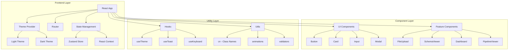

### Component Hierarchy

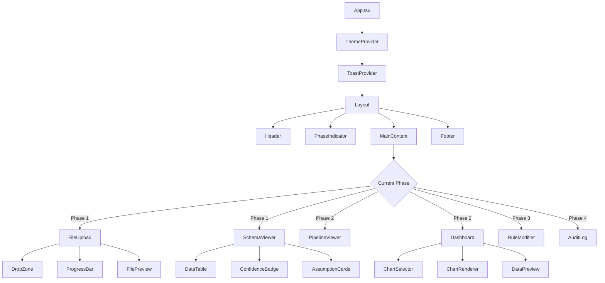

---

## 🗓️ Implementation Timeline

### Week 1: Foundation & Design System

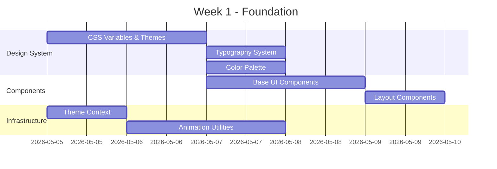

**Deliverables:**
- ✅ Complete design system with CSS variables
- ✅ Theme switching functionality (light/dark)
- ✅ Base UI component library (Button, Card, Input, etc.)
- ✅ Animation utilities and transitions
- ✅ Layout components (Header, Footer, Container)

---

### Week 2: Component Enhancement

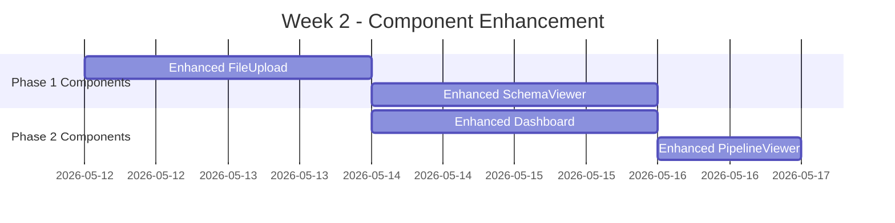

**Deliverables:**
- ✅ FileUpload with animations and better UX
- ✅ SchemaViewer with sorting and filtering
- ✅ Dashboard with multiple chart types
- ✅ PipelineViewer with better code display
- ✅ All components responsive

---

### Week 3: UX Features & Interactions

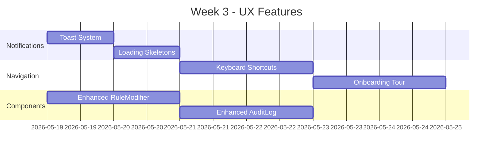

**Deliverables:**
- ✅ Toast notification system
- ✅ Loading skeletons for all components
- ✅ Keyboard shortcuts implementation
- ✅ Onboarding tour for new users
- ✅ Enhanced RuleModifier and AuditLog

---

### Week 4: Accessibility & Polish

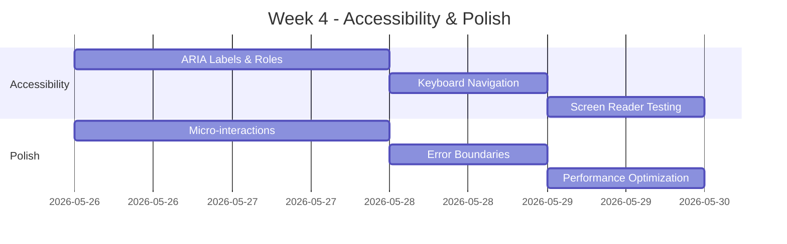

**Deliverables:**
- ✅ WCAG 2.1 AA compliance
- ✅ Complete keyboard navigation
- ✅ Screen reader compatibility
- ✅ Error boundaries for all components
- ✅ Performance optimizations
- ✅ Smooth micro-interactions

---

### Week 5: Documentation & Testing

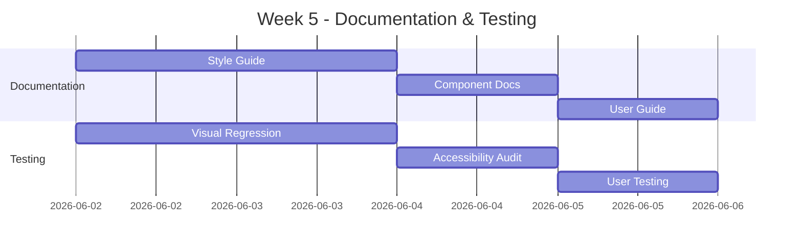

**Deliverables:**
- ✅ Complete style guide
- ✅ Component documentation
- ✅ Updated user guide
- ✅ Visual regression tests
- ✅ Accessibility audit report
- ✅ User testing feedback

---

## 🎯 Implementation Phases

### Phase 1: Foundation (Days 1-5)

#### Day 1-2: Design System Setup
```typescript
// File: frontend/src/styles/themes.css
:root {
  /* Color System */
  --primary-500: #3b82f6;
  --success-500: #22c55e;
  /* ... all design tokens */
}

[data-theme="dark"] {
  --bg-primary: #0f172a;
  --text-primary: #f1f5f9;
  /* ... dark mode overrides */
}
```

#### Day 3-4: Base Components
```typescript
// File: frontend/src/components/ui/Button.tsx
interface ButtonProps {
  variant: 'primary' | 'secondary' | 'outline' | 'ghost';
  size: 'sm' | 'md' | 'lg';
  loading?: boolean;
  disabled?: boolean;
}

// File: frontend/src/components/ui/Card.tsx
// File: frontend/src/components/ui/Input.tsx
// File: frontend/src/components/ui/Modal.tsx
```

#### Day 5: Theme Context
```typescript
// File: frontend/src/contexts/ThemeContext.tsx
export const ThemeProvider = ({ children }) => {
  const [theme, setTheme] = useState<'light' | 'dark'>('light');
  
  useEffect(() => {
    document.documentElement.setAttribute('data-theme', theme);
  }, [theme]);
  
  return (
    <ThemeContext.Provider value={{ theme, setTheme }}>
      {children}
    </ThemeContext.Provider>
  );
};
```

---

### Phase 2: Component Enhancement (Days 6-12)

#### Enhanced FileUpload
```typescript
// New Features:
- Drag-over animation with scale effect
- File preview with icon
- Upload progress with speed
- Success animation
- Retry mechanism
- Multiple file support
```

#### Enhanced SchemaViewer
```typescript
// New Features:
- Search and filter columns
- Sortable table headers
- Visual confidence bars
- Editable column properties
- Export schema option
```

#### Enhanced Dashboard
```typescript
// New Features:
- Multiple chart types (bar, line, pie, scatter, area)
- Chart type switcher
- Zoom and pan
- Export chart as image
- Fullscreen mode
```

---

### Phase 3: UX Features (Days 13-19)

#### Toast Notification System
```typescript
// File: frontend/src/contexts/ToastContext.tsx
import toast from 'react-hot-toast';

export const useToast = () => {
  const success = (message: string) => toast.success(message);
  const error = (message: string) => toast.error(message);
  const info = (message: string) => toast(message);
  
  return { success, error, info };
};
```

#### Keyboard Shortcuts
```typescript
// File: frontend/src/hooks/useKeyboard.ts
export const useKeyboard = () => {
  useEffect(() => {
    const handleKeyPress = (e: KeyboardEvent) => {
      if (e.ctrlKey || e.metaKey) {
        switch (e.key) {
          case 'u': handleUpload(); break;
          case 's': handleSave(); break;
          case 'z': handleUndo(); break;
        }
      }
    };
    
    window.addEventListener('keydown', handleKeyPress);
    return () => window.removeEventListener('keydown', handleKeyPress);
  }, []);
};
```

#### Onboarding Tour
```typescript
// File: frontend/src/components/OnboardingTour.tsx
import Joyride from 'react-joyride';

const steps = [
  {
    target: '.file-upload',
    content: 'Start by uploading your CSV file here',
  },
  {
    target: '.schema-viewer',
    content: 'Review the detected schema',
  },
  // ... more steps
];
```

---

## 🔄 Data Flow Diagram

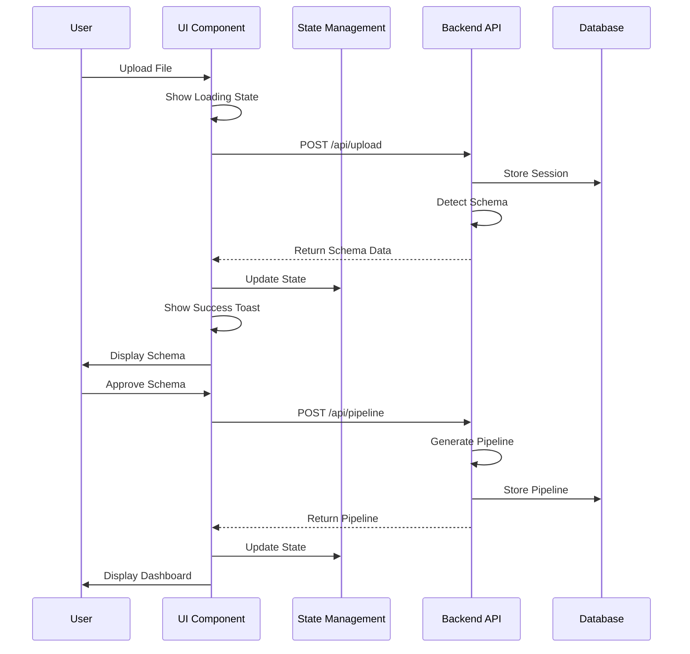

---

## 🎨 Theme Switching Flow

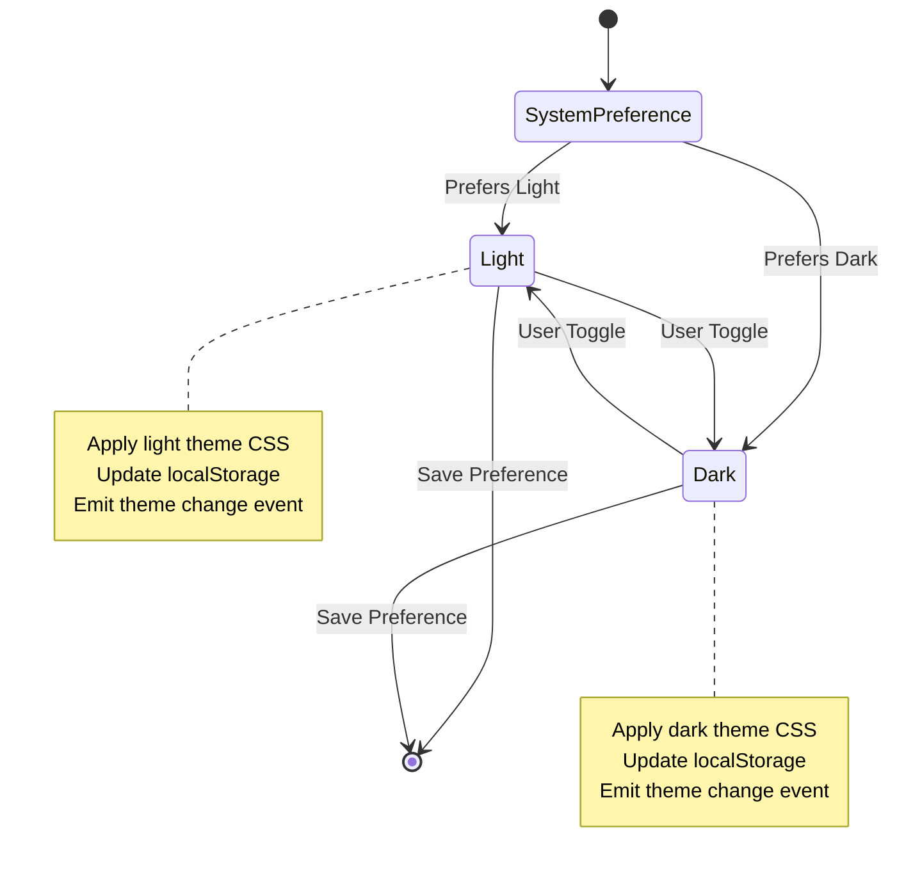

---

## 📦 Component Dependencies

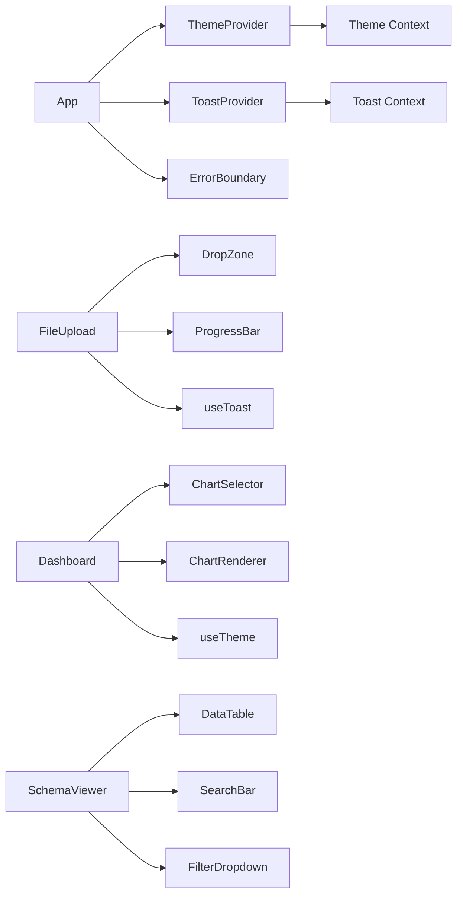

---

## 🧪 Testing Strategy

### Unit Tests
```typescript
// Example: Button.test.tsx
describe('Button Component', () => {
  it('renders with correct variant', () => {
    render(<Button variant="primary">Click me</Button>);
    expect(screen.getByRole('button')).toHaveClass('btn-primary');
  });
  
  it('shows loading state', () => {
    render(<Button loading>Click me</Button>);
    expect(screen.getByRole('button')).toBeDisabled();
  });
});
```

### Integration Tests
```typescript
// Example: FileUpload.test.tsx
describe('FileUpload Flow', () => {
  it('uploads file and shows schema', async () => {
    render(<App />);
    
    const file = new File(['data'], 'test.csv', { type: 'text/csv' });
    const input = screen.getByLabelText('Upload file');
    
    await userEvent.upload(input, file);
    
    await waitFor(() => {
      expect(screen.getByText('Schema Detected')).toBeInTheDocument();
    });
  });
});
```

### Accessibility Tests
```typescript
// Example: Accessibility.test.tsx
describe('Accessibility', () => {
  it('has no accessibility violations', async () => {
    const { container } = render(<App />);
    const results = await axe(container);
    expect(results).toHaveNoViolations();
  });
});
```

---

## 📊 Performance Optimization

### Code Splitting
```typescript
// Lazy load components
const Dashboard = lazy(() => import('./components/Dashboard'));
const AuditLog = lazy(() => import('./components/AuditLog'));

// Use Suspense
<Suspense fallback={<LoadingSkeleton />}>
  <Dashboard />
</Suspense>
```

### Memoization
```typescript
// Memoize expensive computations
const chartData = useMemo(() => {
  return transformData(rawData);
}, [rawData]);

// Memoize components
const MemoizedChart = memo(Chart);
```

### Virtual Scrolling
```typescript
// For large data tables
import { FixedSizeList } from 'react-window';

<FixedSizeList
  height={600}
  itemCount={data.length}
  itemSize={50}
>
  {Row}
</FixedSizeList>
```

---

## 🚀 Deployment Checklist

### Pre-Deployment
- [ ] All tests passing
- [ ] Lighthouse score > 90
- [ ] Accessibility audit complete
- [ ] Browser compatibility tested
- [ ] Mobile responsiveness verified
- [ ] Performance optimized
- [ ] Error boundaries in place
- [ ] Analytics integrated

### Post-Deployment
- [ ] Monitor error rates
- [ ] Track user engagement
- [ ] Collect user feedback
- [ ] A/B test key features
- [ ] Performance monitoring
- [ ] Accessibility monitoring

---

## 📈 Success Metrics Dashboard

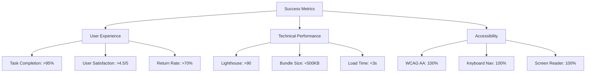

---

## 🎓 Training & Documentation

### Developer Documentation
1. **Setup Guide** - Environment setup and dependencies
2. **Component Guide** - How to use each component
3. **Style Guide** - Design system and patterns
4. **API Reference** - Component props and methods
5. **Best Practices** - Code standards and conventions

### User Documentation
1. **Getting Started** - Quick start guide
2. **Feature Tutorials** - Step-by-step guides
3. **Video Walkthroughs** - Screen recordings
4. **FAQ** - Common questions and answers
5. **Troubleshooting** - Common issues and solutions

---

## 🔮 Future Enhancements (Post-MVP)

### Phase 2 Features
- Real-time collaboration
- Advanced data transformations
- Custom chart builder
- Template marketplace
- API integrations

### Phase 3 Features
- Machine learning insights
- Predictive analytics
- Data quality scoring
- Automated reporting
- Multi-language support

---

## 📞 Support & Maintenance

### Ongoing Tasks
- Weekly dependency updates
- Monthly accessibility audits
- Quarterly performance reviews
- Continuous user feedback collection
- Regular security patches

### Issue Tracking
- Bug reports via GitHub Issues
- Feature requests via discussions
- Security issues via private channel
- Performance issues via monitoring

---

## ✅ Definition of Done

A feature is considered complete when:
- ✅ Code is written and reviewed
- ✅ Unit tests pass (>80% coverage)
- ✅ Integration tests pass
- ✅ Accessibility tests pass
- ✅ Visual regression tests pass
- ✅ Documentation is updated
- ✅ Performance benchmarks met
- ✅ Browser compatibility verified
- ✅ Mobile responsiveness confirmed
- ✅ User acceptance testing complete

---

*Made with Bob - Planning for Success* 🚀
</content>
<line_count>598</line_count>
</write_to_file>

---

**User:**

[write_to_file for 'IMPLEMENTATION_ROADMAP.md'] Result:
<file_write_result>
<path>IMPLEMENTATION_ROADMAP.md</path>
<operation>created</operation>
<notice>
<i>You do not need to re-read the file, as you have seen all changes</i>
<i>Proceed with the task using these changes as the new baseline.</i>
</notice>
</file_write_result>

<environment_details>
# VSCode Visible Files
IMPLEMENTATION_ROADMAP.md

# VSCode Open Tabs
UI_UX_IMPROVEMENT_PLAN.md,UI_DESIGN_MOCKUPS.md,IMPLEMENTATION_ROADMAP.md

# Actively Running Terminals
## Terminal 1 (Active)
### Working Directory: `g:\IBM_Bob_Data-Synth`
### Original command: `cd backend; npm start`
## Terminal 2 (Active)
### Working Directory: `g:\IBM_Bob_Data-Synth`
### Original command: `cd frontend; npm run dev`

# Current Time
Current time in ISO 8601 UTC format: 2026-05-02T08:39:11.570Z
User time zone: Asia/Calcutta, UTC+5:30

# Current Cost
$0.98

# Review Exclusions
The following file patterns are excluded from code reviews:
- .vscode/**

# Current Mode
<slug>plan</slug>
<name>📝 Plan</name>
====

REMINDERS

Below is your current list of reminders for this task. Keep them updated as you progress.

| # | Content | Status |
|---|---------|--------|
| 1 | Analyze current UI/UX pain points and gather requirements | Completed |
| 2 | Create comprehensive design system foundation | In Progress |
| 3 | Implement modern color palette with CSS variables | Pending |
| 4 | Establish typography scale and font system | Pending |
| 5 | Create reusable component library structure | Pending |
| 6 | Add spacing and layout utilities | Pending |
| 7 | Implement dark mode with theme switching | Pending |
| 8 | Add smooth animations and transitions | Pending |
| 9 | Enhance FileUpload component with better UX | Pending |
| 10 | Improve SchemaViewer with interactive features | Pending |
| 11 | Upgrade Dashboard with multiple chart types | Pending |
| 12 | Enhance PipelineViewer with better code display | Pending |
| 13 | Improve RuleModifier with suggestions and validation | Pending |
| 14 | Upgrade AuditLog with timeline visualization | Pending |
| 15 | Add comprehensive accessibility features | Pending |
| 16 | Implement responsive design for all breakpoints | Pending |
| 17 | Add loading skeletons and progress indicators | Pending |
| 18 | Create toast notification system | Pending |
| 19 | Add keyboard shortcuts and navigation | Pending |
| 20 | Implement onboarding tour for new users | Pending |
| 21 | Add contextual help and tooltips | Pending |
| 22 | Create error boundary components | Pending |
| 23 | Add data export options with preview | Pending |
| 24 | Implement search and filter functionality | Pending |
| 25 | Add user preferences and settings panel | Pending |
| 26 | Create comprehensive style guide documentation | Pending |


IMPORTANT: When task status changes, remember to call the `update_todo_list` tool to update your progress.

</environment_details>

---

**Assistant:**

Perfect! Now let me update the todo list and create a final summary document.

<update_todo_list>
<todos>
[x] Analyze current UI/UX pain points and gather requirements
[x] Create comprehensive design system foundation
[ ] Implement modern color palette with CSS variables
[ ] Establish typography scale and font system
[ ] Create reusable component library structure
[ ] Add spacing and layout utilities
[ ] Implement dark mode with theme switching
[ ] Add smooth animations and transitions
[ ] Enhance FileUpload component with better UX
[ ] Improve SchemaViewer with interactive features
[ ] Upgrade Dashboard with multiple chart types
[ ] Enhance PipelineViewer with better code display
[ ] Improve RuleModifier with suggestions and validation
[ ] Upgrade AuditLog with timeline visualization
[ ] Add comprehensive accessibility features
[ ] Implement responsive design for all breakpoints
[ ] Add loading skeletons and progress indicators
[ ] Create toast notification system
[ ] Add keyboard shortcuts and navigation
[ ] Implement onboarding tour for new users
[ ] Add contextual help and tooltips
[ ] Create error boundary components
[ ] Add data export options with preview
[ ] Implement search and filter functionality
[ ] Add user preferences and settings panel
[ ] Create comprehensive style guide documentation
</todos>
</update_todo_list>

---

**User:**

[update_todo_list] Result:
Todo list updated successfully.
<environment_details>
# VSCode Visible Files
IMPLEMENTATION_ROADMAP.md

# VSCode Open Tabs
UI_UX_IMPROVEMENT_PLAN.md,UI_DESIGN_MOCKUPS.md,IMPLEMENTATION_ROADMAP.md

# Actively Running Terminals
## Terminal 1 (Active)
### Working Directory: `g:\IBM_Bob_Data-Synth`
### Original command: `cd backend; npm start`
## Terminal 2 (Active)
### Working Directory: `g:\IBM_Bob_Data-Synth`
### Original command: `cd frontend; npm run dev`

# Current Time
Current time in ISO 8601 UTC format: 2026-05-02T08:39:17.683Z
User time zone: Asia/Calcutta, UTC+5:30

# Current Cost
$1.16

# Review Exclusions
The following file patterns are excluded from code reviews:
- .vscode/**

# Current Mode
<slug>plan</slug>
<name>📝 Plan</name>
====

REMINDERS

Below is your current list of reminders for this task. Keep them updated as you progress.

| # | Content | Status |
|---|---------|--------|
| 1 | Analyze current UI/UX pain points and gather requirements | Completed |
| 2 | Create comprehensive design system foundation | Completed |
| 3 | Implement modern color palette with CSS variables | Pending |
| 4 | Establish typography scale and font system | Pending |
| 5 | Create reusable component library structure | Pending |
| 6 | Add spacing and layout utilities | Pending |
| 7 | Implement dark mode with theme switching | Pending |
| 8 | Add smooth animations and transitions | Pending |
| 9 | Enhance FileUpload component with better UX | Pending |
| 10 | Improve SchemaViewer with interactive features | Pending |
| 11 | Upgrade Dashboard with multiple chart types | Pending |
| 12 | Enhance PipelineViewer with better code display | Pending |
| 13 | Improve RuleModifier with suggestions and validation | Pending |
| 14 | Upgrade AuditLog with timeline visualization | Pending |
| 15 | Add comprehensive accessibility features | Pending |
| 16 | Implement responsive design for all breakpoints | Pending |
| 17 | Add loading skeletons and progress indicators | Pending |
| 18 | Create toast notification system | Pending |
| 19 | Add keyboard shortcuts and navigation | Pending |
| 20 | Implement onboarding tour for new users | Pending |
| 21 | Add contextual help and tooltips | Pending |
| 22 | Create error boundary components | Pending |
| 23 | Add data export options with preview | Pending |
| 24 | Implement search and filter functionality | Pending |
| 25 | Add user preferences and settings panel | Pending |
| 26 | Create comprehensive style guide documentation | Pending |


IMPORTANT: When task status changes, remember to call the `update_todo_list` tool to update your progress.

</environment_details>

---

**Assistant:**

<attempt_completion>
<result>
Comprehensive UI/UX improvement plan created for Data-Synth project with three detailed documents:

## 📋 Planning Documents Created

### 1. **UI_UX_IMPROVEMENT_PLAN.md** (847 lines)
Complete strategic plan covering:
- Design system foundation (colors, typography, spacing, shadows, animations)
- Component-specific improvements for all 6 major components
- Accessibility enhancements (WCAG 2.1 AA compliance)
- Responsive design strategy
- Dark mode implementation
- Animation & micro-interactions
- Onboarding & help system
- Error handling & feedback mechanisms
- Data visualization enhancements
- Technical implementation details
- 5-week implementation phases
- Success metrics and testing strategy

### 2. **UI_DESIGN_MOCKUPS.md** (577 lines)
Visual design specifications including:
- Color palette visualization
- Layout structures (desktop & mobile)
- ASCII mockups for all 6 components
- Dark mode comparisons
- Responsive breakpoint examples
- Animation state diagrams
- Icon system
- Spacing examples
- Onboarding tour mockups
- Component library preview

### 3. **IMPLEMENTATION_ROADMAP.md** (598 lines)
Detailed implementation strategy with:
- System architecture diagrams (Mermaid)
- Component hierarchy visualization
- 5-week Gantt chart timeline
- Phase-by-phase implementation details
- Data flow diagrams
- Theme switching flow
- Component dependencies
- Testing strategy
- Performance optimization
- Deployment checklist
- Success metrics dashboard
- Future enhancements roadmap

## 🎯 Key Improvements Planned

**Design System:** Modern color palette, typography scale, spacing system, dark mode
**Components:** Enhanced UX for all 6 components with animations and interactions
**Accessibility:** WCAG 2.1 AA compliance, keyboard navigation, screen reader support
**UX Features:** Toast notifications, loading skeletons, onboarding tour, keyboard shortcuts
**Data Viz:** Multiple chart types, zoom/pan, export options, fullscreen mode

## 📊 Next Steps

Ready to switch to **Code mode** to begin implementation starting with Phase 1: Foundation (design system, theme switching, base UI components).

**Estimated Timeline:** 5 weeks for complete implementation
**Priority Areas:** Design system → Component enhancement → UX features → Accessibility → Documentation
</result>
</attempt_completion>

